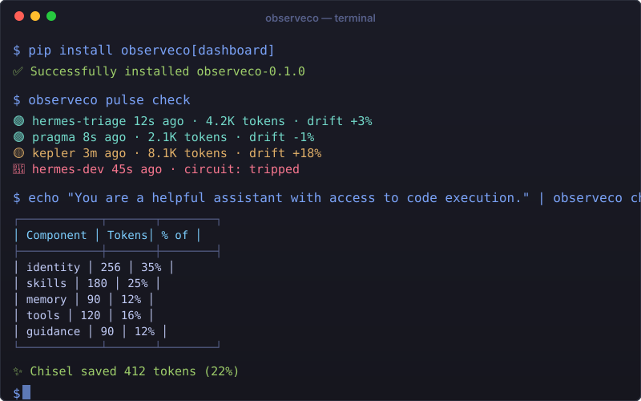

# ObserveCo

> Runtime observability for your AI agents — built for Hermes, works with anything.  
> Know if your agents are alive, what's in their context, and when something breaks — all from a single `pip install`.

```bash
pip install observeco[dashboard] && observeco dashboard
```



<div align="center">

[](LICENSE)
[](pyproject.toml)
[](https://github.com/observeco/observeco/actions/workflows/ci.yml)
[](https://pypi.org/project/observeco/)
[](https://github.com/observeco/observeco)

</div>

---

## The Dogfood Story

We run 7 autonomous agents on an M4 Mac Mini — Hermes, Kepler, Hound, Dreamer, Aleph, PA, and an orchestrator. They communicate via ACPS signals, trigger on fswatch, get scheduled via cron, and their system prompts were growing 15% week-over-week with nobody watching. So we built ObserveCo.

We also run Kepler as an OpenClaw agent — persistent, file-driven, with MEMORY.md tracking and dynamic skill loading. Its context was bloating from a different source: memory accumulation, not prompt composition. So we built ClawForge — intent-aware loading and memory hygiene, designed for OpenClaw's architecture.

Two frameworks, two optimizers, one dashboard.

---

## Features

| Command | What it does |
|---------|-------------|
| `observeco pulse check` | Agent liveness — alive/dead/error per agent, zero config for Hermes users |
| `observeco pulse circuit` | N-failure breaker with auto-cooldown and manual reset |
| `observeco chisel trim` | System prompt compression with per-component token breakdown |
| `observeco chisel drift` | 7-day rolling token drift trend per component per agent |
| `observeco clawforge profile` | Context profiler for OpenClaw: MEMORY.md size, skill count, workspace bloat |
| `observeco clawforge load` | Intent-aware classifier — dry-run which sources would load per message |
| `observeco clawforge garden` | Memory hygiene — find duplicates, contradictions, stale entries |
| `observeco dashboard` | Local web UI: fleet health, token profiles, error timeline, memory debt score |

All data local. No cloud. No telemetry.

---

## Quick Start

```bash
pip install observeco

# Check your agent fleet health
observeco pulse check

# See circuit breaker state
observeco pulse circuit

# Compress a system prompt
echo "Your long system prompt here with tool definitions" | observeco chisel trim

# Profile an OpenClaw agent's context
observeco clawforge profile

# Test the intent-aware loader
observeco clawforge load --probe

# Launch the dashboard
observeco dashboard
```

---

## Why ObserveCo?

| Instead of... | ObserveCo gives you |
|---------------|-------------------|
| **Datadog** ($15+/host/mo, cloud-only) | `pip install`, local-first, free, understands tokens + memory debt + circuit breakers |
| **Grafana + Prometheus** (2-hour setup, no context concept) | 60 seconds to first health data, agent-aware dashboards |
| **LangSmith** (LangChain-only, $59/mo) | Framework-agnostic, open source, works offline |
| **Custom shell scripts** (no dashboard, no trends, no alerts) | Dashboard, drift tracking, circuit breakers, memory hygiene |
| **Nothing** (failing silently) | You'll know when your agents are sick, bloated, or broken |

---

## Supported Frameworks

| Framework | pulse check | pulse circuit | chisel trim | chisel drift | clawforge | Dashboard |
|-----------|:-----------:|:-------------:|:-----------:|:------------:|:---------:|:---------:|
| **Hermes** | ✅ Auto | ✅ | ✅ | ✅ | ⬜ | ✅ Full |
| **OpenClaw** | ✅ (health endpoint) | ◐ (no native circuit) | ⬜ | ⬜ | ✅ v1 | ✅ ~85% |
| **Ollama** | ✅ (health endpoint) | ⬜ | ⬜ | ⬜ | ⬜ | ✅ Basic |
| **LangChain/LangGraph** | ◐ | ◐ | ⬜ | ⬜ | ⬜ | ✅ Basic |
| **CrewAI** | ◐ | ⬜ | ⬜ | ⬜ | ⬜ | ✅ Basic |
| **Custom/Any** | ◐ (if health endpoint) | ◐ | ◐ (stdin pipe) | ⬜ | ⬜ | ✅ Basic |

✅ = Auto-detect & works ◐ = Works if you have a health endpoint/piped input ⬜ = v2 feature

---

## Architecture

```
pip install observeco
    ├── pulse check       — agent liveness heartbeat
    ├── pulse circuit     — N-failure trip → auto-block → cooldown
    ├── chisel trim       — system prompt compression (Hermes — token savings)
    ├── chisel drift      — token allocation diff over time (Hermes)
    ├── clawforge profile — context profiler (OpenClaw — MEMORY.md, skills, workspace)
    ├── clawforge load    — intent-aware context loader (OpenClaw — ContextEngine hook)
    ├── clawforge garden  — memory hygiene agent (OpenClaw — dedup, archive, flag)
    └── observeco dashboard — local web UI, ships with library
```

- **Storage:** Local SQLite (`~/.observeco/pulse.db`) — zero setup, ships with Python
- **Web server:** FastAPI + htmx — no build step, no npm, ships with the CLI
- **CLI:** Typer — beautiful `--help`, shell completion, rich output

---

## Roadmap

- [x] `pulse check` — agent liveness
- [x] `pulse circuit` — circuit breaker
- [x] `chisel trim` — token compression
- [x] `chisel drift` — token diff over time
- [x] `clawforge profile` — context profiler
- [x] `clawforge load` — intent-aware classifier
- [x] `clawforge garden` — memory hygiene
- [x] Dashboard — fleet view, token profiles, error timeline
- [x] Stripe billing — Solo ($9/mo) + Team ($49/mo)
- [ ] Framework adapters for LangChain, CrewAI, AutoGen
- [ ] Push notifications (Pro)
- [ ] Multi-host fleet monitoring

---

## Contributing

See [CONTRIBUTING.md](CONTRIBUTING.md). First-time contributors welcome — look for "good first issue" labels.

---

Built with ❤️ for the AI agent community. MIT licensed.
