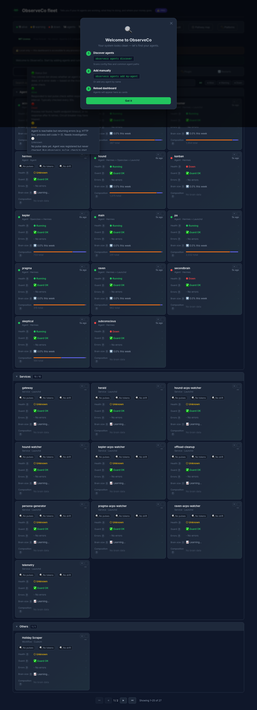

# ObserveCo

> ObserveCo tells you if your AI agents are working, what they're doing, and where your money goes.

```bash
pip install 'observeco[dashboard]' && observeco dashboard
```

> **v0.1 — 12 features live. Pro tier available ($9/mo).** Built and dogfooded on a 7-agent fleet running on a single M4 Mac Mini.

<p align="center">
  
  <br><em>Fleet view with health dots, token bars, drift sparklines, and error timeline. One pip install.</em>
</p>

<div align="center">

[](LICENSE)
[](pyproject.toml)
[](https://github.com/observeco/observeco/actions/workflows/ci.yml)
[](https://pypi.org/project/observeco/)
[](https://github.com/observeco/observeco)

</div>

---

## The Problem

Every AI agent operator has this story: an agent was silently failing for weeks. Context bloating 15% per week. Memory full of duplicates and contradictions. Nobody noticed until a user complained.

This is normal. The tools to fix it don't exist — yet.

---

## From the Trenches (Dogfood)

> We run 7 autonomous agents on an M4 Mac Mini — Hermes, Kepler, Hound, Dreamer, Aleph, PA, and an orchestrator. They talk via ACPS signals, trigger on file changes, get scheduled via cron. For months we ran `ps aux | grep python` and hoped for the best.

> **Then we built ObserveCo.** It caught Hermes' SOUL.md growing 15% week-over-week. It showed Kepler's context carrying 40k tokens of memory it never used. It exposed 3 silent circuit trips in 2 days that nobody saw. These are not edge cases — they're the normal state of any agent fleet older than a week.

---

## Pro Tier ($9/mo — 30-day free trial)

Get the full Observability Engine:

| Feature | Free | Pro |
|---------|:----:|:---:|
| Fleet health monitoring | ✅ | ✅ |
| Circuit breakers | ✅ | ✅ |
| Token breakdown | ✅ (read-only) | ✅ |
| Memory garden | ✅ | ✅ |
| **Drift tracking (7-day history)** | ❌ | ✅ |
| **Push alerts (Telegram / email)** | ❌ | ✅ |
| **CRM & license management** | ❌ | ✅ |
| **Dashboard auto-refresh** | every 60s | every 10s |

Run `observeco dashboard` and click "Unlock with Pro" to start your free trial.

---

## What Ships Now (v0.1)

12 features. One `pip install`. 60 seconds to first health data.

### Fleet Health
| Feature | Command | What it does |
|---------|---------|-------------|
| **Pulse Check** | `observeco pulse check` | Agent liveness — alive / dead / error. Auto-detects from config. |
| **Circuit Breaker** | `observeco pulse circuit` | N-failure trip → auto-block → cooldown. Stops cascade failures. |
| **Safety Guard** | built-in | Noise reduction — only surfaces real issues, not flapping |
| **Heal Button** | dashboard | One-click restart for dead agents. Manual trigger, you're in control. |

### Token Intelligence
| Feature | Command | What it does |
|---------|---------|-------------|
| **Context Trim** | `observeco context trim` (or `observeco chisel trim`) | System prompt compression with per-component token breakdown |
| **Drift Tracking** | `observeco context drift` (or `observeco chisel drift`) | 7-day rolling token drift trend per component per agent |
| **Skill Audit** | `observeco context skills` (or `observeco chisel skills`) | Find bloated, duplicate, or unused skills eating context |

### Memory & Context
| Feature | Command | What it does |
|---------|---------|-------------|
| **Memory Garden** | `observeco memory garden` (or `observeco clawforge garden`) | Find duplicates, contradictions, stale entries in agent memory |
| **Context Profiler** | `observeco context profile` (or `observeco clawforge profile`) | See what's in your agent's context — MEMORY.md, skills, workspace |
| **Intent Classifier** | `observeco context load` (or `observeco clawforge load`) | Dry-run which sources would load per message type |

### Dashboard & Alerts
| Feature | Access | What it does |
|---------|--------|-------------|
| **Fleet View** | `observeco dashboard` | All agents at a glance — green/yellow/red status cards |
| **In-Dashboard Alerts** | free | See alerts when you open the dashboard. Shows discovery gap ("happened 3am, found 7am") |
| **Error Timeline** | free | Full error history with context snapshots |
| **Push Alerts** | v0.3 (D+7) | Telegram / webhook / email — know before you check |

---

## Quick Start

```bash
pip install 'observeco[dashboard]'

# Check your agent fleet
observeco pulse check

# See what's eating your context
echo "Your system prompt" | observeco chisel trim

# Find memory bloat
observeco clawforge garden

# Launch the dashboard
observeco dashboard
```

---

## The Discovery Gap

Every yellow banner in the dashboard shows two timestamps:

> ⚠️ **Kepler** — heartbeat missed
> Happened: 03:15 · Discovered: 07:00 · **Gap: 3h 45m**

That gap is where agents fail silently. ObserveCo makes it visible.

In v0, you see the gap when you open the dashboard. In v0.3 (D+7), push alerts close it — Telegram notifications fire within 3 seconds of detection.

---

## Why ObserveCo?

| Instead of... | ObserveCo |
|---------------|-----------|
| **Datadog** ($15+/host/mo, cloud-only) | `pip install`, local-first, free, understands tokens + memory debt + circuit breakers |
| **Grafana + Prometheus** (2-hour setup, no context concept) | 60 seconds to first health data, agent-aware dashboards |
| **LangSmith** (LangChain-only, $59/mo) | Framework-agnostic, open source, works offline |
| **Nothing** (failing silently) | You'll know when your agents are sick, bloated, or broken |

---

## The Stack

```
pip install observeco
├── pulse        — liveness, circuit breaker, safety guard
├── chisel       — token compression, drift, skill audit
├── clawforge    — memory garden, context profiler, intent loader
└── dashboard    — local web UI (FastAPI + htmx, no npm)
```

- **Storage:** Local SQLite (`~/.observeco/pulse.db`) — zero setup
- **Web server:** FastAPI + htmx — no build step, ships with CLI
- **CLI:** Typer — shell completion, rich output
- **Telemetry:** Optional crash/usage reports to help improve ObserveCo. Opt-out via `OBSERVECO_TELEMETRY=off`. No data collected otherwise.

---

## Roadmap

| Version | Timing | What |
|---------|--------|------|
| **v0.1** | Now | 12 features — monitoring + diagnostics + dashboard |
| **v0.2** | D+3 | Auto-heal (93% coverage) + Extended history |
| **v0.3** | D+7 | Chisel compression + Push alerts (Telegram/webhook/email) |
| **v1.1** | D+14 | OpenClaw runtime plugin (`@observeco/clawforge-plugin`) |

**What's the OpenClaw plugin?** A Node.js plugin that hooks into the ContextEngine to load only what's needed per turn. Your agents stop carrying 100k tokens of context they never use. That's the v1.1 headline.

---

## Supported Frameworks

| Framework | Health | Circuit | Tokens | Memory | Dashboard |
|-----------|:------:|:-------:|:------:|:------:|:---------:|
| **Hermes** | ✅ Auto | ✅ | ✅ | ✅ | ✅ Full |
| **OpenClaw** | ✅ | ◐ | ◐ | ✅ | ✅ ~85% |
| **Ollama** | ✅ | ⬜ | ⬜ | ⬜ | ✅ Basic |
| **LangChain** | ◐ | ◐ | ⬜ | ⬜ | ✅ Basic |
| **CrewAI** | ◐ | ⬜ | ⬜ | ⬜ | ✅ Basic |
| **Custom** | ◐ | ◐ | ◐ | ⬜ | ✅ Basic |

✅ = Auto-detect & works · ◐ = Works with config · ⬜ = Coming

---

## Contributing

See [CONTRIBUTING.md](CONTRIBUTING.md). First-time contributors welcome — look for "good first issue" labels.

---

Built with ❤️ for the AI agent community. MIT licensed.

### Glossary

Hover the "?" icons on any agent card in the dashboard to get instant definitions of:
- **Health** (status dot) — green/yellow/red lifecycle
- **Guard** (circuit breaker) — N-failure auto-stop
- **Errors** — per-agent error badge (24h window)
- **Brain size** (drift) — 7-day token growth trend
- **Composition** (token bar) — identity/skills/memory/tools/guidance breakdown

Each popup includes FAQ. Click the topic header to open the full modal.

---

### 🔐 Observability Boundaries (Threat Model)

ObserveCo monitors **agent processes, health, token usage, and inter-agent communication paths**. It does **not** monitor:

- **API key compromise** — ObserveCo sees which provider you use but never stores API keys. Key hygiene is your responsibility.
- **Prompt injection / data poisoning** — ObserveCo monitors agent health, not conversation content. A poisoned agent that behaves normally will not trigger alerts.
- **Network-level attacks** — We monitor platform connectivity (Telegram/WhatsApp/Discord gateway health) but not TLS termination, DNS, or DDoS.
- **Supply chain attacks** — Plugin dependencies are your risk. ObserveCo can detect bloated skills but not malicious ones.
- **Storage encryption** — All data is local SQLite on your machine. Encrypt your disk; we don't add a separate encryption layer.

**What a kill switch can do:** Stop a runaway agent process immediately (SIGTERM → SIGKILL after 5s). Audit-logged. Human-initiated only.
**What a kill switch cannot do:** Prevent the agent from restarting (auto-restart daemons will re-launch unless you also remove the agent config).
**What auto-heal does:** Restart dead agents, reset tripped circuits, trim bloated memory. Configurable thresholds. Circuit breaker stops after 3 failures.
**What auto-heal does NOT do:** Modify config files, delete agents, change system settings, or execute any action with irreversible side effects.
