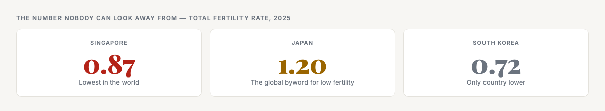
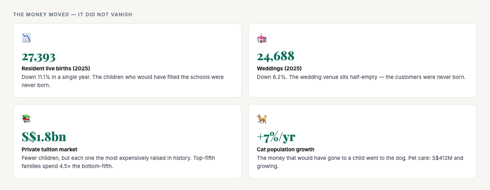
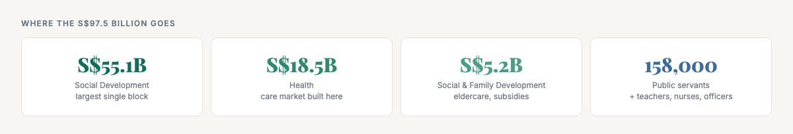
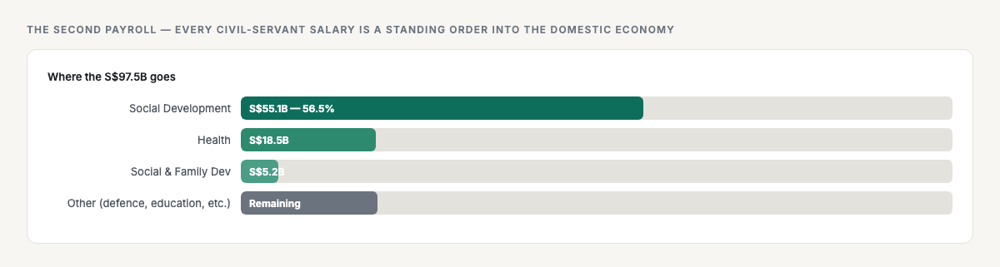

# ObserveCo — Trending-Topic Content Package (Book 1 Quality)

**Date:** 2026-09-08
**Trigger:** Both topics surfaced in today's SG Google Trends (birth rate, SG salary review committee).
**Source visuals:** `32-fertility-collapse.html` + `16-government-money.html` (Book 1).
**Source manuscript:** `whitepapers/book1-map-manuscript.md` (the register this package is written to).
**Voice:** Sean's register — first-person, plainspoken, evidence-first, no hype. Teaches the mechanism, not just the stat.
**Rule:** Draft only. Nothing posted. Sean pushes the button.

---

# PART ONE — THE X ARTICLE (long-form, Book 1 quality)

## Article 1: "Singapore Stopped Having Children. Here's What It Means for Your Business."

**Format:** X Article, ~1,800–2,200 words, 3 embedded visuals (the fertility card + two data callouts).

---

### The number nobody can look away from

Singapore's total fertility rate is **0.87**. The average woman in this country is having fewer than one child.

Let me put that in ordinary terms, because the number alone doesn't land. Demographers measure a country's baby-making with a single figure called the total fertility rate — the average number of children a woman can expect to have over her whole life. If it sits at 2.1, a population keeps its size, because every couple roughly replaces itself. Below that, the country quietly shrinks from within.

Singapore's number is 0.87. Less than one child per woman. So far below replacement that a large share of couples will never have a child at all, and most of the rest will stop at one.

It is lower than Japan. Lower than South Korea — the two countries that have been the global byword for the end of it. Singapore is now the end of the line for it.

Picture the little boy in a buggy at the mall on a Sunday morning, waited on by parents who had planned, and planned, for the sibling who never came.

### The part that surprises everyone

Here is what a fertility collapse does to demand, and it is not what people assume. It does not kill every young market.

Last year, 27,393 resident babies were born — **down 11.1% in a single year**. Weddings fell too, down 6.2%. The wedding venue sits half-empty. The customers were never born.

But watch what happened to the money.

The tuition market is still worth **S$1.8 billion** — and it grew 29% in five years, 64% since 2013. The average household now spends S$104 a month on private tuition. And the gap inside that number is the whole story: the top-fifth of households spend S$162 a month, the bottom-fifth just S$36 — a four-and-a-half-fold spread, the widest inequality gap in the entire spending map.

Fewer children does not mean less money on children. It means **far more money on each of the few children** — and the families with the most money spend the most on the fewest.

The young people who chose not to have children did something even more interesting. They did not stop spending. They **redirected**.

The money that would have gone to a child — to the school, the nappies, the enrichment — did not vanish. It went to the dog. Singapore's dog population is growing 2% a year, its cat population 7% a year, and the pet-care industry, worth S$412 million, is largely a creation of young households raising a pet the way their parents raised a child.

It went to the table. Four in ten Singaporeans eat out at least once a week; half of the young eat out constantly.

The fertility crisis is a huge, silent **reallocation** — out of nappies and into restaurants and dogs and trips. The childless are not poor. They are the most free-spending adults in the country, on the wrong categories.

### The mechanism, not the headline

This is the part most coverage gets wrong. The fertility collapse is not a single event you can point to. It is a **lagging**.

The child who is born today is a consumer in five years and a worker in twenty. So the direct market effect — the thing a business can act on now — is the education, the parenting, the child care. That is where the money is moving today.

But the deeper effect is the one this article is really about. Fewer births are the other side of the same coin as a rising elderly share. A country is not "fertility is down" and "population is ageing" as two separate problems. They are **one mechanical connection**: fewer babies in, more old people out.

One in five Singapore citizens is now 65 or older. It was one in eight ten years ago. It is headed to one in four. And the household itself is collapsing inward — 1.49 million resident households, getting smaller, more numerous, more single. The single-person household is a distinct object with its own spending rhythm: no one to split a dinner with, so they buy the single-serving, the ready-to-eat, the delivery, the service that replaces the missing other.

The whole market for convenience, loneliness, and delivery is downstream of that.

### What this means for your business

Stop reading this as a demographic headline. Read it as a **map of where the money is going**.

- **The shrinking-household consumer.** With fertility at 0.87 and live births down 11%, the buying unit is getting smaller and older. If your business is built on the family of four, the family of four is disappearing.
- **The concentration.** Fewer children, but each one the most expensively raised in history. The tuition boom is the proof. If you serve the child, serve the *few* children — the ones whose parents spend everything on them.
- **The reallocation.** The childless are the most free-spending adults in the country. They spend on restaurants, pets, travel, experiences. If your business is on the side of the money that's moving, you win. If it's on the side that's gone, you're chasing a market that already walked away.

This is not a trend. It is a fact already in motion. It happens one empty Saturday at a time, for decades.

The question every business owner should ask is not "is the market shrinking?" It is: **is my business on the side of the money that's moving, or the side that's gone?**

---

## Article 2: "The Government Is Singapore's Biggest Customer. Most Businesses Never See It."

**Format:** X Article, ~1,500–1,900 words, 2 embedded visuals (the government-money card + one data callout).

---

### The second payroll

Singapore's salary review committee is trending. Let me tell you what it's actually about — because it's not really about civil servant pay.

It's about the **second payroll** feeding this economy.

The government spends **S$97.5 billion** a year in operating expenditure. Not the reserves. Not borrowing. That is the money the state moves through the economy in a single year to run the country.

The biggest single block is social development at **S$55.1 billion** — 56.5% of the whole budget. Health follows at **S$18.5 billion**. Social and family development at **S$5.2 billion**.

And it pays **158,000 public servants** — plus the teachers, nurses, and officers who serve the country — benchmarked at the **65th to 75th percentile** of private-sector pay.

### The mechanism most people miss

Here is the part that changes how you should read the salary review committee.

The government engine does not generate its own wages from a market. It **borrows the global engine's benchmark and pays it through the state's brand**. The teacher's pay, the civil servant's pay, the senior officer's pay — these are the global engine's salary levels, funneled through the state's fiscal capacity. The brand of the state is what lets it fund pay at the 75th percentile of the private market for work that no market prices at all.

And that payroll feeds the domestic layer. The civil servant buys dinner at the local restaurant, coffee at the café, tuition for their kids, care for their parents, a holiday, a renovation.

**Every government salary is a standing order into the domestic economy** — exactly like the banker's. It shows up at your counter, your clinic's reception desk, your kid's tuition centre, every single month, as reliably as rent.

There are two payrolls feeding the domestic layer. The banker's salary is one. The government's payroll is the other — and it is the quietest. It does not rise and fall with the global business cycle in the same way. It is a second, steadier pipeline.

### The door that's locked — and the key

Now, a lot of that S$97.5 billion goes to things no small business will ever touch. Defence. Infrastructure. The machinery of government itself. You are not going to build an MRT line and you are not going to supply the navy.

But here is the key that unlocks this stream: a very large share of government spending in Singapore is spent on **domestic services** — care for the elderly, health services, early childhood education, social support, community programmes. And the state does not run most of these services directly. It **funds them, and it buys them from providers**.

The government does not want to own and run every eldercare centre in the country. It wants those centres to exist, so it pays for them, and it expects the sector to provide them. A small operator who can run a reliable eldercare programme, who can manage a team of carers, who can meet the licensing and reporting standards, is a provider the state actively needs.

The same logic runs through early childhood. Childcare, infant care, and preschool places are in constant demand, and the state funds the supply. A small, well-run childcare centre is helping the government meet a demand, not fighting it.

### The honest gate

I will not hide the hard part. The government money stream has a gate, and the gate is **compliance**. You cannot drift into this stream the way you can drift into a consumer shop. There are standards to meet, staff qualifications to hold, audits to pass, and a long sales cycle measured in years rather than weeks.

If you are a lone owner with no tolerance for paperwork, this stream will frustrate you.

But if you are willing to build a proper organisation, this is the **most defensible stream a small business can enter**. Government-funded services do not vanish in a downturn. The demand for care does not fall when the economy slows. In a country where the population is ageing and the state has committed to funding the answer, this stream is steady, and it is growing.

The other door is smaller but worth naming. The state spends money every day with small vendors on the ordinary goods and services it needs to keep running — printing, cleaning, catering, maintenance, equipment. Getting onto the government's vendor list takes work, and the competition is real, but it is not closed. If you can supply a reliable, modest service at a fair price, the state is actually a good customer. It pays on time, it pays in full, and it does not vanish in a downturn. For a small business that wants a floor under its revenue, a few government contracts can be that floor.

### So who is the customer?

Sometimes it is the state itself, buying a service. More often it is the citizen who receives the funded service, with the state standing behind the payment.

What do they buy? Care, health, education, and the social services that hold a dense, ageing city together.

Can a small business sell into it? Yes, genuinely, and more openly than most owners believe. But it is a stream you **qualify for**, not one you walk into. The door is real, and the door is locked, and you need the key of compliance and standards to open it.

The salary review committee is not a news story about pay. It is a reminder that the most reliable customer in this country is the one most businesses never think to serve.

---

# PART TWO — THE X POSTS (beefed up, educational)

## Topic 1 — BIRTH RATE

### X Post 1A (primary — the reallocation mechanism)

> Singapore's birth rate is 0.87 — the lowest in the world. Lower than Japan. Lower than South Korea.
>
> But here's the part nobody says: tuition is still a S$1.8 billion market. Pet care hit S$412 million. Cats are up 7% a year.
>
> Fewer children. More spending per child. The market isn't shrinking — it's **redirecting**. The money that would have gone to a child went to the dog, the restaurant, the trip.
>
> The childless aren't poor. They're the most free-spending adults in the country — on the wrong categories.
>
> The question every business owner should ask: is your business on the side of the money that's moving, or the side that's gone?
>
> #Singapore #SingaporeBusiness #Demographics #SME

### X Post 1B (alt — the "one empty Saturday" mechanism)

> Singapore's fertility rate is 0.87. The children who would have filled the schools, the wedding halls, the tuition centres — they were never born.
>
> 27,393 live births last year. Down 11.1%. Weddings down 6.2%.
>
> But the money didn't vanish. It moved. Tuition is still S$1.8bn — because fewer kids means each one is the most expensively raised in history. Top-fifth families spend 4.5× the bottom-fifth.
>
> This isn't a trend. It's a fact already in motion. It happens one empty Saturday at a time, for decades.
>
> If your business is built on the next generation, the next generation isn't coming. The money moved. Did you?
>
> #Singapore #Demographics #BusinessStrategy

## Topic 2 — SG SALARY REVIEW COMMITTEE

### X Post 2A (primary — the second payroll mechanism)

> Singapore's salary review committee is trending. Here's what it actually means for your business.
>
> The government spends S$97.5 billion a year. It pays 158,000 public servants at the 65th–75th percentile of private-sector pay.
>
> That's not a regulator. That's the **second payroll** feeding the domestic economy — a standing order that shows up at your counter every month, as reliably as rent.
>
> And a huge share of that money is spent on domestic services the state funds but doesn't run: eldercare, childcare, health, social support. The state buys them from providers.
>
> The most defensible market in Singapore is the one most businesses never think to serve.
>
> #Singapore #GovTech #SingaporeBusiness #PublicSector

### X Post 2B (alt — the "biggest customer" hook)

> The salary review committee isn't about civil servant pay. It's about the second payroll feeding Singapore's economy.
>
> S$97.5 billion in government spend. S$55.1 billion on social development alone. 158,000 people paid at the 65th–75th percentile of the private market.
>
> The government engine doesn't generate its own wages from a market — it borrows the global engine's benchmark and pays it through the state's brand. Every one of those cheques lands in the domestic economy.
>
> The door is real, and the door is locked. The key is compliance and standards. But for the business that qualifies, this is the most defensible stream in the country.
>
> #Singapore #PublicSector #SingaporeBusiness

---

# PART THREE — REDDIT POSTING (manual)

## Why Reddit (and how it's different from X)

Reddit is where Singaporeans argue about companies, pricing, and the economy **in long form** — the exact raw material your positioning takes exploit. The audience is different from X: they punish self-promotion hard and reward a genuine, researched take that makes them think. A link drop will get downvoted. A well-built argument that names real numbers and ends with a question will get engagement.

**Two honest rules before you post:**
1. **Don't drop a link to the X article as the post.** Reddit treats that as spam. Write a self-contained post that carries the argument on its own; mention the book/company only if the subreddit allows it, and keep it to a one-line sign-off.
2. **Match the subreddit's culture.** `r/singapore` skews news/current-affairs and is trigger-happy on anything that reads as marketing. `r/askSingapore` is safer for a genuine question-framed take. `r/singaporefi` is where the money/positioning angle lands best.

## Recommended subreddits + which topic fits

| Subreddit | Best topic | Fit |
|---|---|---|
| **r/askSingapore** | Both (framed as a question) | Best — Q&A culture, tolerates personal business takes |
| **r/singaporefi** | Salary review / government money | Strong — money-focused, the "second payroll" angle lands |
| **r/singapore** | Birth rate | Medium — will get engagement but heavier moderation/mod-policing on promotion |

Post **one** topic, not both, and post on **one** subreddit at a time. Cross-posting the same content to three subs in a day reads as a spam network.

## Draft posts (copy-paste ready)

### Post A — Birth rate, for r/askSingapore (framed as a question)

> **Title:** Singapore's birth rate is the lowest in the world (0.87). What does that actually mean for small business owners here?
>
> **Body:**
> Genuine question that's been bugging me. Singapore's total fertility rate is 0.87 — lower than Japan, lower than South Korea, the lowest in the world. 27,393 resident babies were born last year, down 11% in a single year. Weddings down 6%.
>
> But here's the part I find interesting and rarely see discussed: the money didn't disappear, it redirected.
>
> Tuition is still a S$1.8 billion market — because fewer kids means each one is the most expensively raised in history. Top-fifth families spend 4.5x the bottom fifth. Pet care hit S$412 million with cat populations up 7% a year. Childless adults are the most free-spending demographic in the country — on restaurants, pets, travel, experiences.
>
> So the customer isn't shrinking, it's moving. For anyone running a business here — especially ones built on the family / next generation — are you seeing this in your numbers? And is your business on the side of the money that's moving, or the side that's gone?
>
> Curious what people think, especially small business owners.

### Post B — Salary review / government money, for r/singaporefi

> **Title:** The Singapore government spends S$97.5B a year — is it the most overlooked customer for small businesses?
>
> **Body:**
> With the salary review committee in the news, I've been thinking about the government not as a regulator but as the country's biggest customer — and I suspect most small business owners never see it.
>
> The government spends S$97.5 billion a year in operating expenditure. Biggest block is social development at S$55.1B, then health at S$18.5B. It pays 158,000 public servants at the 65th–75th percentile of private-sector pay.
>
> The part that changed my thinking: the government doesn't run most of its funded services directly. It *funds* them and *buys* them from providers — eldercare, childcare, health services, social support, community programmes. A small operator who can meet the licensing and standards is a provider the state actively needs.
>
> The honest catch: the door is real, and the door is locked. You can't drift into this stream like a consumer shop. It takes compliance, staff qualifications, audits, and a sales cycle measured in years. But for a business that qualifies, government-funded demand doesn't vanish in a downturn.
>
> Am I wrong about this? Has anyone here successfully gotten government-funded work (eldercare, childcare, health, social services)? What was the actual path — and was it worth it?

## How to post on Reddit (exact steps)

### Desktop (recommended — easiest to format)

1. **Sign in** at `reddit.com` (you said you have a logged-in account).
2. **Pick the subreddit** — go straight to the sub's URL (e.g. `reddit.com/r/askSingapore`). Read the subreddit's pinned **rules** post first — many SG subs require a minimum account age/karma and ban self-promotion.
3. **Click "Create Post"** (top right, or the pencil icon on mobile).
4. **Choose the post type: "Text"** (not Link, not Image) — you're posting a self-contained argument, not a link drop.
5. **Title:** Paste the title from above. Reddit titles cannot be edited after posting, so check spelling.
6. **Body (optional "Text" field):** Paste the body. Reddit uses **Markdown** — the `**bold**` and the line breaks will render. Leave one blank line between paragraphs (Reddit collapses single newlines).
7. **Preview:** Reddit shows a live preview below the box — check the bolding and paragraph breaks look right.
8. **Select a flair if the sub requires it** (e.g. `r/askSingapore` may ask for a flair on some setups). If unsure, pick the most neutral one or "Discussion."
9. **Click "Post."** Do NOT immediately cross-post or share the link elsewhere.

### Mobile app

1. Open the app, sign in.
2. Search or open the subreddit (e.g. `r/askSingapore`).
3. Tap the **+ / pencil** icon at the bottom center → **"Post"**.
4. Choose **"Text"** post type.
5. Paste title + body (same as desktop).
6. Review the live preview, add flair if required, tap **Post**.

## After posting — what to do (and not do)

| Do | Don't |
|---|---|
| Stay and reply to every comment for the first 3–4 hours (Reddit algorithms reward response) | Abandon the thread after posting |
| Answer the pushback calmly with more data (you have the numbers) | Get defensive / argue from authority |
| Leave the X-book link until *after* engagement builds, if at all — and only if a commenter asks | Drop the link in the post body (kills it) |
| Reply thoughtfully to the strongest counterargument first | Post the same content to 2+ subreddits same day |

## Content safety notes (your own rules, applied)

- **No fabricated numbers** — these posts only use the verified Book 1 figures (0.87 TFR, 27,393 births, S$1.8bn tuition, S$412M pet care, S$97.5B spend, 158,000 civil servants). Every one traces to the visuals/manuscript.
- **No self-promotion spam** — the posts carry the argument alone; the book is only referenced if a commenter asks.
- **No hype words** — plainspoken, evidence-first, in your register.
- **Note:** I still can't post for you — this is manual only, per the "nothing posted without approval" rule. These are ready to copy-paste.

---

# PART FOUR — THE HEYGEN VIDEO SCRIPTS (beefed up, educational)

**Format recommendation (from the earlier HeyGen session):** Given your feedback that the AI face reads "too fake" and fights ObserveCo's authenticity message, the strongest play is **voiceover-over-visual** — your cloned voice narrating over the actual insight-visual cards (03 + 12), not a talking-head avatar. The real data card is the visual; your voice carries it. This is Path A from the earlier session.

## Video A — "Singapore Stopped Having Children" (birth rate) ≈ 60s

> **Visual:** fertility card (32) on screen throughout; zoom to the 0.87 hero stat, then the comparison row, then the impact grid.
>
> **VO:**
> Singapore's birth rate is 0.87. The lowest in the world. Lower than Japan. Lower than South Korea.
>
> Last year, 27,393 babies were born. Down eleven percent in a single year. Weddings fell too — down six percent.
>
> But here's the part nobody talks about. The money didn't vanish. It moved.
>
> Tuition is still a 1.8 billion dollar market — because fewer kids means each one is the most expensively raised in history. Pet care hit 412 million. Cats are up seven percent a year.
>
> The childless aren't poor. They're the most free-spending adults in the country — on the wrong categories.
>
> Fewer children. More spending per child. The customer didn't disappear. The money just moved.
>
> The question for every business owner: is your business on the side of the money that's moving, or the side that's gone?
>
> *Pause. That's it.*

## Video B — "The Government Is Singapore's Biggest Customer" (salary review) ≈ 60s

> **Visual:** government-money card (16) on screen; zoom to the S$97.5B hero stat, then the breakdown grid, then the flow visual.
>
> **VO:**
> Singapore's salary review committee is trending. But it's not really about civil servant pay.
>
> It's about the second payroll feeding this economy. The government spends 97.5 billion dollars a year. Social development alone — 55 billion. Health — 18.5 billion.
>
> And it pays 158,000 public servants at the 65th to 75th percentile of private-sector pay.
>
> Here's the mechanism most people miss. The government doesn't generate its own wages from a market. It borrows the global engine's benchmark and pays it through the state's brand.
>
> Every one of those cheques lands in the domestic economy. A standing order at your counter, every month, as reliably as rent.
>
> And a huge share of that money is spent on services the state funds but doesn't run — eldercare, childcare, health. The state buys them from providers.
>
> The most defensible market in Singapore is the one most businesses never think to serve.
>
> *Pause. That's it.*

### HeyGen delivery notes
- **Voice:** your cloned voice (upload `sean2_mono.wav` to HeyGen → Instant Clone, or attach the pre-cloned track).
- **Pace:** conversational, morning-coffee energy. Slight pause before the "but here's the part nobody talks about" turn.
- **Emphasis beats:** "**0.87**," "**lowest in the world**," "**the money just moved**" (A); "**97.5 billion**," "**second payroll**," "**most defensible market**" (B).
- **Export:** 9:16 for IG Reels + TikTok; 16:9 for YouTube/X. Both scripts are ~60s — good for reels (30–60s sweet spot).
- **Visual layer:** use the actual insight-visual HTML cards as the on-screen graphic (screenshot them at 1200px wide, or render to PNG). Real data card = the visual, your voice = the narration. No fake face.

---

# PART FIVE — HASHTAGS

## Birth rate (Topic 1)
**Primary set (SG + topic):**
`#Singapore` `#SingaporeBusiness` `#Demographics` `#SME` `#SingaporeEconomy`

**Secondary (reach/trending):**
`#FertilityRate` `#Population` `#BusinessStrategy` `#SmallBusiness` `#EntrepreneurSG`

## Salary review (Topic 2)
**Primary set:**
`#Singapore` `#SingaporeBusiness` `#PublicSector` `#GovTech` `#SingaporeEconomy`

**Secondary:**
`#CivilService` `#GovernmentSpending` `#BusinessStrategy` `#SME` `#SingaporeJobs`

## Cross-platform notes
- **X:** 2–3 hashtags max (the hook + one topic tag). Don't stack all of them — it reads as spam.
- **IG/TikTok:** use the fuller set; hashtags matter more for discovery there. Put 3–4 in the caption, the rest in the first comment.
- **YouTube:** 3–5 in the description; the title should carry the hook ("Singapore's birth rate is the lowest in the world. Here's what it means for business.").

---

# PART SIX — WHAT'S INTENTIONALLY NOT IN HERE

- **No hype words** ("revolutionary," "game-changing") — banned by the voice contract.
- **No feature dump** — each piece carries ONE wedge (the reallocation / the second payroll) and teaches ONE mechanism.
- **No fabricated numbers** — every figure traces to the verified insight-visual cards + Book 1 manuscript.
- **No client claims** — these are Book 1 macro topics, not client work, so no confidentiality issue.

---

# STATUS

- [ ] Sean reviews the two X articles (Part One)
- [ ] Sean reviews the X posts (Part Two — pick primary or alt per topic)
- [ ] Sean reviews the Reddit posts + posting guide (Part Three)
- [ ] Sean reviews the video scripts (Part Four — A, B, or both)
- [ ] Sean approves hashtags (Part Five)
- [ ] (If video) Sean records/uses cloned voice → HeyGen → export 9:16 + 16:9
- [ ] Sean posts (I never post without approval)
