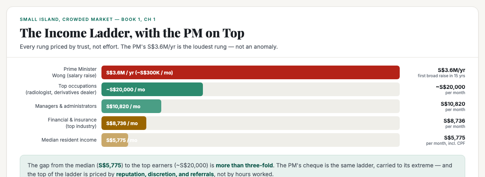
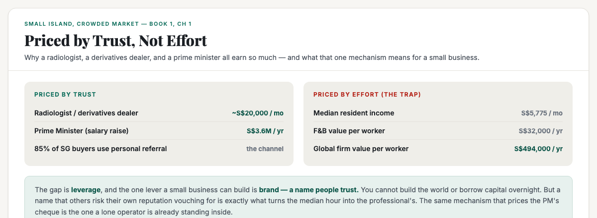

# ObserveCo — Trending-Topic Content Package (Book 1 Quality)

**Date:** 2026-09-08
**Trigger:** Trending on X — "Singapore PM Wong's Salary Rises to S$3.6 Million with Charity Pledge" (topic `2097233350645924237`). Story: the government accepted an independent committee's recommendation to raise PM Wong's annual package from S$2.2M to S$3.6M — the first broad adjustment in 15 years; entry-level ministers rise toward S$1.2M; MPs' monthly allowances rise from S$13,750 to S$18,500; Wong pledged to donate the increase.
**Source visuals:** `05-income-ladder.html` + `16-government-money.html` (Book 1).
**Source manuscript:** `whitepapers/book1-map-manuscript.md` (Ch 1 — the income ladder, trust-first buying, the second payroll, brand-as-multiplier).
**Voice:** Sean's register — first-person, plainspoken, evidence-first, no hype. Teaches the mechanism, not the headline.
**Rule:** Draft only. Nothing posted. Sean pushes the button.

---

# THE FRESH PERSPECTIVE (the wedge)

Every hot take on this story is populist anger: *"S$3.6M for the PM? Tone-deaf while the median earner makes S$5,775 a month."* Both the foreign press and the home commenters read it as greed and disconnect.

This piece does not re-argue that fight. It does something more useful: **it reframes the S$3.6M as the loudest rung of the income ladder — proof, not an outlier.**

The mechanism (the wedge): **Singapore prices labour by reputation, discretion, and referral, not by hours worked.** The radiologist and the derivatives dealer at ~S$20,000/mo. The PM at S$300K+/mo. Even the median earner lives inside a trust-priced economy — 85% of buyers find their solutions through personal referral. When the median earners and the high earners are priced by the same thing, then the S$3.6M isn't a scandal; it's a signal about *how the whole market prices trust* — and that same rung is the one a small business can climb.

**The "so what" for a business owner:** you cannot build a global engine, and you cannot borrow capital overnight. But brand — a name people trust, a reputation others risk their own standing to vouch for — is the one multiplier a lone operator can build. It's what turns the median hour into the professional's. The S$3.6M cheque is priced by the exact mechanism you're already standing inside.

---

# PART ONE — THE X ARTICLE (long-form, Book 1 quality)

## Article: "Singapore's PM Just Got a Raise. Here's What That Salaries Actually Mean for Your Business."

**Format:** X Article, ~1,800–2,200 words, 3 embedded visuals.

---

### The number nobody can look away from

Singapore's Prime Minister is getting a raise. His annual package goes from **S$2.2 million to S$3.6 million** — the first broad adjustment in fifteen years. Ministers rise toward S$1.2 million. MPs' monthly allowances jump from S$13,750 to S$18,500.

The reaction is predictable, and mostly it's fury.

Let me be honest up front: I get the fury. The median Singaporean earns **S$5,775 a month**, including employer CPF. That is the gap that makes the news story land — one man's annual cheque is more than fifty years of the median earner's monthly pay.

But here is what almost every hot take gets backwards. The S$3.6 million is not an anomaly sitting above a sane income map. **It is the loudest rung at the top of a ladder where every rung is priced by the same thing.** And once you see that, the story stops being about the Prime Minister — and starts being about your business.

### Why the top of the ladder pays what it does

Look at who actually sits at the top of Singapore's income ladder. It is not bureaucrats pushing paper. It is the **diagnostic radiologist**, the **derivatives dealer**, the private-practice doctor — the people who earn roughly **S$20,000 a month**, more than three times the median.

Ask yourself what those jobs have in common. It is not that they work three times harder than the person earning S$5,775. Nobody works three times harder. It is that their work is **client- and trust-driven**. A radiologist reads a scan and a surgeon operates on what they found. A derivatives dealer moves a client's money on their word, their judgment, their discretion. Their income rests on the fact that someone wealthy was willing to trust them — and kept trusting them, and referred them.

A man who earns his living because wealthy clients trust his judgment is a man who buys the same way. He values reputation, discretion, and referrals — because his own work is built on those same three things.

Now add the Prime Minister's raise to that ladder and it stops being a scandal and starts being the same mechanism carried to its extreme. The PM's job is priced, in the state's own words, to "attract top talent" for the job that carries the most trust and the most discretion in the country. Whether you agree with the number is a separate argument. But it is not a *different species* of salary from the radiologist's. It is the same species, sitting at the top of the same ladder.

### The median is priced on the same thing

Here is the part people miss, and it is the part that matters for a business.

Singapore's domestic economy does not buy on price and clicks. Roughly **85% of buyers in Singapore find their solutions through personal referral** — someone they trust tells them about you. The most trusted advisor to a small business owner is not an ad, not a website, not a platform. It is **another business owner**.

A language model can sound warm and know the local context and answer fluently. It cannot make a third party stake their reputation on recommending it. That is the mechanism the top of the income ladder is built on — and it is the mechanism the whole domestic economy runs on.

So the S$5,775 median earner and the S$20,000 radiologist and the S$3.6 million Prime Minister are not three unrelated numbers. **They are three rungs of one ladder, and the rungs get higher as the trust gets bigger.**

### The second payroll underneath it all

There is a quieter reason this story should interest you even more, and it connects to the S$97.5 billion the Singapore government spends every year.

The state does not generate its own wages from a market. It **borrows the global engine's benchmark and pays it through the state's brand**. Civil servants are matched to the private sector at the 65th–75th percentile. Every government salary — from the entry-level minister's S$1.2 million down to the teacher's and the nurse's and the officer's — is a **standing order into the domestic economy**, exactly like the banker's. It shows up at your counter, your clinic's reception, your tuition centre, every single month, as reliably as rent.

When a politician's pay rises, that standing order just got slightly bigger. The raise is not parked in a bank vault; it is a marginally larger cheque flowing into the same domestic layer that most small businesses sell into. Anger at the number is fair politics. But pretending it does not touch your market is a business error.

### What this actually means for your business

Stop reading the salary story as a headline to react to. Read it as a **map of how the money is priced**.

- **The premium customer buys on trust.** The top of the income ladder earns what it does because its work is client- and trust-driven — and those people buy the same way. If you want the premium rung of the market (that top 13–15% of households that carries most of the discretionary spend), you compete on reputation, discretion, and referrals. Not on price.
- **The rung you can climb is brand.** You cannot build a global engine, and you cannot borrow capital overnight. But a name people trust — a reputation that a fellow owner will risk their own standing vouching for — is the one multiplier a lone operator can build. It is what turns the median hour into the professional's.
- **The salary review is a reminder, not a scandal.** The most reliable, most defensible buyer in this country (the state, and everyone it pays) keeps getting more valuable to serve. The mechanism that prices the PM's cheque is the mechanism you are already standing inside.

The S$3.6 million is not the story. The ladder underneath it is — and you are on it whether you chose to be or not.

---

# PART TWO — THE X POSTS (beefed up, educational)

## Primary — the trust-pricing mechanism

> Everyone's furious the Singapore PM is getting a raise to S$3.6M/yr while the median earner makes S$5,775/mo.
>
> Here's the part the outrage misses: it's not an anomaly. It's the loudest rung of a ladder where every rung is priced by trust, not effort.
>
> The radiologist makes ~S$20,000/mo. The derivatives dealer ~S$20,000/mo. Not because they work 3x harder — because people's money rests on their word.
>
> 85% of SG buyers find solutions through personal referral. The domestic economy prices by who vouches for you, not price.
>
> You can't build a global engine overnight. But brand — a name people risk their own standing vouching for — is the one rung a lone operator can climb.
>
> The salary story isn't about politicians. It's about how the whole market prices trust. And that's your market too.
>
> #Singapore #SingaporeBusiness #IncomeLadder

## Alt — the second-payroll hook

> Singapore PM Wong gets a raise to S$3.6M/yr. The hot takes call it tone-deaf.
>
> Here's the angle nobody's running: a government salary is a standing order into the domestic economy — as reliable as rent.
>
> The state spends S$97.5B a year and pays its people at the 65th–75th percentile of private pay. Every one of those cheques lands at your counter, your clinic, your tuition centre.
>
> The raise isn't parked in a vault. It's a marginally bigger cheque flowing through the domestic layer most small businesses sell into.
>
> Angry at the number? That's fair. Pretending it doesn't touch your market? That's a business error.
>
> #Singapore #PublicSector #SingaporeBusiness

---

# PART THREE — HASHTAGS (per platform)

## X — keep it to 1–2 tags (the hook + one topic tag)
- Primary: `#Singapore` + `#SingaporeBusiness` (or `#IncomeLadder` / `#PublicSector` for the alt)

---

# STATUS

- [x] Rendered 3 visuals (fig-pm-01, fig-pm-02, banner-pm-ladder) — 1200×440 / 1200×480, verified present + non-blank
- [ ] Sean reviews the X article (Part One)
- [ ] Sean reviews the X post (Part Two — pick primary or alt)
- [ ] Sean posts (I never post without approval)

---

*Draft only. Nothing posted without approval.*
