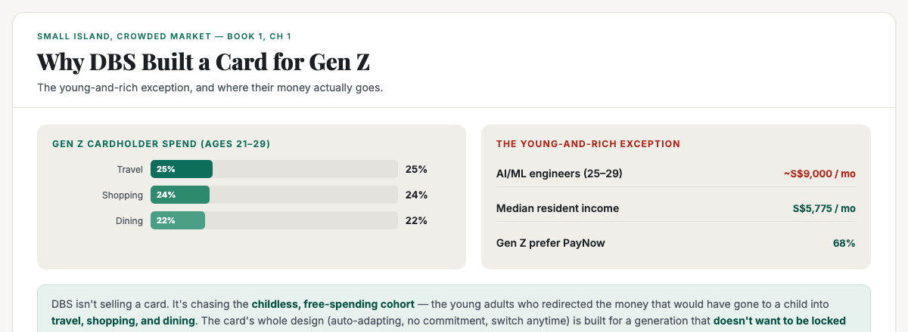
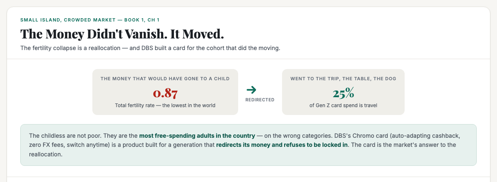

# ObserveCo — Trending-Topic Content Package (Book 1 Quality)

**Date:** 2026-09-09
**Trigger:** Trending on X — DBS launches Chromo + TravelLah! cards for Gen Z (ages 21–29), pitched around "reward maxxing" and "travel hacking."
**Source visuals:** `05-income-ladder.html` + `32-fertility-collapse.html` (Book 1).
**Source manuscript:** `whitepapers/book1-map-manuscript.md` (Ch 1 — the young-and-rich exception, the reallocation, the payments channel).
**Voice:** Sean's register — first-person, plainspoken, evidence-first, no hype. Teaches the mechanism, not the headline.
**Rule:** Draft only. Nothing posted. Sean pushes the button.

---

# THE FRESH PERSPECTIVE (the wedge)

Every hot take on this story is a product review: *"DBS launched a card for Gen Z, here's the cashback math."* Or a cynical one: *"Banks are chasing young customers with shiny cards."*

This piece does not re-argue that. It does something more useful: **it reads the card as a demographic signal, not a product.**

The wedge: **DBS isn't selling a card. It's chasing the childless, free-spending cohort — the young-and-rich exception.** The AI/ML engineers aged 25–29 earning ~S$9,000/mo. The young adults who redirected the money that would have gone to a child into travel, shopping, and dining. The card's whole design — auto-adapting cashback, no commitment, switch anytime — is built for a generation that **doesn't want to be locked in**, which is the same psychology as the fertility collapse.

**The "so what" for a business owner:** when the biggest bank in Southeast Asia redesigns its product around a demographic's *spending psychology*, that's a signal about where the money is going. The card tells you the customer is the childless young adult spending on experiences — and if your business isn't positioned where that spend is going, you're chasing a market that already walked away.

---

# PART ONE — THE X ARTICLE (long-form, Book 1 quality)

## Article: "DBS Just Built a Card for the Childless. Here's What That Tells You About Where Singapore's Money Is Going."

**Format:** X Article, ~1,800–2,200 words, 3 embedded visuals.

---

### The number nobody can look away from

DBS just launched a credit card for people aged 21 to 29. It's called **Chromo**, and it does something no other card in Singapore does: it **automatically** gives you up to 5% cashback on your top two spending categories each month. You don't pick categories. You don't plan ahead. The card watches where you actually spend and rewards you there.

There's also a debit card called **TravelLah!** with zero foreign-exchange fees on overseas spending.

The marketing calls it "reward maxxing" and "travel hacking." The cynic calls it a bank chasing young customers. Both are missing the point.

This is not a card story. **This is a demographic signal wearing a credit card** — and it tells you more about where Singapore's money is going than any earnings report.

### The young-and-rich exception

Here's the first thing the card tells you. DBS is not chasing poor students. It is chasing a specific, unusually well-paid cohort.

Look at the income ladder. The median Singaporean earns **S$5,775 a month**. But there is a striking exception: **AI/ML engineers aged 25 to 29 earn roughly S$9,000 a month** — more than half again the median, at an age when most people are still paying off their first car loan.

These are the young-and-rich. They have money, they have no children, and they have no intention of being locked into anything.

DBS's own survey found that for young adults, the top two considerations in a card are *ease of earning rewards* and *benefits on the categories where they spend most*. And where do they spend? **Travel 25%, shopping 24%, dining 22%.** That's the whole story in three numbers.

### The reallocation

Now connect it to the bigger picture, because this is the part that matters.

Singapore's fertility rate is **0.87** — the lowest in the world. The money that would have gone to a child — to the school, the nappies, the enrichment — did not vanish. It **redirected**. It went to the dog, the restaurant, the trip.

The childless are not poor. They are the **most free-spending adults in the country** — on the wrong categories. And DBS has built a card for exactly that.

The card's design is the tell. Chromo doesn't ask you to commit to a category. It adapts to wherever you spend each month. You can switch between cashback and miles once a month without losing what you've earned. Zero FX fees overseas. Partner deals with Trip.com, Agoda, Klook, Shopee, TikTok Shop, Haidilao — and merchants in Malaysia, Japan, and South Korea.

This is a product built for a generation that **refuses to be locked in**. The same psychology that drives the fertility collapse — fewer commitments, more flexibility, experiences over things — is the psychology this card is engineered around.

### The rails underneath it all

There's a quieter layer worth naming. A card is just the front door. Underneath it are the **payment rails** — and that's where the real money is.

Digital wallets are ~39% of online and ~29% of in-person spend in Singapore. **PayNow is the dominant rail — 68% of Gen Z prefer it.** DBS PayLah! leads the wallets at ~26%, ahead of GrabPay, ShopeePay, Google and Apple Pay.

The digital banks — Trust, GXS, MariBank, ANEXT, Green Link — are each an ecosystem tie-up. A channel owns the transaction, not the brand.

So when DBS launches a Gen Z card, it's not just selling plastic. It's trying to own the **transaction** — the moment the childless young adult's money moves. That's the real prize, and it's the same prize every business in the domestic layer is competing for.

### What this actually means for your business

Stop reading the card launch as a product review. Read it as a **map of where the money is going**.

- **The customer is the childless young adult.** The most free-spending, most discretionary cohort in the country — and they spend on travel, shopping, dining, experiences. If your business is built on the family of four, the family of four is disappearing.
- **They refuse to be locked in.** The card's whole design — auto-adapting, no commitment, switch anytime — is the psychology of the cohort. If your business demands loyalty and commitment, you're fighting the current. If you meet them where they are, you win.
- **The rails matter more than the brand.** The card is the front door; the transaction is the prize. Whoever owns the moment the money moves owns the relationship.

The DBS card is not a story about a bank. It's a story about **who Singapore's money is going to** — and whether your business is on the side of the money that's moving, or the side that's gone.

---

# PART TWO — THE X POSTS (beefed up, educational)

## Primary — the reallocation mechanism

> DBS just launched a card for Gen Z. The marketing calls it "reward maxxing." The cynic calls it a bank chasing young customers.
>
> Here's the part nobody's saying: it's a demographic signal wearing a credit card.
>
> The card auto-adapts to where you spend. No commitment. Switch anytime. Zero FX fees. It's built for a generation that refuses to be locked in.
>
> Why? Because the childless are the most free-spending adults in the country. The money that would've gone to a child went to the trip, the table, the dog.
>
> AI/ML engineers aged 25–29 earn ~S$9,000/mo — the young-and-rich exception. Their spend: travel 25%, shopping 24%, dining 22%.
>
> When the biggest bank in SEA redesigns its product around a demographic's psychology, that's a signal about where the money is going. Is your business on the side that's moving, or the side that's gone?
>
> #Singapore #SingaporeBusiness #GenZ

## Alt — the "rails" hook

> DBS launched Chromo + TravelLah! for Gen Z. Everyone's reviewing the cashback.
>
> The real story is the rails underneath. A card is just the front door — the prize is owning the transaction.
>
> PayNow is the dominant rail: 68% of Gen Z prefer it. DBS PayLah! leads wallets at ~26%. Digital banks (Trust, GXS, MariBank) are each an ecosystem tie-up.
>
> A channel owns the transaction, not the brand. When DBS chases Gen Z, it's trying to own the moment the childless young adult's money moves.
>
> That's the same prize every business in the domestic layer is competing for.
>
> #Singapore #Fintech #Payments

---

# PART THREE — HASHTAGS (per platform)

## X — keep it to 1–2 tags (the hook + one topic tag)
- Primary: `#Singapore` + `#SingaporeBusiness` (or `#GenZ` / `#Fintech` for the alt)

---

# STATUS

- [x] Rendered 3 visuals (fig-dbs-01, fig-dbs-02, banner-dbs-genz) — 1200×440 / 1200×480, verified present + non-blank
- [ ] Sean reviews the X article (Part One)
- [ ] Sean reviews the X post (Part Two — pick primary or alt)
- [ ] Sean posts (I never post without approval)

---

*Draft only. Nothing posted without approval.*
