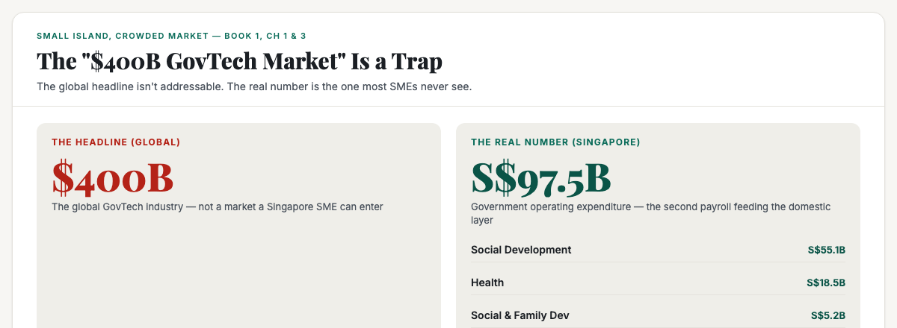
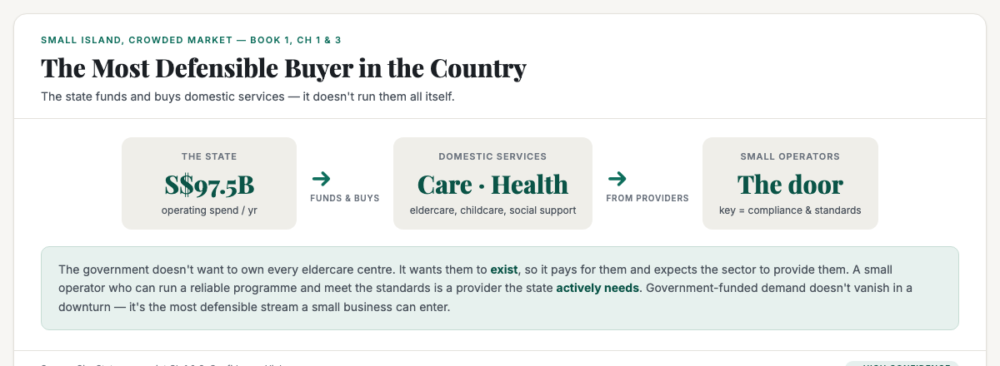

# ObserveCo — Trending-Topic Content Package (Book 1 Quality)

**Date:** 2026-09-09
**Trigger:** Trending on X — "GovTech: the $400B market hiding in plain sight." The $400B figure is the *global* GovTech industry size; the GovInsider piece (with Cambridge's Dr Tanya Filer) argues "all GovTech is local."
**Source visuals:** `16-government-money.html` + `20-five-streams.html` (Book 1).
**Source manuscript:** `whitepapers/book1-map-manuscript.md` (Ch 1 & 3 — the second payroll, the five streams, the most defensible buyer).
**Voice:** Sean's register — first-person, plainspoken, evidence-first, no hype. Teaches the mechanism, not the headline.
**Rule:** Draft only. Nothing posted. Sean pushes the button.

---

# THE FRESH PERSPECTIVE (the wedge)

Every hot take on this story is either hype ("$400B! The market is huge!") or a correction ("that's global, not Singapore"). Both miss the useful point.

This piece does not re-argue the number. It does something more useful: **it reframes the "$400B" as a trap, and points to the real number that most SMEs never see.**

The wedge: **the "$400B" is a global headline, not a door you can walk through. The door that's real is the S$97.5B the state moves through the domestic economy — and a large share is spent on services the state funds and buys from providers, not runs itself.** That's the market hiding in plain sight: the most defensible buyer in the country, and the one most businesses never think to serve.

**The "so what" for a business owner:** you can't enter a global GovTech market. But you can qualify for the government-funded domestic services stream — eldercare, childcare, health, social support — where the state actively needs providers. The gate is compliance and standards, not capital. Government-funded demand doesn't vanish in a downturn.

---

# PART ONE — THE X ARTICLE (long-form, Book 1 quality)

## Article: "The '$400B GovTech Market' Is a Trap. Here's the Real Number Most Singapore Businesses Never See."

**Format:** X Article, ~1,800–2,200 words, 3 embedded visuals.

---

### The number nobody can look away from

There's a story doing the rounds that GovTech is a **$400 billion market hiding in plain sight**. It sounds enormous. It sounds like the opportunity of a lifetime.

It's a trap.

The $400 billion is the **global** GovTech industry — every government's technology spend, from Singapore to Sweden to Senegal. It is not a market a Singapore small business can enter. You are not going to win a contract to digitise a Scandinavian tax authority.

But here's the thing. The people who wrote that headline were pointing at something real. They just aimed at the wrong number. The real number — the one that actually matters for a business in Singapore — is **S$97.5 billion**. And it's hiding in plain sight.

### The second payroll

Let me explain what that S$97.5 billion actually is.

It's the Singapore government's **operating expenditure for a single year**. Not the reserves. Not borrowing. That is the money the state moves through the economy to run the country.

The biggest single block is **social development at S$55.1 billion** — 56.5% of the whole budget. Health follows at **S$18.5 billion**. Social and family development at **S$5.2 billion**. And it pays **158,000 public servants**, benchmarked at the 65th to 75th percentile of private-sector pay.

Here's the mechanism most people miss. The government engine does not generate its own wages from a market. It **borrows the global engine's benchmark and pays it through the state's brand**. Every government salary — from the minister's down to the teacher's and the nurse's — is a **standing order into the domestic economy**, exactly like the banker's. It shows up at your counter, your clinic's reception, your tuition centre, every single month, as reliably as rent.

There are two payrolls feeding the domestic layer. The banker's salary is one. The government's payroll is the other — and it is the quietest. It does not rise and fall with the global business cycle. It is a second, steadier pipeline.

### The door that's real

Now, a lot of that S$97.5 billion goes to things no small business will ever touch. Defence. Infrastructure. The machinery of government itself. You are not going to build an MRT line and you are not going to supply the navy.

But here is the key that unlocks this stream: a very large share of government spending in Singapore is spent on **domestic services** — care for the elderly, health services, early childhood education, social support, community programmes. And the state does not run most of these services directly. **It funds them, and it buys them from providers.**

The government does not want to own and run every eldercare centre in the country. It wants those centres to *exist*, so it pays for them, and it expects the sector to provide them. A small operator who can run a reliable eldercare programme, who can manage a team of carers, who can meet the licensing and reporting standards, is a provider the state **actively needs**.

The same logic runs through early childhood. Childcare, infant care, and preschool places are in constant demand, and the state funds the supply. A small, well-run childcare centre is helping the government meet a demand, not fighting it.

### The honest gate

I will not hide the hard part. The government money stream has a gate, and the gate is **compliance**. You cannot drift into this stream the way you can drift into a consumer shop. There are standards to meet, staff qualifications to hold, audits to pass, and a long sales cycle measured in years rather than weeks.

If you are a lone owner with no tolerance for paperwork, this stream will frustrate you.

But if you are willing to build a proper organisation, this is the **most defensible stream a small business can enter**. Government-funded services do not vanish in a downturn. The demand for care does not fall when the economy slows. In a country where the population is ageing and the state has committed to funding the answer, this stream is steady, and it is growing.

The other door is smaller but worth naming. The state spends money every day with small vendors on the ordinary goods and services it needs to keep running — printing, cleaning, catering, maintenance, equipment. Getting onto the government's vendor list takes work, and the competition is real, but it is not closed. If you can supply a reliable, modest service at a fair price, the state is actually a good customer. It pays on time, it pays in full, and it does not vanish in a downturn.

### So who is the customer?

Sometimes it is the state itself, buying a service. More often it is the citizen who receives the funded service, with the state standing behind the payment.

What do they buy? Care, health, education, and the social services that hold a dense, ageing city together.

Can a small business sell into it? Yes, genuinely, and more openly than most owners believe. But it is a stream you **qualify for**, not one you walk into. The door is real, and the door is locked, and you need the key of compliance and standards to open it.

The "$400B" headline is a trap. The S$97.5 billion is the real number — and the most reliable customer in this country is the one most businesses never think to serve.

---

# PART TWO — THE X POSTS (beefed up, educational)

## Primary — the "$400B trap" mechanism

> "GovTech is a $400B market hiding in plain sight."
>
> It's a trap. That's the GLOBAL number. You're not going to digitise a Scandinavian tax authority.
>
> The real number for a Singapore business is S$97.5B — government operating spend in a single year.
>
> And a huge share of it is spent on services the state funds but doesn't run: eldercare, childcare, health, social support. The state buys them from providers.
>
> A small operator who can meet the standards is a provider the state actively needs. Government-funded demand doesn't vanish in a downturn.
>
> The door is real, and the door is locked. The key is compliance and standards. But for the business that qualifies, this is the most defensible stream in the country.
>
> #Singapore #GovTech #SingaporeBusiness

## Alt — the "second payroll" hook

> The "$400B GovTech market" is trending. Here's the angle nobody's running.
>
> The government spends S$97.5B a year. It pays 158,000 public servants at the 65th–75th percentile of private pay.
>
> That's not a regulator. That's the second payroll feeding the domestic economy — a standing order that shows up at your counter every month, as reliably as rent.
>
> The state doesn't generate its own wages from a market. It borrows the global engine's benchmark and pays it through the state's brand.
>
> The most defensible market in Singapore is the one most businesses never think to serve.
>
> #Singapore #PublicSector #SingaporeBusiness

---

# PART THREE — HASHTAGS (per platform)

## X — keep it to 1–2 tags (the hook + one topic tag)
- Primary: `#Singapore` + `#GovTech` (or `#PublicSector` / `#SingaporeBusiness` for the alt)

---

# STATUS

- [x] Rendered 3 visuals (fig-gov-01, fig-gov-02, banner-govtech-400b) — 1200×440 / 1200×480, verified present + non-blank
- [ ] Sean reviews the X article (Part One)
- [ ] Sean reviews the X post (Part Two — pick primary or alt)
- [ ] Sean posts (I never post without approval)

---

*Draft only. Nothing posted without approval.*
