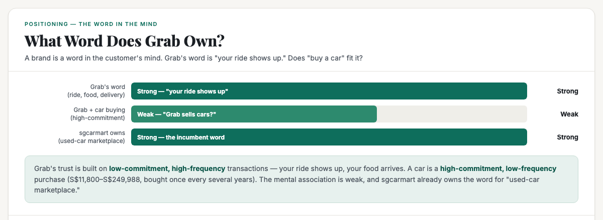
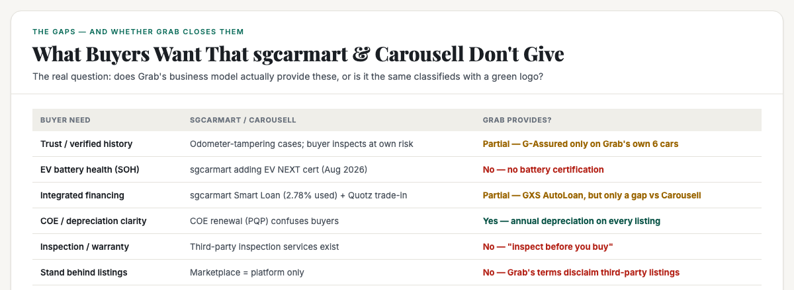
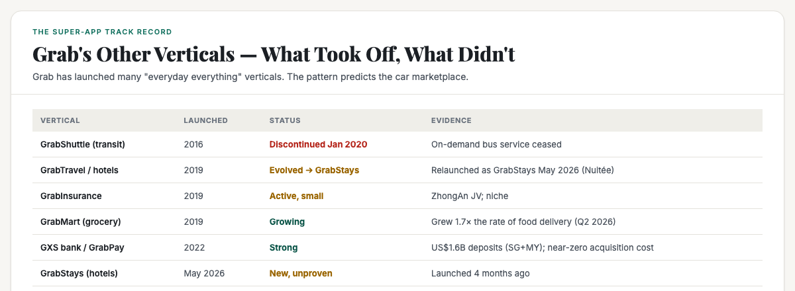

# ObserveCo — Trending-Topic Content Package (Book 1 Quality)

**Date:** 2026-09-09
**Trigger:** Trending on X — "Grab launches car marketplace with new and pre-owned vehicles for sale" (ST, 09 Sep 2026).
**Source visuals:** `fig-grab-01-word.html`, `fig-grab-02-gaps.html`, `fig-grab-03-track-record.html`, `banner-grab-car.html`.
**Source manuscript:** `whitepapers/book1-map-manuscript.md` (Ch 1 — own a word, walls vs doors, category vs position).
**Voice:** Sean's register — first-person, plainspoken, evidence-first, no hype. Teaches the mechanism, not the headline.
**Rule:** Draft only. Nothing posted. Sean pushes the button.

---

# THE FRESH PERSPECTIVE (the wedge)

Every hot take on this story is either a product review ("Grab sells cars now, here's the listings") or a cynical one ("super-app bloat"). Both miss the useful question.

This piece does something more useful: **it reads the launch through the lens of positioning — the single most important idea in marketing that most people have never heard of.** It teaches the reader what a "word in the mind" is, then applies it to the car marketplace.

The wedge: **Grab's word is "your ride shows up." A car is the opposite kind of purchase. The marketplace only works if Grab closes a real gap that sgcarmart and Carousell don't — and the evidence says it closes two, but leaves the most important one (trust) open.**

**The "so what" for a business owner:** this is a masterclass in the difference between a *category* and a *position*. Grab is entering a category (car sales) where it doesn't own a word. The same lesson applies to any small business: entering a crowded category without owning a word is a fight you'll lose; owning a specific word is the only ground you can win.

---

# PART ONE — THE X ARTICLE (long-form, Book 1 quality)

## Article: "Grab Now Sells Cars. Here's the Positioning Trap Hiding in It."

**Format:** X Article, ~2,200–2,600 words, 4 embedded visuals.

---

### The number nobody can look away from

Grab quietly opened a car sales site on 9 September 2026. **Car Marketplace by Grab** — at rentals.grab.com/car-marketplace — sells new and used cars to the general public, not just to Grab drivers.

On launch evening it carried **44 cars** from eight sellers: 24 brand new and 20 used, priced from **S$11,800 to S$249,988**. Only 7 of the 44 run on petrol alone; the rest are electric, hybrid, or plug-in hybrid.

The cheapest six are Grab's own retired private-hire cars. Every one has done between **527,000 and 719,000 km** — what an ordinary family car would take three decades to cover — and every one has a COE that expires in 2027.

That's the story on the surface. But there's a deeper question underneath it, and it's the one almost nobody is asking.

**Does Grab own the word for this?**

### The idea most people have never heard of: a brand is a word in the mind

Before we get to Grab, I need to teach you the single most useful idea in marketing — because it's the lens that makes this story make sense.

Here it is: **a brand is not a logo, a product, or a company. A brand is a word in the customer's mind.**

When you hear "Volvo," you think *safety*. When you hear "Domino's," you think *30 minutes*. When you hear "Grab," you think *your ride shows up*. That's not an accident. It's the whole game.

The reason this matters is that the human mind has a short list for every category. Ask someone to name a ride-hailing app and they'll say Grab, maybe Gojek. Ask them to name a second one and they'll struggle. The mind keeps a short list of who's best at something — and the brands at the top of that list get the business.

This is called **positioning**. And there's a brutal corollary that every business owner needs to understand:

**A category is not a position.** "Care" is a category — a thousand companies do care, and none of them can be referred for it. "The dementia specialist" is a position — a specific word a person can put their name on. The difference is the difference between competing on price and being the name people recall.

So when Grab launches a car marketplace, the question isn't "can Grab sell cars?" It's: **does "buy a car" fit the word Grab already owns?**

### The word Grab owns — and the word it doesn't

Grab's word is built on **low-commitment, high-frequency** transactions. Your ride shows up. Your food arrives. Your groceries get delivered. These are small, frequent, trust-light purchases — you don't agonize over a S$15 ride.

A car is the exact opposite. It's a **high-commitment, low-frequency** purchase. S$11,800 to S$249,988. Bought once every several years. The buyer agonizes for weeks. And the trust calculus is completely different — you're not trusting "your ride shows up," you're trusting "this car is worth S$100,000 and won't break next month."

Here's the uncomfortable truth: **when you hear "buy a used car in Singapore," the word that comes to mind is sgcarmart, not Grab.** sgcarmart owns that word. It's been the used-car marketplace for two decades. Grab is entering a category where a strong incumbent already owns the position.

This is what positioning theory calls a **wall** — a category where a few names hold the money and the customer can only name them. You don't fight a wall head-on. You find the crack.

So the real question becomes: **is there a crack? Is there something sgcarmart and Carousell don't give buyers that Grab can?**

### What buyers want that sgcarmart and Carousell don't give

I researched this carefully. Here's what Singapore car buyers actually want, and whether the incumbents provide it:

**1. Trust / verified history.** This is the big one. Buying a used car in Singapore is genuinely scary — there are documented odometer-tampering cases, and the buyer is told to "inspect at your own risk." sgcarmart is a marketplace, not a guarantor. Carousell is worse — it's a general classifieds site with a documented scam problem. Neither stands behind the car.

**2. EV battery health.** This is new and growing. As EVs flood the market, buyers want to know the battery's State of Health (SOH) — the single most expensive component. sgcarmart is only now adding an EV battery certification (EV NEXT, Aug 2026). It's a real, emerging gap.

**3. Integrated financing.** Buying a car means arranging a loan, and the process is fragmented. sgcarmart already has a Smart Loan (2.78% for used cars) and a Quotz trade-in valuation. So this is a gap mainly for **Carousell**, not sgcarmart.

**4. COE / depreciation clarity.** This is the most confusing part of buying a car in Singapore. A S$11,800 car with a COE expiring in 2027 is really a S$11,800 car for eight months, then a decision worth S$60,000–S$126,000 (the COE renewal PQP). Most buyers don't understand this until it's too late.

**5. Inspection / warranty.** Independent inspection services exist, but they're separate, paid, and the buyer has to arrange them.

**6. Standing behind the listing.** This is the deepest gap. A marketplace that *vouches* for the car would be worth paying for. Neither sgcarmart nor Carousell does this.

### Does Grab actually close these gaps?

This is where the analysis gets interesting — and where the stars either align or don't.

**What Grab DOES provide:**
- **Integrated financing.** The marketplace is run by GrabRentals, and it pushes **GXS AutoLoan** — Grab's own digital bank. This is a real gap-closer **vs Carousell** (which has no financing), though sgcarmart already has a Smart Loan. The seamlessness — financing through the same app you use for rides — is the edge.
- **Depreciation clarity.** Every listing shows an annual depreciation figure — the number Singapore buyers actually compare. That's genuinely useful, and most classifieds don't put it front and center.

**What Grab does NOT provide:**
- **Trust / verified history.** Here's the kicker. Grab's own terms say it does **not** vouch for the accuracy of any third-party listing — the mileage, the condition, the accident history. For the 38 cars sold by outside dealers, Grab is just the platform. The "guaranteed mileage" promise on its landing page applies only to Grab's own 6 cars (the G-Assured ones — which are the 527,000-km ex-fleet cars).
- **EV battery certification.** No SOH certification on the marketplace.
- **Inspection / warranty.** The terms say "inspect before you buy, as you would anywhere else."

So here's the honest verdict: **Grab closes one real gap (depreciation clarity) and offers a seamless financing option (vs Carousell, though sgcarmart already has loans), but leaves the most important one — trust — wide open.** The one thing that would justify a new marketplace, verified trust, is exactly what Grab does not provide for most of its listings.

### The super-app track record — does this pattern predict success?

Grab has launched a lot of "everyday everything" verticals. The pattern is instructive:

- **GrabShuttle (transit)** — launched 2016, **discontinued January 2020**. On-demand bus service, gone.
- **GrabTravel / hotels** — launched 2019, kept relaunching, now **GrabStays** (May 2026, via Nuitée). Still unproven.
- **GrabInsurance** — launched 2019 (ZhongAn JV). Active but niche.
- **GrabMart (grocery)** — launched 2019. **Growing** — grew 1.7× the rate of food delivery in Q2 2026.
- **GXS bank / GrabPay** — launched 2022. **Strong** — US$1.6B deposits in SG+MY, near-zero acquisition cost.

The pattern is clear: **Grab wins where it extends an existing high-frequency habit** (food → groceries, rides → payments). It struggles where it **jumps into a low-frequency, high-commitment category** (transit was discontinued; travel keeps relaunching).

A car is the **lowest-frequency, highest-commitment** purchase of all. By Grab's own track record, that's the hardest kind of category for it to win.

### So — is this a good idea?

Let me be honest, because that's the whole point of this piece.

**The positioning case against:** Grab doesn't own the word for car-buying. sgcarmart does. Grab's trust is built on low-commitment, high-frequency transactions, and a car is the opposite. Its own track record says it struggles in low-frequency categories. And it's not even closing the one gap — trust — that would justify a new marketplace.

**The positioning case for:** Grab is a *marketplace* company, and a car marketplace is a marketplace. It has the distribution (millions of users), the financing (GXS), and the data (it knows what cars drivers actually use). If it positions this as "the platform that helps Singaporeans go electric" — extending its mobility word — it's a coherent flank, not a jump. The EV angle is genuinely differentiated: all 20+ new cars are EV/hybrid, and Grab has a real driver ecosystem to feed.

**The verdict:** the stars are **not** fully aligned. Grab closes two real gaps but leaves the trust gap open — and trust is the one thing that would make a new car marketplace worth it. It's a defensible flank if Grab leads with the EV/driver-ecosystem angle, but it's a category stretch if Grab positions it as "Grab, now selling cars."

### What this means for your business

This isn't just a story about Grab. It's a masterclass in the difference between a category and a position — and that lesson applies to every small business in Singapore.

- **A category is not a position.** "Care" is a category. "The dementia specialist" is a position. "Car marketplace" is a category. "The platform that helps you go electric" is a position. The business that owns a specific word is the one that gets referred; the business that competes in a vague category competes on price.
- **Don't fight a wall head-on.** If a few names own the money in your category (like sgcarmart owns used cars), you don't enter and compete on price. You find the crack — the word, the niche, the gap they don't own.
- **The gap that matters is trust.** In a market that buys on referral (85% of Singapore buyers find solutions through personal referral), the business that a trusted person will vouch for is the one that wins. Grab's car marketplace is a case study in what happens when you enter a trust-driven category without providing the trust.

Grab's car marketplace is not a story about a super-app. It's a story about **what happens when a brand enters a category where it doesn't own a word** — and whether it can find the crack. The same question is the one every small business should ask about its own market.

---

# PART TWO — THE X POSTS (beefed up, educational)

## Primary — the positioning mechanism

> Grab quietly launched a car marketplace. 44 cars, S$11,800 to S$249,988. All new cars are EV/hybrid.
>
> The hot takes are calling it super-app bloat. Here's the question nobody's asking: does Grab own the word for this?
>
> A brand is a word in the customer's mind. Grab's word is "your ride shows up." A car is the opposite — high-commitment, low-frequency, bought once every several years.
>
> When you hear "buy a used car in Singapore," you think sgcarmart, not Grab. That's a wall, not a door.
>
> So does Grab close a real gap? It offers GXS AutoLoan financing (though sgcarmart already has loans) and depreciation clarity on every listing.
>
> But it leaves the big one open: trust. Grab's own terms say it doesn't vouch for 38 of its 44 listings. The "guaranteed mileage" promise only covers its own 6 cars — the 527,000-km ex-fleet ones.
>
> Grab's track record: it wins where it extends a high-frequency habit (food→groceries, rides→payments). It loses where it jumps into low-frequency categories (GrabShuttle was discontinued).
>
> A car is the lowest-frequency, highest-commitment purchase of all.
>
> The lesson for every business: a category is not a position. Entering a crowded category without owning a word is a fight you'll lose. Owning a specific word is the only ground you can win.
>
> #Singapore #SingaporeBusiness #Positioning

## Alt — the "trust gap" hook

> Grab now sells cars. The interesting part isn't the cars — it's what Grab does and doesn't vouch for.
>
> 44 listings at launch. But Grab's own terms say it does NOT vouch for the accuracy of 38 of them — the mileage, the condition, the history.
>
> The "guaranteed mileage" promise? Only on Grab's own 6 cars. Which are the 527,000-km ex-fleet ones with COEs expiring 2027.
>
> So the one thing that would justify a new car marketplace — verified trust — is exactly what Grab doesn't provide for most cars.
>
> In a market where 85% of buyers find solutions through personal referral, trust is the whole game. Grab entered a trust-driven category without providing the trust.
>
> #Singapore #SingaporeBusiness #Trust

---

# PART THREE — HASHTAGS (per platform)

## X — keep it to 1–2 tags (the hook + one topic tag)
- Primary: `#Singapore` + `#SingaporeBusiness` (or `#Positioning` for the primary)

---

# STATUS

- [x] Rendered 4 visuals (fig-grab-01, fig-grab-02, fig-grab-03, banner-grab-car) — 1200×440 / 1200×480, verified present + non-blank
- [ ] Sean reviews the X article (Part One)
- [ ] Sean reviews the X post (Part Two — pick primary or alt)
- [ ] Sean posts (I never post without approval)

---

*Draft only. Nothing posted without approval.*
