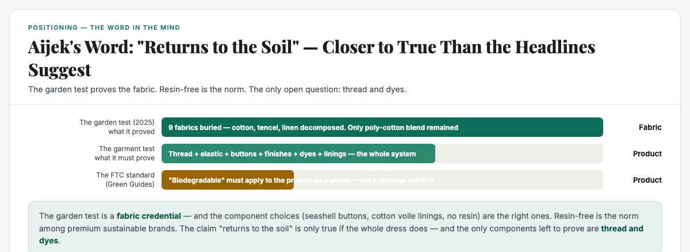
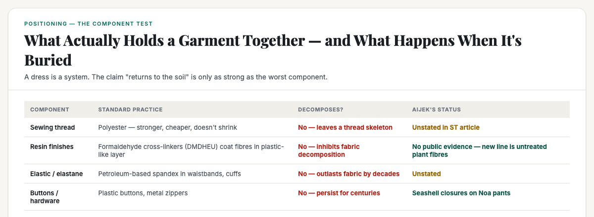

# ObserveCo — Trending-Topic Content Package (Book 1 Quality)

**Date:** 2026-09-10
**Trigger:** Trending on X — "Multi-million dollar S'pore fashion brand Aijek relaunches after 7-year hiatus" (ST, 10 Sep 2026).
**Source visuals:** `fig-aijek-01-word.html`, `fig-aijek-02-components.html`, `fig-aijek-03-trust.html`, `banner-aijek.html`.
**Source manuscript:** `whitepapers/book1-map-manuscript.md` (Ch 1 — own a word, walls vs doors, category vs position) + `whitepapers/print/output/ebook/book2-manuscript-CURRENT.md` (Ch 1 — the word in the mind, credentials, being first in the mind vs first in time).
**Voice:** Sean's register — first-person, plainspoken, evidence-first, no hype. Teaches the mechanism, not the headline.
**Rule:** Draft only. Nothing posted. Sean pushes the button.

---

# THE FRESH PERSPECTIVE (the wedge)

Every hot take on this story is either a comeback story ("she's back after 7 years!") or a sustainability puff piece ("now 100% biodegradable!"). Both miss the useful question.

This piece does something more useful: **it answers the question everyone is asking wrong — "will the rebranding succeed?" — by testing the claim the way it should be tested: at the component level, not the surface level.** The garden test proves the *fabric* decomposes. But a garment is not a swatch. It's a system — sewing thread, elastic, buttons, linings, resin finishes, dyes. And a "biodegradable" claim is only as strong as the worst component in that system.

The wedge: **Aijek's word is "returns to the soil." The garden test proves her fabrics do. The question that decides whether the word is true — and whether the rebranding survives scrutiny — is whether the whole garment returns to the soil, not just the fabric.** The good news: resin-free is not only possible, it's the norm among the premium sustainable brands Aijek is positioning against — and there's no public evidence Aijek uses resin. The remaining question is narrow: what thread are the garments sewn with, and what dyes are used? Those two components are undisclosed — and they're the only ones that could still fail the claim.

**The "so what" for a business owner:** the same trap we established with GreenPackers applies here. A claim is only as good as the weakest link. The garden test is a credential — but it's a fabric credential, not a garment credential. The rebranding succeeds if she can show the whole garment passes the test — and the evidence so far says she's closer to that than any competitor in the market.

---

# PART ONE — THE X ARTICLE (long-form, Book 1 quality)

## Article: "Aijek's 'Returns to the Soil' Claim Is Closer to True Than You Think. Here's the Component Test Nobody's Running."

**Format:** X Article, ~2,200–2,600 words, 4 embedded visuals.

---

### The number nobody can look away from

On 24 September, a Singapore fashion brand that hasn't sold a single piece in seven years will open its doors again. **Aijek** — the label that once pulled in close to **$4 million a year**, worked with **15 factories**, and was stocked in **about 200 stores** across Asia and the US, including Tangs, Anthropologie, Shopbop, Neiman Marcus and Bloomingdale's — is relaunching.

The comeback story is already being written. Founder Danelle Woo shut the brand down in 2019 because the success was eating her life — she was jetting between Shanghai, Singapore and New York so often she'd wake up not knowing which city she was in. Seven years later, she's back with a new promise: **100% plant-based, biodegradable fabrics. "The key is that after the lifespan of the textile is up, it can return to the soil. You can't have even 1 per cent of polyester."**

And she has a story to back it. In 2025, she buried samples of nine fabrics in her father's garden. Six months later, the cotton, tencel and linen were gone. Only the recycled polyester-cotton blend remained.

It's a great story. It's also a **fabric test, not a garment test** — and that's the difference between a real claim and a superficial one.

### The garden test proves the fabric. It says nothing about the garment.

Here's the problem with the garden test, and it's the same problem we established with GreenPackers: **a claim is only as strong as the worst component.**

A garment is not a swatch. It's a system. When you buy a dress, you're not buying a piece of fabric — you're buying fabric **plus** sewing thread, **plus** elastic, **plus** buttons, **plus** lining, **plus** finishes, **plus** dyes. And every one of those components has its own end-of-life behaviour.

The garden test buried **nine fabrics**. It did not bury a **garment**. And the difference matters, because the components that hold a garment together are exactly the ones that don't decompose.

### The components that kill a "biodegradable" claim

Let me walk through what's actually in a garment, and what happens to each part when it's buried:

**1. Sewing thread.** Standard garment construction uses **polyester thread** — it's stronger, cheaper, and doesn't shrink like cotton thread. Polyester does not biodegrade. A cotton dress sewn with polyester thread doesn't decompose as a garment: the fabric rots away and leaves a **polyester thread skeleton** behind. The claim "returns to the soil" is false for the object you actually bought, even if the main material is true.

**2. Resin finishes.** This is the hidden one. Anti-wrinkle treatments use **cross-linking resins** — typically formaldehyde-based compounds like DMDHEU — that bond with cellulose fibres. The resin **coats the fibre in a plastic-like layer** that inhibits biodegradation. The research is blunt: *"Chemical resins used for wrinkle resistance turn biodegradable cotton into a persistent environmental pollutant."* A GOTS-certified organic cotton dress treated with a non-biodegradable resin finish **voids its eco-credentials** — the certification applies to the fibre, not the finish. Even a 100% natural fibre can be made non-biodegradable by what's put on it.

**3. Elastic and elastane.** Waistbands, cuffs, and stretch panels use **spandex/elastane** — petroleum-based, non-biodegradable, and notoriously hard to recycle. A dress with an elastane waistband has a component that will outlast the fabric by decades.

**4. Buttons and hardware.** Aijek gets this one right — the Noa pants use **seashell closures in place of plastic buttons**. But zippers, metal hardware, and plastic buttons persist for centuries. The industry's own assessment: *"Traditional hardware often persists in the environment for centuries while the primary fabric may disappear much sooner."*

**5. Dyes and mordants.** Natural dyes can be fine; heavy-metal mordants (chrome, copper, tin) can contaminate soil as the fabric degrades. The claim "returns to the soil" implies the breakdown products are safe — that's a separate test from "it decomposed."

**6. Linings and interlinings.** Aijek's Freya dress is "fully lined in soft cotton voile" — good. But many garments use polyester linings and fusible interlinings (glued synthetic webs) that don't decompose.

### The standard that matters: the FTC Green Guides

Here's the regulatory reality. The FTC's Green Guides — the US standard that most global brands design to — require that a **"biodegradable" claim be substantiated for the product as a whole**, not for a material within it. The product must completely decompose within a reasonably short period after customary disposal.

The key word is **product**. A cotton dress sewn with polyester thread is not a biodegradable product — the thread doesn't decompose. A cotton dress with a resin finish is not a biodegradable product — the finish inhibits decomposition. The claim is only as strong as the worst component, and the standard is written that way on purpose.

So the question for Aijek is not "do your fabrics decompose?" It's: **"does the whole garment decompose — thread, elastic, buttons, finishes, dyes, linings?"**

### What Aijek actually gets right — and what's unproven

Let me be fair, because the brand is doing more than most — and the resin question deserves an honest answer.

**On resin finishes: there is no public evidence Aijek uses them.** I researched this thoroughly. The ST article, aijek.com, the Instagram account, and retailer listings contain no mention of resin finishes, anti-wrinkle treatments, or chemical coatings. The new collection's fabrics are ramie, cotton voile, and plant-based fibres — and the brand's whole promise is "you can't have even 1 per cent of polyester." That's a genuine break from the old Aijek, which used synthetics: an eBay listing shows a "95% silk 5% Spandex" lace dress, and the Padua romper was "100% poly" per ModeSens. The new line is materially different.

**But the component question remains open — and it's not about resin specifically.** The ST article doesn't say what thread the garments are sewn with, whether there's elastic in any piece, or what dyes are used. Ramie is notoriously wrinkle-prone — which means either the brand accepts wrinkles (consistent with its "easy, breezy" casual positioning) or it uses some finish it hasn't disclosed. The honest answer: no evidence of resin, but no evidence of the full component list either.

**What's right:**
- The **zero-polyester rule** on fabrics is real and strict — "you can't have even 1 per cent of polyester."
- The **seashell closures** on the Noa pants replace plastic buttons — a genuine component-level choice.
- The **cotton voile linings** on the Freya and Thea dresses avoid polyester linings.
- The **kerawang embroidery** is done by hand with traditional foot-operated machines — no synthetic thread from modern machines (though the thread itself is still a question).

**What's unproven — and the article doesn't say:**
- **What thread are the garments sewn with?** The ST article doesn't say. If it's polyester, the "returns to the soil" claim fails at the seam.
- **Is there any elastic in the collection?** The Noa pants have a curved opening — if there's a waistband elastic, that's elastane.
- **What dyes are used?** Natural dyes with safe mordants, or synthetic?
- **Is there a whole-garment decomposition test?** The garden test buried fabrics, not garments. There's no evidence of a product-level test.

### Why the clothes cost $200 or more — and it's not resin

The price question deserves a direct answer, because it's the one everyone actually asks. The $159–$459 price range is not explained by resin finishes. It's explained by four things:

**1. Natural fibres cost more than synthetics.** Ramie, silk, and cotton voile are 2–5x the cost of polyester equivalents. The old Aijek's "100% poly" romper was the cheap option; the new line's plant-based fibres are the expensive option.

**2. Hand kerawang embroidery is extremely labour-intensive.** The ST article describes the process: patterns drawn, then embroidered with traditional foot-operated sewing machines, then sections of fabric cut by hand to create the openwork. This is hours of skilled artisan labour per garment — the kind of work that can't be automated. The Balinese artisans are paid for that time.

**3. Small batches mean no scale economics.** Four factories, small drops, fewer pieces than the 200 Bloomingdale's once commissioned. Every garment carries a higher share of fixed costs — design, sampling, pattern-making — because it's spread over fewer units.

**4. Brand equity from the $4M era.** Aijek was stocked in Bloomingdale's, Anthropologie, Shopbop, Neiman Marcus. That history carries a price premium — the mind already holds "Aijek = Singapore fashion that made it abroad."

So the honest answer to "is resin why her clothes cost $200+?" is: **no.** The price is the cost of natural fibres, hand craft, small batches, and brand equity. Resin finishes would actually be a *cheaper* way to make ramie behave — the fact that there's no evidence of them is consistent with a brand that's paying for the real thing.

### Resin-free is possible — and it's the norm among premium sustainable brands

The question that follows is fair: is it even realistic to make clothes without resin? The answer is yes — and it's not rare. Resin is a *choice*, not a requirement. There are two resin-free paths, and both are well-trodden:

**1. Fibres that don't wrinkle naturally.** Wool and silk are naturally wrinkle-resistant — no treatment needed. Raw silk specifically is known for its natural wrinkle recovery. That's why the old Aijek's silk lace worked. Synthetics (polyester, nylon) also resist wrinkles — but that's the problem, not the solution.

**2. Embrace the wrinkle.** This is the bigger trend, and it's exactly the lane Aijek is in. Premium linen brands — Eileen Fisher, LA Relaxed, MATE the Label — explicitly sell linen that wrinkles. The wrinkle IS the aesthetic. Linen Couture literally markets "Embrace the Wrinkle: Linen's Textured Charm Is Its Superpower." The "easy, breezy" positioning Aijek is going for ("clothes for the modern Bali babe") is the same play.

Why does resin exist at all? Because the industry uses DMDHEU (formaldehyde-based) to deliver "non-iron" convenience cheaply. It's been the standard since the 1960s. But it's a convenience feature, not a structural requirement — and it's exactly what makes "biodegradable" claims fail.

**What this means for Aijek:** her ramie and cotton voile pieces WILL wrinkle. That's either a feature — consistent with the casual, relaxed positioning — or a problem, if customers expect non-iron convenience at $389. The absence of resin evidence is actually *consistent* with a brand that accepts wrinkles. A $389 ramie dress that wrinkles is a statement; a $389 ramie dress that's been resin-treated to not wrinkle would be a lie about "returns to the soil."

So the honest read is more supportive than the headline suggests: **resin-free is not only possible — it's the norm among the premium sustainable brands Aijek is positioning against.** The garden test + no-resin + seashell buttons + cotton voile linings is a coherent whole-garment story. The only remaining gap is the sewing thread and dyes, which are undisclosed — and those are the two components where the claim could still fail.

### So — will the rebranding succeed?

Let me be honest, because that's the whole point of this piece.

**The case for:** the repositioning is coherent. The name is retained — the mind already holds "Aijek = Singapore fashion that made it abroad." The word "returns to the soil" is genuinely differentiated — no competitor has a garden test. The timing is right: Singapore's sustainable fashion market is growing at a projected **25.4% CAGR** (US$30.28M in 2024 → US$232.65M by 2033). And the anti-growth scale — four factories, small drops, online only — is a coherent rejection of the burnout that killed the first Aijek. On the component question, the brand is doing more right than most: no evidence of resin, seashell buttons, cotton voile linings, zero polyester in fabrics. Resin-free is the norm among the premium sustainable brands it's positioning against — so the bar it's being held to is achievable, and it's already most of the way there.

**The case against:** the claim has a hole in it — but it's a narrow one. The garden test is a fabric credential, not a garment credential. The two components that could still fail — sewing thread and dyes — are undisclosed. In a market where **57% of Singaporeans think fashion brands greenwash** (YouGov), a claim that can't be fully substantiated is a weapon for critics. The FTC standard is written for the product, not the material — and if Aijek can't show the whole garment passes, the word "returns to the soil" is a claim waiting to be tested by someone less friendly than the ST.

**The verdict:** the repositioning has a real chance — and the gap is closing, not structural. The garden test is a great start, the component choices (seashell, cotton voile, no-resin) are the right ones, and the only remaining proof is the sewing thread and dyes. If she can show those two pass — or even just disclose them honestly — the word "returns to the soil" survives scrutiny. The question isn't whether the fabric returns to the soil. It's whether the dress does — and Aijek is closer to answering that than any competitor in the market.

### What this means for your business

This isn't a story about fashion. It's a masterclass in the difference between a claim and a credential — and it applies to every small business in Singapore.

- **A claim is only as strong as the worst component.** The garden test proves the fabric. The garment is a system. If any component fails, the claim fails. This is the same lesson as GreenPackers: the certification is only as good as the weakest link — and the weakest link is always the one you didn't test.
- **The standard is written for the product, not the material.** The FTC Green Guides require "biodegradable" to apply to the product as a whole. If your product is a system, your claim must cover the system. A claim about one part is not a claim about the whole.
- **A credential beats a claim — but only if the credential covers the claim.** The garden test is a real credential. It's just not a complete one. The brand that can show the whole product passes — not just the headline material — owns the trust gap. The brand that can't is vulnerable to the exact scrutiny it invited.
- **The category label is not the position.** "Sustainable" is a category — a thousand brands say it. "Returns to the soil" is a position — but only if it's true for the whole garment. The word is only as strong as the proof behind it.

Aijek's comeback is not a story about a fashion brand. It's a story about **what happens when a brand makes a claim it can't yet fully prove — and whether it closes the gap before someone else tests it.** The same question is the one every small business should ask about its own claims.

---

# PART TWO — THE X POSTS (beefed up, educational)

## Primary — the component test

> A Singapore fashion brand that made $4M a year and stocked Bloomingdale's is relaunching after 7 years. Its new promise: 100% biodegradable, "returns to the soil."
>
> The founder buried 9 fabric samples in her father's garden. 6 months later, the cotton, tencel and linen were gone. Great story.
>
> But here's the question nobody's asking: a garment is not a swatch.
>
> A dress is fabric + sewing thread + elastic + buttons + finishes + dyes. And the components that hold a garment together are exactly the ones that don't decompose.
>
> Standard construction uses polyester thread — it doesn't biodegrade. A cotton dress sewn with polyester thread rots into a thread skeleton.
>
> Anti-wrinkle resin finishes coat natural fibres in a plastic-like layer that inhibits decomposition. A GOTS-certified organic cotton dress with a resin finish voids its eco-credentials.
>
> I researched Aijek specifically: no public evidence of resin finishes. The new line is ramie, cotton voile, plant-based fibres — a real break from the old line, which used "95% silk 5% spandex" and "100% poly" pieces.
>
> And resin-free is possible — it's the norm among premium sustainable brands. Wool and silk don't wrinkle naturally. Linen brands (Eileen Fisher, MATE the Label) embrace the wrinkle as the aesthetic. Resin is a convenience choice, not a requirement.
>
> So Aijek is closer than the headline suggests: garden test + no-resin + seashell buttons + cotton voile linings is a coherent whole-garment story. The only remaining gap: what thread and what dyes? Those two are undisclosed.
>
> And the $200+ price? Not resin. It's natural fibres (2-5x the cost of poly), hand kerawang embroidery (hours of artisan labour per piece), small batches, and brand equity from the $4M era.
>
> The lesson for every business: a claim is only as strong as the worst component. Test the whole product, not the headline material — and give credit where the components are right.
>
> #Singapore #SingaporeBusiness #Positioning

## Alt — the "hole in the claim" hook

> Aijek is relaunching after 7 years with a beautiful story: she buried 9 fabrics in her father's garden, and 6 months later only the polyester blend was left. "It can return to the soil."
>
> The story is true. It's also incomplete.
>
> A garment is not a swatch. It's thread + elastic + buttons + finishes + dyes. And the parts that hold it together are the parts that don't decompose.
>
> Polyester thread. Elastane waistbands. Resin finishes that coat cotton in a plastic-like layer. The FTC requires "biodegradable" to apply to the whole product — not one material.
>
> To be fair to Aijek: I found no evidence of resin finishes. The new line is genuinely plant-based — a real break from the old line's spandex and poly pieces. And resin-free is achievable — it's the norm among premium sustainable brands.
>
> The garden test + no-resin + seashell buttons + cotton voile linings is a coherent whole-garment story. The only remaining gap: what thread and what dyes? Those two are undisclosed.
>
> In a market where 57% of Singaporeans think fashion brands greenwash, the brand that closes the last two components — or just discloses them honestly — owns the trust gap.
>
> The question isn't whether the fabric returns to the soil. It's whether the dress does.
>
> #Singapore #SingaporeBusiness #Trust

---

# PART THREE — HASHTAGS (per platform)

## X — keep it to 1–2 tags (the hook + one topic tag)
- Primary: `#Singapore` + `#SingaporeBusiness` (or `#Positioning` for the primary)

---

# STATUS

- [x] Rendered 4 visuals (fig-aijek-01, fig-aijek-02, fig-aijek-03, banner-aijek) — 1200×440 / 1200×480, verified present + non-blank
- [ ] Sean reviews the X article (Part One)
- [ ] Sean reviews the X post (Part Two — pick primary or alt)
- [ ] Sean posts (I never post without approval)

---

*Draft only. Nothing posted without approval.*
