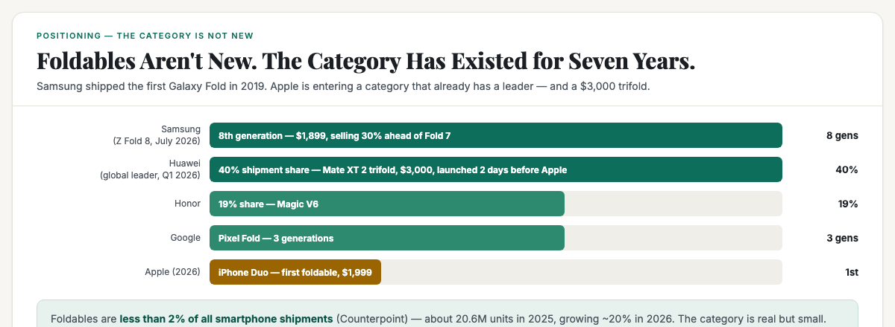
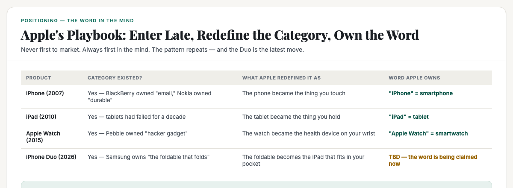
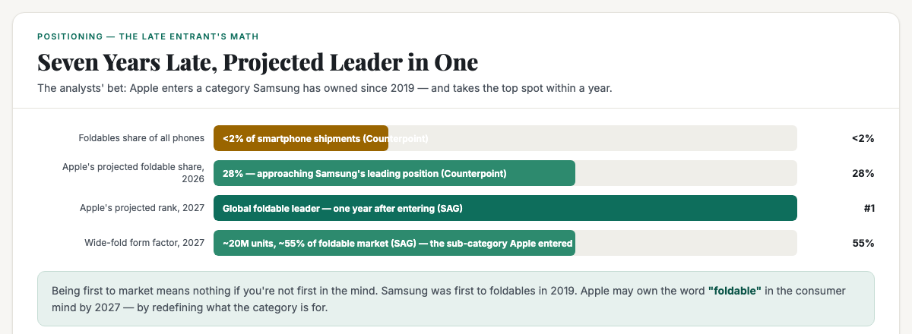

# ObserveCo — Trending-Topic Content Package (Book 1 Quality)

**Date:** 2026-09-10
**Trigger:** Trending on X — "Apple unveils iPhone Duo, its first foldable" (Apple event, 09 Sep 2026). First marquee launch under new CEO John Ternus.
**Source visuals:** `fig-apple-01-category.html`, `fig-apple-02-word.html`, `fig-apple-03-race.html`, `banner-apple-duo.html`.
**Source manuscript:** `whitepapers/book1-map-manuscript.md` (Ch 1 — own a word, walls vs doors, category vs position) + `whitepapers/print/output/ebook/book2-manuscript-CURRENT.md` (Ch 1 — the word in the mind, being first in the mind vs first in time).
**Voice:** Sean's register — first-person, plainspoken, evidence-first, no hype. Teaches the mechanism, not the headline.
**Rule:** Draft only. Nothing posted. Sean pushes the button.

---

# THE FRESH PERSPECTIVE (the wedge)

Every hot take on this story is either a product review ("the Duo is $1,999, 254g, no telephoto") or a fanboy fight ("Apple finally caught up to Samsung"). Both miss the useful question.

This piece does something more useful: **it answers the question everyone is asking wrong — "why is this a new category when foldables are not new?" — by showing that Apple isn't creating a category, it's redefining one.** Foldables have existed for seven years. Samsung is on its eighth generation. Huawei launched a $3,000 trifold two days before Apple's event. The category is not new. What Apple is doing is the same move it pulled with the iPhone, the iPad, and the Apple Watch: **enter late, redefine what the category is FOR, and own the word.**

The wedge: **"Foldable" is a category. "The foldable that's an iPad in your pocket" is a position. Apple doesn't need to be first to market — it needs to be first in the mind. And the data says it may get there within a year: Counterpoint projects Apple at 28% foldable share in 2026, and SAG forecasts Apple becomes the global foldable leader in 2027 — one year after entering a category Samsung has owned since 2019.**

**The "so what" for a business owner:** you don't have to be first. You have to be first in the mind. When a bigger player enters your category late, they don't compete on your terms — they redefine the category and make you compete on theirs. The only defense is owning a word they can't take. Apple's playbook is the masterclass: the category label is not the position; the specific word is.

---

# PART ONE — THE X ARTICLE (long-form, Book 1 quality)

## Article: "Apple's iPhone Duo Isn't a New Category. It's a Repositioning — and That's the Whole Lesson."

**Format:** X Article, ~2,200–2,600 words, 4 embedded visuals.

---

### The number nobody can look away from

On 9 September 2026, Apple announced the **iPhone Duo** — its first foldable phone. $1,999 to start. 7.6-inch inner display, 5.4-inch outer. Titanium frame, A20 Pro chip, 31 hours of battery. Preorders October 16, in stores October 23.

The hot takes are already split into two camps. The product reviewers are comparing specs: the Duo is 254 grams and 11.3mm thick folded, while Samsung's Galaxy Z Fold 8 is 201 grams and 9.7mm — and costs $100 less. The fanboys are arguing about whether Apple "finally caught up."

Both camps are missing the question that actually matters — and it's the question the headline writers keep getting wrong.

**Why is everyone calling this a "new category" when foldables are not new?**

### The category is not new. Here's the proof.

Foldable phones have been on sale since **2019**, when Samsung shipped the original Galaxy Fold. Since then:

- **Samsung** is on its **eighth** generation of the Z Fold (the Fold 8 launched July 2026, $1,899, and is selling 30% ahead of its predecessor in the US).
- **Huawei** has been the global foldable leader — 40% shipment share in Q1 2026 — and launched a **$3,000 trifold, the Mate XT 2, two days before Apple's event**.
- **Honor** holds ~19% share. **Google** has shipped three generations of Pixel Fold. **Xiaomi** launched a new foldable the same week as Apple.
- The market is real but small: foldables are **less than 2% of all smartphone shipments** (Counterpoint). About 20.6 million units in 2025, growing ~20% in 2026.

So when Apple's new CEO John Ternus stood on stage and called the Duo "the most transformational change to iPhone since the original," he was not announcing a new category. He was announcing a **repositioning** of an existing one.

This is the single most important idea in marketing, and almost nobody has heard of it. Let me teach it to you, because it's the lens that makes this story — and your business — make sense.

### A brand is a word in the mind. A category is not a position.

Here's the idea: **a brand is not a logo, a product, or a company. A brand is a word in the customer's mind.**

When you hear "Volvo," you think *safety*. When you hear "Domino's," you think *30 minutes*. When you hear "Grab," you think *your ride shows up*. That's not an accident. It's the whole game.

The human mind keeps a short list for every category. Ask someone to name a ride-hailing app and they'll say Grab, maybe Gojek. Ask for a second and they'll struggle. The brands at the top of the short list get the business; everyone else competes on price.

And here's the brutal corollary: **a category is not a position.** "Care" is a category — a thousand companies do care, and none of them can be referred for it. "The dementia specialist" is a position — a specific word a person can put their name on. "Foldable" is a category — Samsung, Huawei, Honor, Google all make foldables. "The foldable that's an iPad in your pocket" is a position.

So the real question about the Duo isn't "can Apple make a foldable?" It's: **what word is Apple trying to own — and can it take it from the people who already own it?**

### Apple's playbook: enter late, redefine the category, own the word

This is the part the product reviewers miss. Apple has never been first to a category. It has been **first in the mind** — and it gets there by redefining what the category is for.

- **The iPhone (2007).** Smartphones existed. BlackBerry owned "email." Nokia owned "durable." Apple redefined the category: the phone became *the thing you touch*. Today, "iPhone" is the word for smartphone in most of the world.
- **The iPad (2010).** Tablets existed — and failed, for a decade. Apple redefined the category: the tablet became *the thing you hold*. "iPad" is the word for tablet.
- **The Apple Watch (2015).** Smartwatches existed. Pebble owned "hacker gadget." Apple redefined the category: the watch became *the health device on your wrist*. "Apple Watch" is the word for smartwatch.
- **The iPhone Duo (2026).** Foldables have existed for seven years. Samsung owns "the foldable that folds." Huawei owns "the foldable that folds three times." Apple is trying to redefine the category: the foldable becomes *the iPad that fits in your pocket*.

Listen to Ternus's own words from the keynote: *"Others have created foldables that just feel like two phones stuck together… scrolling through vertical content feels compromised."*

That is a repositioning statement. He is not saying "we made a foldable." He is saying "every foldable you've seen so far is wrong, and here's what a foldable should actually be." The Duo's landscape, iPad-like 4:3-ish display, the under-display camera, the Apple Pencil support, the "inspired by the versatility of iPad" framing — every design choice is aimed at one word: **"the foldable that's an iPad in your pocket."**

### Does the word fit? The evidence says maybe — and that's the interesting part.

Here's where it gets honest, because the repositioning only works if the word fits what Apple can actually deliver.

**The case for:** Apple has the one thing no foldable maker has — a decade of iPadOS large-screen software. Samsung's software was written for a phone that unfolds; Apple's was written for a big screen that folds. The Duo runs iPad-like apps, split-screen, Apple Pencil. That's a genuinely different product promise: not "a bigger phone" but "a smaller iPad." And the market data backs the timing: analysts call the **wide-fold form factor** (landscape, iPad-like) the next growth engine — SAG forecasts wide folds growing from effectively zero in 2025 to ~20 million units in 2027, about 55% of the foldable market. Apple is entering exactly the sub-category that's about to become the main one.

**The case against:** the word "iPad in your pocket" costs $1,999 — and the iPad itself costs $349. The Duo is heavier than the Fold 8 (254g vs 201g), thicker folded (11.3mm vs 9.7mm), and has no telephoto lens. And Apple's track record of redefining categories is real but not automatic: the Vision Pro was a $3,499 attempt to redefine "spatial computing," and it has not become the word for anything yet. Redefining a category works when the new word is something enough people want at a price enough people will pay.

**The verdict:** the repositioning is coherent — Apple is not selling "a foldable," it's selling "the foldable that's an iPad in your pocket" — and the form factor timing is right. Whether the word sticks depends on whether enough people want an iPad in their pocket badly enough to pay $1,999 for it. The analysts are betting yes: Counterpoint projects Apple at **28% foldable share in 2026**, and SAG forecasts Apple becomes the **global foldable leader in 2027** — one year after entering a category Samsung has owned for seven.

### What this means for your business

This isn't a story about Apple. It's a masterclass in the difference between a category and a position — and it applies to every small business in Singapore.

- **You don't have to be first. You have to be first in the mind.** Samsung was first to foldables in 2019. Apple may own the word "foldable" in the consumer mind by 2027. Being first to market means nothing if you're not first in the mind; being first in the mind means everything even if you're seven years late.
- **When a bigger player enters your category, they don't compete on your terms — they redefine the category.** Samsung spent seven years defining "foldable" as "a phone that folds." Apple walked in and said "no, it's an iPad that fits in your pocket." The incumbent's defense is owning a word the entrant can't take. Samsung's word is "the foldable that folds" — and Apple just made that word feel like a compromise.
- **The category label is not the position.** "Foldable" is a label. "The foldable that's an iPad in your pocket" is a position. "Eco packaging" is a label. "The microplastic-tested disposables" is a position. "Digital marketing" is a label. "The Google Ads specialist for clinics" is a position. The business that owns a specific word is the one that gets referred; the business that competes in a vague category competes on price.

Apple's iPhone Duo is not a story about a foldable phone. It's a story about **what happens when a brand enters a category it doesn't own — and redefines the category so the word fits.** The same move is available to every small business. The question is whether you're building a category label or claiming a word.

---

# PART TWO — THE X POSTS (beefed up, educational)

## Primary — the repositioning mechanism

> Apple just announced its first foldable, the iPhone Duo. $1,999. 7.6-inch inner display. Preorders October 16.
>
> Every headline is calling it a "new category." It's not. Foldables have existed since 2019 — Samsung is on its 8th generation, Huawei launched a $3,000 trifold two days before Apple's event.
>
> So why does it feel new? Because Apple isn't creating a category. It's redefining one.
>
> A brand is a word in the customer's mind. "Foldable" is a category — Samsung, Huawei, Honor, Google all make them. "The foldable that's an iPad in your pocket" is a position.
>
> Apple's playbook: enter late, redefine the category, own the word. iPhone (smartphones existed). iPad (tablets existed). Apple Watch (smartwatches existed). Now the Duo (foldables existed).
>
> Ternus said it himself: "Others have created foldables that just feel like two phones stuck together." That's a repositioning statement, not a product spec.
>
> The data says it might work: Counterpoint projects Apple at 28% foldable share in 2026. SAG says Apple becomes the global foldable leader in 2027 — one year after entering a category Samsung has owned for seven.
>
> The lesson for every business: you don't have to be first. You have to be first in the mind. When a bigger player enters your category, they don't compete on your terms — they redefine the category. Own a word they can't take.
>
> #Singapore #SingaporeBusiness #Positioning

## Alt — the "category vs position" hook

> Apple's iPhone Duo is being called a "new category." Foldables are not new — Samsung's been selling them since 2019.
>
> What's new is the word Apple is trying to own.
>
> "Foldable" is a category. A thousand companies make foldables. "The foldable that's an iPad in your pocket" is a position — a specific word a person can put their name on.
>
> That's the difference between competing on price and being the name people recall.
>
> Apple's pattern: iPhone, iPad, Apple Watch — never first to market, always first in the mind. It redefines what the category is FOR.
>
> The same move is available to every small business. The question isn't "what category am I in?" It's "what word do I own?"
>
> #Singapore #SingaporeBusiness #Positioning

---

# PART THREE — HASHTAGS (per platform)

## X — keep it to 1–2 tags (the hook + one topic tag)
- Primary: `#Singapore` + `#SingaporeBusiness` (or `#Positioning` for the primary)

---

# STATUS

- [x] Rendered 4 visuals (fig-apple-01, fig-apple-02, fig-apple-03, banner-apple-duo) — 1200×440 / 1200×480, verified present + non-blank
- [ ] Sean reviews the X article (Part One)
- [ ] Sean reviews the X post (Part Two — pick primary or alt)
- [ ] Sean posts (I never post without approval)

---

*Draft only. Nothing posted without approval.*
