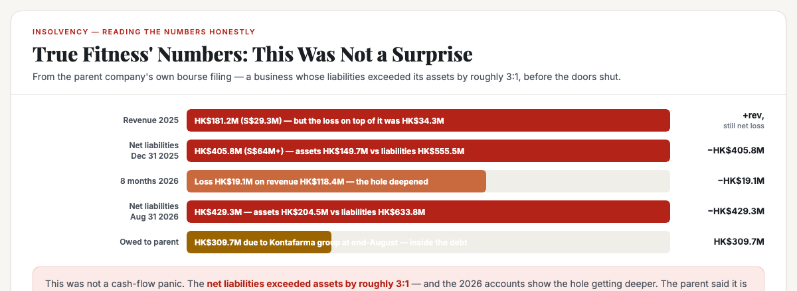
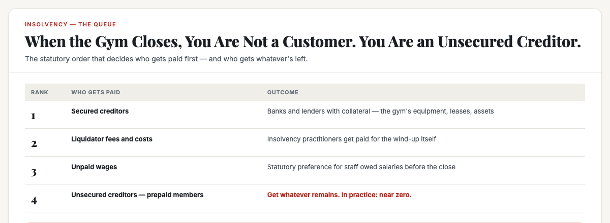
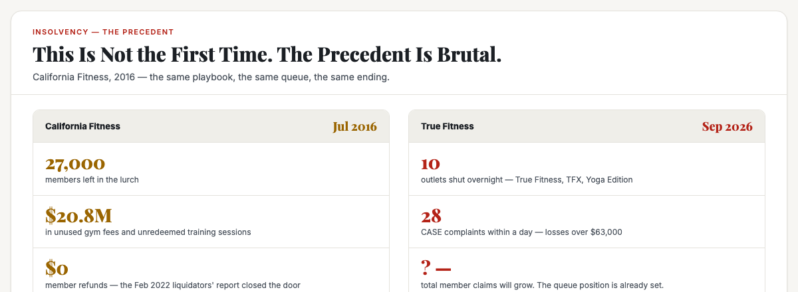

# ObserveCo — Trending-Topic Content Package (Book 1 Quality)

**Date:** 2026-09-11
**Trigger:** Trending on X / IG — "True Fitness and True Yoga in Singapore to close; parent Kontafarma China Holdings winding up the business" (ST + CNA, 11 Sep 2026). All 10 outlets under True Fitness, TFX and Yoga Edition shut with immediate effect after provisional liquidation.
**Source visuals:** `fig-true-01-numbers.html`, `fig-true-02-creditors.html`, `fig-true-03-precedent.html`, `banner-true-fitness.html`.
**Source manuscript:** `whitepapers/book1-map-manuscript.md` (Ch 1 — reading numbers honestly, where does the number come from / what does it measure) + `whitepapers/print/output/ebook/book2-manuscript-CURRENT.md` (Ch 1 — the word in the mind, being first in the mind vs first in time).
**Voice:** Sean's register — first-person, plainspoken, evidence-first, no hype. Teaches the mechanism, not the headline.
**Rule:** Draft only. Nothing posted. Sean pushes the button.

---

# THE FRESH PERSPECTIVE (the wedge)

Every hot take on this story is either a consumer story ("members locked out, lost fees!") or a corporate story ("HK parent ditches gyms for pharma"). Both miss the useful question.

This piece does something more useful: **it answers the question everyone is asking wrong — "will members get their money back?" — by showing that prepaid members are not customers in a liquidation — they are unsecured creditors.** That word decides everything. Unsecured creditors sit at the back of a statutory queue, behind secured lenders, behind liquidator fees, behind wages owed to staff, behind everything the company actually owns. The California Fitness collapse of 2016 is the precedent: 27,000 members left holding $20.8 million in unused fees and sessions — and a 2022 liquidators' report closed the door on refunds.

The wedge: **"You are not a customer. You are an unsecured creditor."** When a gym takes prepayment, the money stops being yours the moment it hits their account — and in a wind-up, the law ranks you behind secured lenders and staff wages. The number that decides your recovery is not the $79 you paid on Sept 9 — it's your position in the queue.

**The "so what" for a business owner:** the same reading-numbers discipline from Book 1 — ask where the number comes from, what it measures, and what it ranks — applies to every prepayment you take. Every business that collects money upfront is running a quiet float. The question is whether you treat that float as revenue or as a liability, and whether your customer knows they are effectively lending you money with no collateral. True Fitness collected for 22 years; the member who paid Sept 9 found out the hard way what that word — creditor — really means.

---

# PART ONE — THE X ARTICLE (long-form, Book 1 quality)

## Article: "The Number Nobody's Talking About: True Fitness Didn't Just Close — Its Prepaid Members Just Became Unsecured Creditors"

**Format:** X Article, ~2,200–2,600 words, 4 embedded visuals.

---

### The number nobody can look away from

On the night of 10 September 2026, a gym chain that has been part of Singapore's fitness landscape for twenty-two years told the Hong Kong stock exchange it could not continue.

True Fitness and True Yoga — along with their sister brands TFX and Yoga Edition, ten outlets across the island — are gone. Creditors' voluntary winding-up. Provisional liquidators from RSM appointed the same night. By the morning, notices were pasted across the doors at Velocity, Tampines, Ang Mo Kio, Great World, Millenia Walk. Hoarding went up. Members stood outside reading the notices, gym bags in hand, trying to process the arithmetic.

The hot takes are already split into two camps. The consumer camp is asking "how do I get my money back?" The corporate camp is tutting about "the death of the traditional gym." Both are missing the number that actually decides this story — and it is not the $64 million in net liabilities, and it is not the 10 outlets. It is the word that quietly described 28 Singaporeans in a CASE complaint within hours of the news breaking:

**Creditor.**

### The numbers, read honestly

Here is what the parent company's stock exchange filing actually says. The True Singapore Group, which runs the True Fitness, TFX and Yoga Edition brands:

- Recorded revenue of about **HK$181.2 million (S$29.3 million) in 2025**, and a loss of about HK$34.3 million.
- As at Dec 31 2025, total assets of about HK$149.7 million; total liabilities of about HK$555.5 million; **net liabilities of about HK$405.8 million (S$64 million+)**.
- For the eight months ended Aug 31 2026, revenue of about HK$118.4 million; a loss of about HK$19.1 million; total assets HK$204.5 million against total liabilities HK$633.8 million — **net liabilities of about HK$429.3 million**.
- Owed its parent Kontafarma group about HK$309.7 million at end-August.

Read those numbers with the Book 1 discipline. Where does the number come from? A bourse filing — a primary source, the company itself, under listing rules that carry penalties for misstatement. Is it current? Days old. What does it measure? Losses and net liabilities over two periods. Is it one number or a range? They say the group is HK$400+ million in the hole, one number, and the direction of travel is consistent: the hole got deeper in 2026.

**What this tells you:** this was not a cash-flow panic. This was a company whose liabilities exceeded its assets by roughly 3:1 — before the doors ever shut. The parent said the move lets it focus on its pharmaceutical business, which brings in about 77% of group revenue. That is a parent doing arithmetic, not a surprise.

### The number nobody's talking about: you are a creditor

Now here is the part the consumer stories keep missing. When you prepaid for a True Fitness membership, or bought a block of PT sessions, or paid for a yoga package — you did not buy a product. You made a loan.

In insolvency law, that is exactly how it is treated. The moment a gym takes your prepayment, the money stops being yours. It sits in their account, gets spent on rent, wages, equipment, and other members' trainers. If the gym keeps trading, you never notice — you get the service, the loan is repaid in kind. But the moment the gym stops trading, the legal word for you changes.

You are not a customer with a complaint. You are an **unsecured creditor** with a claim.

Here is what that means, in the statutory order that decides everything:

- **Secured creditors** — banks and lenders with collateral backed by the gym's assets — get paid first.
- **Liquidator fees and costs** come out of whatever is left.
- **Statutory preferences** — unpaid wages for staff — get paid next.
- **Unsecured creditors** — suppliers, landlords' unsecured claims, and *every prepaid member who ever paid for a membership or a PT package* — get paid from whatever remains. In practice, for most SG gym collapses of the last decade: near-zero.

The member who told ST she paid **$79 a month, starting Sept 9** — a day before the news broke — is the cleanest example in the story. She does not have a product problem. She has a position-in-the-queue problem.

**Read the number honestly:** her $79 ranks behind every secured lender, every liquidator invoice, every unpaid wage bill, and every other creditor in the same class. She may get a fraction back; she may get nothing. That is not cruelty — that is the law, and it is the same law that governs every prepaid arrangement in Singapore, from gyms to tuition centres to renovation firms.

### This is not the first time. The precedent is brutal.

If you want to know what happens next, do not ask the pundits. Ask California Fitness.

In July 2016, California Fitness closed all its Singapore outlets with immediate effect — the same playbook: doors locked, notices pasted, members outside. The numbers were staggering: **nearly 27,000 members left holding about $20.8 million in unused gym access fees and unredeemed training sessions.** Members filed claims, joined petitions, threatened legal action. Some had been sold "lifetime" memberships.

The end of that story took six years to write. In February 2022, the liquidators' report closed the door: the winding-up would not produce member refunds. The report blamed management and the auditor for the mess. The members — the unsecured creditors — got effectively nothing.

Here is the brutal arithmetic that connects 2016 to 2026: **the money was spent.** Prepayments funded the operations that delivered the service members enjoyed while the gym traded. When the doors close, there is usually nothing left that belongs to the last person in the queue — because the last person in the queue's money was already spent on rent and wages and lights while the gym was still open.

That is the mechanism. California Fitness is not ancient history; it is the same structural outcome, and it is the reason the CASE complaints — 28 complaints, losses of more than $63,000 — will almost certainly end the same way: **a proof of debt form, a long wait, and a recovery that is a fraction of what was paid.**

### The "so what" for a business owner

This article is not a consumer-advice piece. It is a business lesson wearing a news story, and the lesson is uncomfortable.

**One: prepayment is a loan, not revenue.** Every business that takes money upfront — gyms, studios, tuition centres, renovation firms, subscription services — is running a float. The accounting rules know this: "deferred revenue" is a liability on the balance sheet, not profit. The businesses that get in trouble are the ones that start treating the float as money they can spend on growth, then discover — the moment the music stops — that the float was never theirs. It was a loan from people who had no collateral in the deal.

**Two: the queue is the truth.** When you buy prepaid, your position in the insolvency queue is the single most important number in the arrangement. Before you pay six months upfront for anything, ask: where would I stand if this place closed tomorrow? If the answer is "behind the banks and the landlord," you are not buying a discount — you are lending money unsecured, for whatever the discount is worth.

**Three: the customer does not know they are a creditor — and that asymmetry is a business opportunity.** Here is the honest flip side. The business that educates its customers about what prepayment means — that sells month-to-month, that offers insurance-backed packages, that lets prepaid customers know they are effectively creditors and what that rank means — owns a word the incumbents cannot take. "The gym that never takes more than a month upfront" is a position. "The studio where your sessions are protected by an escrow arrangement" is a position. The category — "premium gym" — has no defense against the collapse everyone saw coming, except the one thing True Fitness and California Fitness never marketed: what happens to the customer's money if everything goes wrong.

The member who paid $79 on a Tuesday and watched her gym board up on Thursday did not lose the money because she was careless. She lost it because nobody — the gym, the regulator, the industry — had made the one number that mattered legible to her: her position in the queue.

True Fitness ran in Singapore for 22 years. It built a word in the minds of thousands of Singaporeans — and that word, whatever it was, did not include what happens to your money when the music stops. That is the number nobody was talking about, and it is the number every prepaid customer in Singapore should now be looking at.

---

# PART TWO — THE X POSTS (beefed up, educational)

## Primary — the creditor mechanism

> True Fitness just closed all 10 Singapore outlets. Everyone's asking: "will members get their money back?"
>
> The question is wrong. The right question is: what rank are they in the queue?
>
> When you prepay a gym membership, you're not buying a product. You're making an unsecured loan. The moment the money hits their account, it's spent on rent, wages, lights. You only ever get your service back if the business keeps trading.
>
> The moment it stops trading, the law has a word for you: unsecured creditor.
>
> Position in the queue:
> 1. Secured lenders (the bank with collateral)
> 2. Liquidator fees
> 3. Unpaid wages (staff)
> 4. Unsecured creditors — you — get whatever's left
>
> California Fitness 2016: 27,000 members, $20.8M in prepaid fees and sessions. The 2022 liquidators' report: no refunds.
>
> The money was spent. That's the mechanism.
>
> The lesson for every business that takes prepayment: that money is a loan, not revenue. Treat it like one. And the customer who understands where they stand in the queue — and the business that makes that legible to them — owns a word the incumbents can't take.
>
> #Singapore #Business

## Alt — the "positioning" hook

> 22 years. 10 outlets. Three brands. One night.
>
> True Fitness didn't close because people stopped wanting to work out. It closed because prepaid members were lending it money — unsecured — and the business spent the loans faster than it could earn them back.
>
> The parent's own filing: net liabilities of over S$64 million. Revenue wasn't the problem — it was the gap between what members prepaid and what the business owed.
>
> Every gym membership paid upfront is an unsecured loan to a business you hope stays alive. The discount you get for paying 6 months ahead is the interest on that loan — paid by you, in risk.
>
> The business that positions against this — "we never take more than a month upfront" — owns a word nobody in the category has ever claimed: safety.
>
> The category didn't have a word for what happens to your money when the gym closes. Now it does. A competitor just got handed it.
>
> #Singapore #Positioning

---

# PART THREE — HASHTAGS (per platform)

## X — keep it to 1–2 tags (the hook + one topic tag)
- Primary: `#Singapore` + `#Business`
- Alt: `#Singapore` + `#Positioning`

---

# STATUS

- [x] Rendered 4 visuals (fig-true-01, fig-true-02, fig-true-03, banner-true-fitness) — 1200×440 / 1200×480, verified present + non-blank
- [ ] Sean reviews the X article (Part One)
- [ ] Sean reviews the X post (Part Two — pick primary or alt)
- [ ] Sean posts (I never post without approval)

---

*Draft only. Nothing posted without approval.*

---

## Research notes (for follow-up edits)

**Primary sources:**
- Kontafarma China Holdings HKEX announcement, 10 Sep 2026 — "Inside Information: Creditors' Voluntary Winding-Up of Singapore Subsidiaries" (reported via MissLobang, ST, CNA).
- ST, "True Fitness and True Yoga to shutter; customers report losses of more than $63,000" (Calista Wong & Ann Neo, 11 Sep 2026, updated 13:48 SG) — revenue/loss figures, net liabilities, CASE 28 complaints, member Jeanette Chen $79/mo paid Sept 9, outlet list, Taiwan exit Oct 2025.
- CNA, "True Fitness, True Yoga to close in Singapore; parent company cites competition, rising costs" — 3 brands, 10 outlets, 257 staff at end-2025 (via BT).
- MissLobang fact sheet — liquidators (Goh Wee Teck, Lin Yueh Hung, RSM SG), EGM 7 Oct 2026, unsecured creditor position, practical steps for members.
- ACRA BizFile (11 Sep 2026): both companies "in liquidation – creditors voluntary winding up".

**Precedent:**
- California Fitness (2016): ~27,000 members, $20.8M in unused fees/sessions (ST, Feb 2022 liquidators' report — no refunds).

**Confidence labels:** All numbers from the bourse filing/ST report — High confidence. Commentary on insolvency priority — High confidence, standard Singapore/Windmill Act-style ranking (secured > fees > preference > unsecured); flag for a lawyer check if published as advice.

**Wedge anchor:** Book 1, "Reading numbers honestly" — where does the number come from / what does it measure — applied to the word "creditor."
