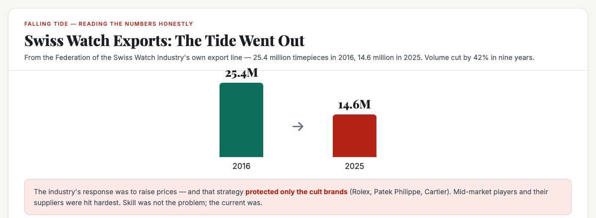
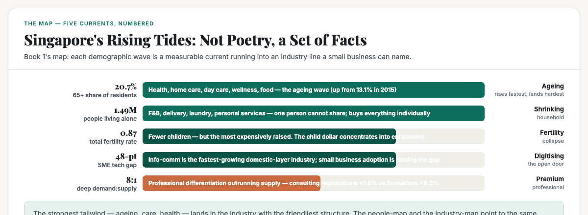
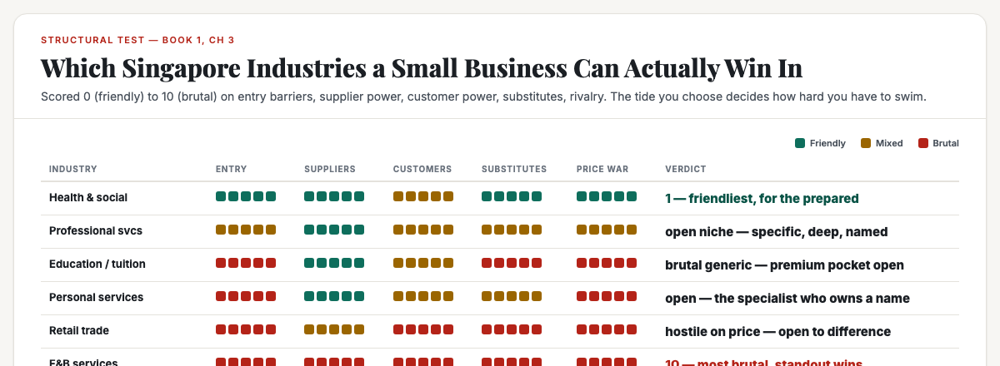
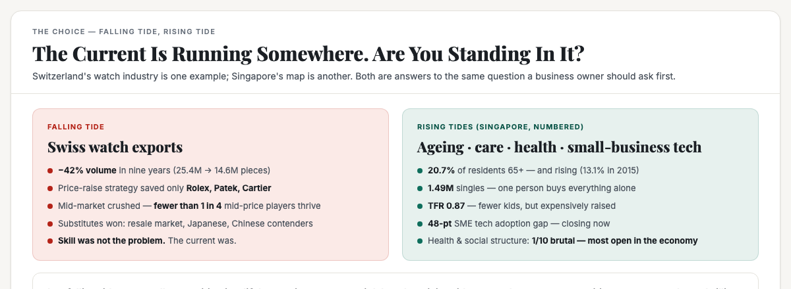

# ObserveCo — Trending-Topic Content Package (Book 1 Quality)

**Date:** 2026-09-12
**Trigger:** Trending on X — ST: "Luxury watchmakers say Gen Z buying trends call for bold changes" (12 Sep 2026). Swiss watch exports fell from 25.4M timepieces (2016) to 14.6M (2025); the industry cushioned the fall by raising prices — a strategy that protects only the cult brands (Rolex, Patek, Cartier) and crushes the mid-market. Gen Z buys less on status, fuels the resale market, and Japanese + credible Chinese contenders (Laopu, movements comparable to ETA/Sellita) are taking mid-price volume.
**Source visuals:** `fig-watch-01-exports.html/.png`, `fig-watch-02-waves.html/.png`, `fig-watch-03-structure.html/.png`, `fig-watch-04-tides.html/.png`, `banner-watch-tide.html/.png`.
**Source manuscript:** `whitepapers/book1-map-manuscript.md` — Ch 1 (reading numbers honestly), Ch 2 (the bridge: demographic waves → industries; growth/stale/decline = "the current is at your back"), Ch 3 (structural test, survival numbers, the slots).
**Voice:** Sean's register — first-person, plainspoken, evidence-first, no hype. Teaches the mechanism, not the headline.
**Rule:** Draft only. Nothing posted. Sean pushes the button.

---

# THE FRESH PERSPECTIVE (the wedge)

Every hot take on the watch story is either a sector piece ("Swiss luxury is dying!") or a Gen Z piece ("kids don't care about status anymore"). Both miss the question that actually matters to a business owner in Singapore: **the Swiss didn't lose because they were out-manoeuvred — they lost because they bet their industry's tide had gone out, then tried to out-swim it with prices.** The price-raise strategy worked for exactly three brands with cult followings. It gutted everyone in the middle.

This piece does something more useful: **it turns the falling tide into the case for choosing your industry before choosing your position.** Book 1's map shows the tide is not a metaphor in Singapore — it is a set of numbered currents: 65+ share at 20.7% and rising, 1.49 million singles buying alone, TFR at 0.87 concentrating the child dollar, a 48-point adoption gap in small-business tech, professional differentiation demand outrunning supply eight to one. The wedge: **"A rising tide lifts all boats. A falling tide shows who was swimming badly — and it makes even good swimmers look slow."**

**The "so what" for a business owner:** being skilful is not enough. The Swiss are the most skilful watchmakers on earth, and their exports halved. In a falling tide, skill only decides who sinks last. In a rising tide — ageing, care, health, premium professional, small-business digitising — a merely competent operator earns more than a brilliant one fighting the current. Choose the tide first. Then choose your boat.

---

# PART ONE — THE X ARTICLE (long-form, Book 1 quality)

## Article: "The Tide Went Out on Swiss Watchmakers. The Lesson for Every Singapore Business Owner: Choose Your Industry Before You Choose Your Position"

**Format:** X Article, ~2,200 words, 4 embedded visuals.

---

### The number nobody can look away from

In 2016, Swiss watchmakers exported **25.4 million timepieces**. In 2025, they exported **14.6 million**. That is not a downturn. That is forty-two percent of the volume gone in nine years, in the country that invented the modern luxury watch.

The story on the surface — from the Straits Times, Bloomberg and the annual Geneva Watch Days gathering — is about Gen Z. Younger buyers, the executives say, are less driven by status and brand loyalty and "more about excitement, emotion, discovery" (Jean-Christophe Babin, president of Geneva Watch Days and chairman of Bulgari). They buy second-hand online for immediate gratification. Japanese brands — Seiko, Citizen, Casio — hold the mid-price segment. Chinese contenders — Laopu going viral, movements now comparable to ETA or Sellita for standard complications — are eating the middle from below. The Federation of the Swiss Watch Industry's own export line tells you which way the current is running.

But the useful story is not about watches. It is about what the industry did when the tide went out.

### The response was a price rise — and it saved only the cult brands

Swiss watchmakers did not spend nine years doing nothing. They executed one of the most successful pricing strategies in modern luxury: sell fewer pieces at much higher prices. Volumes halved; revenue held. That worked — for the largest brands with cult-like followings. As the ST piece put it: the price strategy is protecting only Rolex, Patek Philippe and Cartier. The mid-market players and their suppliers are being hit hard. "It's a tougher market for those in the middle," said Rodolfo Festa-Bianchet, CEO of Bianchet. Breitling's CEO Georges Kern calls it the industry's possible "new normal."

Read that figure the honest way — *where does the number come from, what does it actually measure?* The 25.4-to-14.6 export line measures volume, the number of physical watches. The revenue line measures price. The industry swapped one number for the other, and the swap works only for the three brands whose names alone move people. For everyone else in the category, the tide went out on the whole coast, and raising prices did not raise the water; it just exposed who had no shelter.

Here is the part a Singapore business owner should feel in the gut. **The Swiss did not fail because they were unskilled. They are the most skilful watchmakers alive. They failed because they were swimming in a falling tide, and in a falling tide, skill only decides who sinks last.**

### Why the tide is not a metaphor in Singapore

The word "tide" sounds like poetry. It is not. In Singapore, the current under your industry is a set of numbered facts, and a simple map — the one this piece is built on — shows they are measurable. Consider five of them.

**One: the island is ageing — and the money is following.** Residents aged 65 and over are **20.7% of the population, up from 13.1% in 2015** (Population.gov.sg). About 6.6% of those over 65 — roughly 52,000 people — need care today, and nearly all of them age in place, at home. That is not a demographic note; it is a demand line for home-care aides, day-care centres, meal delivery, monitoring services. MTI describes health and social services as "resilient" even while other domestic industries slowed.

**Two: the household is shrinking.** **1.49 million people live alone.** Seniors living alone jumped from 62,000 to 88,000. A person who lives alone cannot share a dinner, a rent, a washing machine — so they buy single servings, delivery, a laundromat, a pet, a streaming subscription. Every one of those is an industry line.

**Three: the child dollar is concentrating.** The resident total fertility rate is **0.87** — below one child per woman — and live births fell 11.1% in 2025. There are fewer children, but they are the most expensively raised children this country has ever produced. The money did not disappear when the birth rate fell; it concentrated into premium pockets in education and enrichment.

**Four: the small-business technology gap is closing — fast.** Information & communications is the fastest-growing domestic-layer industry. There is a roughly **48-point gap** between how fast small businesses adopt technology and how fast large businesses do, and it is being closed. The businesses that differentiate now own positions the late adopters cannot take.

**Five: premium professional demand is outrunning supply.** The demand for *specific, deep* differentiation is outrunning supply by **eight to one**: management-consulting registrations grew 1.0 percent while business formations grew 8.5 percent. The generic advice is anchored at zero by the state's free advisory centres. The specific, named, vouchable expert is underserved.

### The structural test: a rising tide lands best where the structure is friendly

Here is the subtlety that separates this map from a headline list of "hot industries." A rising tide does not land evenly. The ageing wave lands hard in health and care — industries that are **hard to enter** (regulation, licences, trust), where the barrier filters the crowd and trust stops the fight over price. The same demand lands softly in retail and food — easy to enter, brutal to survive, a hundred shops competing on price for the same dollar.

The structural test scores the domestic-layer industries from 0 (friendly) to 10 (brutal) on entry barriers, supplier power, customer power, substitutes, and rivalry. Health and social services scores **1 — the friendliest industry in the economy for a prepared small operator**. Professional services sits in the middle with a specific, deep niche open. Education has premium pockets but a brutal generic field (1,000+ tuition centres). Food and beverage scores **10 — the most brutal** — with a five-year survival rate under one quarter for entrants with no particular edge. Retail is hostile to anyone who competes on price, which is why it is open to anyone who does not.

The pattern is the point: **the strongest tailwind — ageing, care, health — lands in the industry with the friendliest structure.** The people-map and the industry-map point to the same place. That coincidence is the whole reason the tide lesson is actionable rather than poetic.

### The falling-tide list — read it and feel how close to home it is

The same MTI numbers that map the rising tides also map the falling ones. Retail trade's aggregate is still growing (+5.0% in 2025, +4.0% in mid-2026), but department stores are down **5.7%**; F&B services softened to **−2.3%** in June 2026. The format is losing to the substitute — online, delivery, a newer way to serve the same need. The cessation counts confirm it: in 2025, retail trade saw about **6,800** business cessations, wholesale about 10,000, professional services about 9,600, food and beverage about 3,100.

None of this tells you to avoid food or retail. It tells you the current is against you there, and only a position that pulls you out of the commodity will save you. The Swiss story is the proof: a positioned luxury brand survived the falling tide; a mid-market watch with no position did not.

### Choose the tide first. Then choose your boat.

This is the uncomfortable arithmetic, and it is the honest one: **in a falling tide, an excellent position is a lifeboat — it means you sink last, or you survive while others drown. In a rising tide, a merely competent position earns more than a brilliant one fighting the current.** The watch industry is full of brilliant positions, and its volume halved.

These slots are where the rising tide meets a door a small business can actually walk through. All of them are capital-light, trust-driven, and sitting in industries the big players find too small or too messy:

- **Ageing-in-place consulting** — the one-on-one service that tells a family what to buy, install, plan for. Nobody owns it; the demand is exploding.
- **Boutique day care for one profile** — "dementia mornings," "stroke-rehab afternoons." The generic centres are full and indifferent.
- **Deep-niche enrichment** — one subject, one exam, one type of student, owned by one name — taking the concentrated child dollar from the generic centres.
- **The small-business technology specialist** — "we fix the tools for the clinic, the salon, the tuition centre." The 48-point adoption gap is the open door.
- **A trusted advisor to the foreign professional** — the EP holder who needs a named, vouchable local specialist. Premium demand, thin supply.

Here is the full circle, and it is the reason this article is not about watches. **The Swiss are not a cautionary tale about craftsmanship. They are a cautionary tale about industry choice.** They chose — or inherited — a category whose tide was going out, and then spent nine years discovering that no amount of skill, pricing, or heritage reverses a current. Singapore has currents that are numbered, mapped, and running the other way. The question for a business owner is not "how good is my product?" It is "which way is the water moving where I am standing?"

A rising tide lifts all boats. The boats that actually matter are the ones that chose the right water.

---

# PART TWO — THE X POSTS (beefed up, educational)

## Primary — the tide mechanism

> Swiss watch exports fell from 25.4 million to 14.6 million pieces in nine years. The industry's response: raise prices. It saved Rolex, Patek and Cartier — and crushed everyone in the middle.
>
> This is not a watch story. It's the best case study in why choosing your industry matters more than choosing your position.
>
> In a falling tide, skill only decides who sinks last. The Swiss are the most skilled watchmakers alive — and their volume halved.
>
> Singapore's rising tides are numbered, not poetic:
> - 65+ share: 20.7% and rising (13.1% in 2015) → health, home care, ageing-in-place
> - 1.49M people live alone → delivery, laundry, personal services
> - TFR 0.87 → fewer kids, but the most expensively raised → deep-niche enrichment
> - 48-point SME tech adoption gap → the small-business tech specialist
> - Professional differentiation demand outrunning supply 8:1 → the named, vouchable expert
>
> The strongest tailwind — ageing, care, health — lands in the industry with the friendliest structure: health & social scores 1/10 brutal. F&B scores 10/10 — and its no-edge entrants have a five-year survival rate under 25%.
>
> Choose the tide first. Then choose your boat.
>
> #Singapore #Business

## Alt — the "positioning" hook

> Swiss watchmakers did everything right: heritage, craftsmanship, pricing power. Their exports still halved — 25.4M to 14.6M pieces in nine years.
>
> Because the tide went out on the whole category. The price-raise strategy only works for brands whose name alone moves people. For the mid-market, it was a falling tide, and skill was not enough.
>
> The lesson: an excellent position is a lifeboat in a falling tide — it means you sink last. In a rising tide, a merely competent position earns more than a brilliant one fighting the current.
>
> Singapore's map has the currents numbered. Ageing (20.7% of residents, rising), smaller households (1.49M singles), concentrated child spend (TFR 0.87), a 48-point tech adoption gap, professional demand outrunning supply 8:1.
>
> The slots: ageing-in-place consulting. Boutique day care for one profile. Deep-niche enrichment. The small-business tech specialist. The trusted advisor to the EP holder.
>
> Everyone asks "what should I build?" The better question: which way is the water moving where I'm standing?
>
> #Singapore #Positioning

---

# PART THREE — HASHTAGS (per platform)

## X — keep it to 1–2 tags (the hook + one topic tag)
- Primary: `#Singapore` + `#Business`
- Alt: `#Singapore` + `#Positioning`

---

# STATUS

- [x] Rendered 5 visuals (fig-watch-01..04, banner-watch-tide) — 1200×440 / 1200×480, verified present + non-blank
- [ ] Sean reviews the X article (Part One)
- [ ] Sean reviews the X post (Part Two — pick primary or alt)
- [ ] Sean posts (I never post without approval)

---

*Draft only. Nothing posted without approval.*

---

## Research notes (for follow-up edits)

**Primary sources:**
- ST/Bloomberg, "Luxury watchmakers say Gen Z buying trends call for bold changes" (12 Sep 2026, via Geneva Watch Days) — export figures 25.4M (2016) → 14.6M (2025), Federation of the Swiss Watch Industry; Babin (Bulgari/Geneva Watch Days) on Gen Z "excitement, emotion, discovery", resale market, Royal Pop AP×Swatch; Festa-Bianchet (Bianchet) on mid-market squeeze; Kern (Breitling) "new normal"; Muller (LuxeConsult) on Japanese brands + "less weight to the Swiss-made hallmark"; Babin on Chinese movement quality (ETA/Sellita comparable) and Laopu.
- Book 1 manuscript (`whitepapers/book1-map-manuscript.md`) — all Singapore tide numbers: Ch 2 bridge table (waves→industries), MTI growth table (2025/1Q26), Ch 3 structural test + cessation counts + survival figures, slots table.

**Confidence labels:**
- Swiss export figures, quotes — High (ST/Bloomberg, syndicated).
- Singapore population/fertility/structure numbers — High (Book 1 manuscript cites SingStat/MTI/Population.gov.sg).
- Industry mapping (wave → industry → slot) — Moderate (Book 1's own synthesis judgment).

**Wedge anchor:** Book 1, Ch 2 — "Being in a growing industry does not guarantee you win, but it means the current is at your back. Being in a stale or declining one means the current is against you, and only a position that pulls you out of the commodity can save you." Applied to the watch story, inverted: the Swiss *had* a position — the tide went out anyway.
