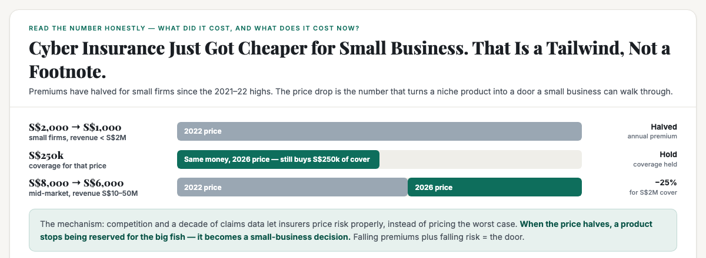
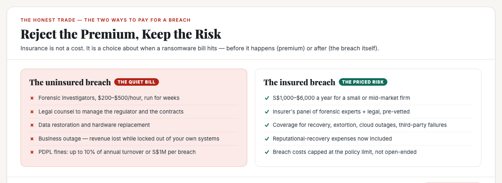
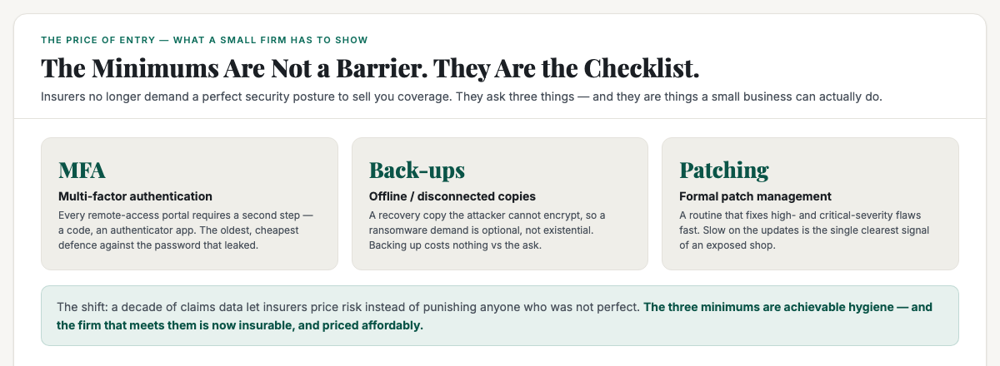
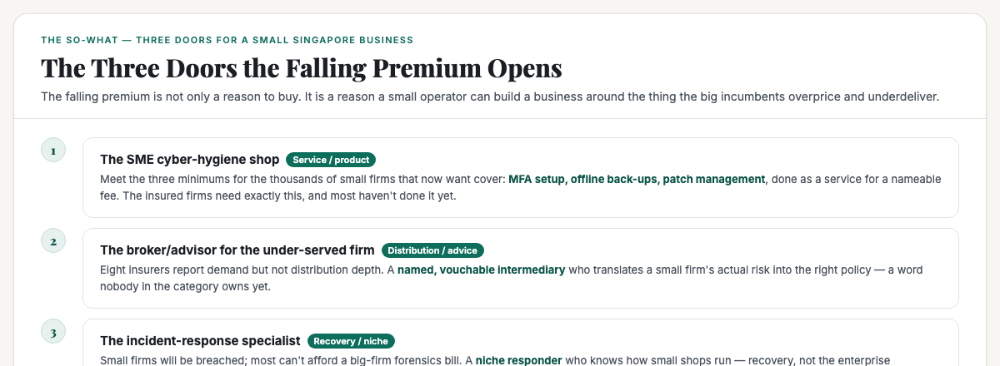

# ObserveCo — Trending-Topic Content Package (Book 1 Quality)

**Date:** 2026-09-14
**Trigger:** Trending on X — ST: "Cyber insurance gains ground in Singapore as coverage widens, premiums fall" (ST, 14 Sep 2026). Demand up among SMEs and mid-market firms as threats rise; premiums down sharply since the 2021–22 highs; coverage broader; minimum-security requirements now achievable by small firms.
**Source visuals:** `fig-cyb-01-arithmetic.html/.png`, `fig-cyb-02-rejects-price.html/.png`, `fig-cyb-03-minimums.html/.png`, `fig-cyb-04-compliance.html/.png`, `banner-cyber-insurance.html/.png`.
**Source manuscript:** `whitepapers/book1-map-manuscript.md` — Ch 1 (reading numbers honestly: where does the number come from / what does it measure), Part 3 ch 2 (growth / stale / decline = "the current is at your back", the digitising engine), Part 3 ch 3 (the structural test, the slots, the small-business tech specialist).
**Voice:** Sean's register — first-person, plainspoken, evidence-first, no hype. Teaches the mechanism, not the headline.
**Rule:** Draft only. Nothing posted. Sean pushes the button.

---

# THE FRESH PERSPECTIVE (the wedge)

Every hot take on the cyber-insurance story is either a consumer-safety piece ("protect your business from ransomware!") or an insurance-trade piece ("premiums are falling, buy coverage!"). Both treat cyber insurance as a purchase decision. Both miss the structural question a small business owner should be asking: **is cyber insurance a tailwind industry — and, if so, a tailwind for whom?**

The answer is counter-intuitive, and it is the whole wedge. **Cyber insurance is not a tailwind industry for small businesses to enter as sellers — the insurers are walls, a handful of names holding the market.** But the falling premium is the strongest tailwind in the economy right now for *the people who serve small businesses from the outside*: the hygiene shop, the broker, the incident responder. The price drop turns a niche no small firm could afford into a decision millions of small firms can now make — and every one of those firms suddenly needs someone to get them covered, keep them eligible, and rescue them when they are breached.

The wedge: **"The cyber-insurance premium just halved. The risk didn't. That gap — falling price, rising threat — is the rarest thing in business: a genuine tailwind. It just isn't where most people are looking for it."**

**The "so what" for a business owner:** Book 1's map teaches that a tailwind is not "a hot industry" — it is a current running at your back, and it lands hardest in the industries where the structure is friendly and the demand is growing. Cyber insurance is insurance — a wall, dominated by MSIG, Allianz, AXA XL, Chubb, AIG, Markel, QBE. You do not enter that wall. But the falling premium is pouring the fuel of a growing, price-accessible market into a fragmented, under-served service layer built on trust — exactly the structure Book 1 says a positioned small business wins. The tailwind is real. It is just blowing on the *services*, not the *policies*.

---

# PART ONE — THE X ARTICLE (long-form, Book 1 quality)

## Article: "Cyber Insurance Just Got Cheaper. The Risk Didn't. That Gap Is the Best Tailwind in Singapore Business Right Now."

**Format:** X Article, ~2,400 words, 4 embedded visuals.

---

### The number nobody can look away from

In under three years, the price of cyber insurance for a Singapore small business has **halved**.

A firm with revenue below S$2 million could once expect to pay around **S$2,000 a year** for S$250,000 of coverage. Today that same cover starts at roughly **S$1,000**. Mid-market firms — revenue between S$10 million and S$50 million — see their starting premium for S$2 million in coverage fall from S$8,000 to **S$6,000**, down 25 percent since 2022. Eight insurers and brokers have told the Straits Times the same thing: demand is up, and it has been climbing for two or three years straight.

Read that the way you read any number that matters. Where does it come from? AWG Insurance Brokers, a named Singapore broker, to the papers. Is it current? Days old. What does it actually measure? The *price* a small firm pays to transfer its cyber risk — not the size of the risk itself. And that distinction is the entire story.

Because here is the number no headline is showing you: **the risk did not halve. It grew.**

A May 2026 QBE survey of 400 Singapore companies found **39 percent had experienced at least one AI-related cyber incident in the past year** — AI-generated malware, attackers using AI to find vulnerabilities, phishing with AI-enhanced content. Media reports of damaging breaches keep making the financial and operational fallout visible. The demand is not a fad; it is businesses seeing what a breach actually costs.

**Falling price. Rising threat. That combination — not either number on its own — is the tailwind.**

### The honest read: why "premiums fell" is not the same as "risks fell"

Let me slow that down, because it is the mechanism this whole piece rides on.

A price fall can be good news for one of two reasons. Either the thing got less risky to provide — or the market got more crowded and sellers were forced to compete. For cyber insurance in Singapore, it is the second.

After a decade of watching real claims — ransomware, social-engineering fraud, cloud outages, third-party provider failures — insurers finally have enough data to **price risk instead of pricing fear.** In the 2021–22 spike, premiums were high because nobody knew what a breach cost a small firm, so insurers priced the worst case. As the data accumulated, they could tell a freight forwarder's risk from a clinic's, a salon's from a law firm's. That let them compete — and new entrants (US-based Liberty, Japan's Sompo) joined established names (Chubb, AIG, MSIG) to widen coverage further.

Karlis Trops of Allianz Commercial Asia puts it plainly: the industry used to ask every firm, regardless of size, the same exhaustive set of questions. Now the depth of the questions is **"reflective of the size of the company, what they do and the risks their business face."** That is the market learning to differentiate — and differentiation is what drives the price down.

So the mechanism is honest: **premiums fell because the market got smarter about risk, not because the risk got smaller.** The threat kept climbing on the other side of the ledger.

### The trade — insurance is not a cost, it's a choice about when the bill lands

Here is what a small business owner should understand before the "buy it / don't buy it" debate. Insurance is not spending money to avoid risk. It is choosing **when** the bill for a breach lands — before it happens, in a predictable premium, or after it happens, in the open-ended cost of a breach.

The breach that insurance covers is not abstract. If you run a business that holds customer data — a clinic with patient records, a tuition centre with parents' contacts, a salon with booking systems, a freight forwarder with invoices — and your systems get locked by ransomware, you are paying for:

- **Forensic experts** — the investigators who find out what happened and how far it spread, billed at hundreds of dollars an hour, for weeks;
- **Legal counsel** — to manage the regulator and the notification obligations;
- **Restoring the data** — and, if you were lax with back-ups, possibly paying the ransom;
- **The outage itself** — the revenue you did not earn while locked out of your own business;
- **And, increasingly, the regulator.** Since October 2022, Singapore's maximum penalty for a data-protection breach is **10 percent of an organisation's annual local turnover, or S$1 million, whichever is higher.** AWG put a number on it: a mid-sized firm with S$20 million in turnover faces a potential **S$2 million fine** for a single compliance failure.

An uninsured breach is an open-ended bill. An insured breach is a capped, pre-priced transfer. That is not an argument to buy the most expensive policy — it is the honest structure of the decision.

### The three minimums — and why they are the real story

Here is where the falling premium is more than a price cut. It is a change in who is even **eligible** to buy.

In the past, insurers would hand a firm a checklist of technical measures, and if you fell short on one item, you could be declined outright. For most small firms, that single gap was the end of the conversation. You did not buy cyber insurance because you could not buy it.

That has changed. With enough claims data to estimate a breach's cost for different kinds of businesses, insurers now **offer coverage to firms with imperfect defences** — charging a higher premium or adding restrictions to price the extra risk, but no longer turning them away. Trops again: "We've reached a balance where the number and technicality of questions asked is reflective of the size of the company."

That does not mean anything goes. There are still three non-negotiable minimums, and they matter precisely because they are achievable by a small firm:

- **Multi-factor authentication (MFA)** on every remote-access portal — the cheap, effective defence against the leaked password;
- **A serious back-up strategy** — including offline or disconnected copies the attacker cannot encrypt, so a ransomware demand is optional rather than existential;
- **A formal patch-management process** — with fast fixes for high- and critical-severity vulnerabilities.

Those are not a corporate security department's wish list. They are three pieces of hygiene a firm of five people can actually do. **The three minimums are the checklist, not the barrier — and that is what turns cyber insurance from a walled-off product into a small-business decision.**

### Is cyber insurance a tailwind industry? Only if you read the tides right.

Now the question the headline should force. The map this piece is built on rests on a distinction that sounds obvious and is almost never applied: **a rising tide does not land where you want it to — it lands where the structure lets it.** The same demand lands hard in industries that are hard to enter and trust-driven, and lands softly in easy-to-enter, price-war industries.

So let me answer "is cyber insurance a tailwind industry for small Singapore businesses?" with brutal honesty: **as a business that underwrites policies — no.** The insurers are a wall. MSIG, Allianz, AXA XL, Chubb, AIG, Markel, QBE, plus the brokers Marsh and Howden — a handful of capital-heavy names. A small business does not enter the insurance wall, and the tide-reading discipline says to stop there and look for the gap.

But drop the question down one level — **where does the falling premium pour into?** — and the answer flips completely. Because every small firm that now can afford S$1,000 of coverage suddenly needs three things it does not have:

1. **Eligibility** — most small firms have not done MFA, offline back-ups, and patch management yet. The insured need exactly the hygiene the insurer requires, and most haven't done it.
2. **A broker who understands them** — eight insurers report rising demand, but distribution to a S$2-million-revenue firm is not a deep or well-served channel. The demand is growing faster than the advice.
3. **Recovery, eventually** — some of these firms will be breached. The big-firm forensics playbook is out of reach; a responder who knows how a small shop runs is not.

That is the tailwind. It is not in the premiums — it is in the **fragmented, trust-driven, under-served service layer around them.** And that is exactly the structure a positioned small business wins: capital-light, built on a named reliable operator, sitting in a door the big players find too small.

### Three doors for a small Singapore business

Nothing below is a settled finding — each is a lead you verify before entering, because the rule is that an "open word" means *where to look*, not a guarantee. But here is where the falling premium points a small business.

**Door one — the SME cyber-hygiene shop.** The minimums are the price of entry to coverage, and thousands of insured firms have not met them. A service that sets up MFA, configures offline back-ups, and runs patch management — for a nameable fee, for the clinic, the tuition centre, the salon, the freight forwarder — is meeting demand that the insurers themselves have created and cannot serve. This is the **small-business technology specialist** slot from the map: "we fix the tools for the clinic, the salon, the tuition centre." The 48-point gap between how fast small and large businesses adopt technology is the open door — and the falling premium just made the customer willing to pay to close it.

**Door two — the broker-advisor for the under-served firm.** A named, vouchable intermediary who translates a small firm's actual risk into the right policy — not a volume quote but a person who understands a salon is different from a law firm. Insurance is a wall, but advice is a door. The big brokers chase enterprise; nobody has claimed the word for small-business cyber risk.

**Door three — the niche incident responder.** Small firms will be breached; most cannot afford the enterprise forensics bill. A responder who knows how small operations run — recovery, not the big-playbook — is insurance's own demand showing up as a service.

Each of these is a slot, not a business — a place a position can live. And the pattern across all three is the same one that maps everywhere: **the tailwind lands hardest in the fragmented, under-served corner — the ground a positioned small business owns.**

### The honest closing

Let me tell you what the story is *not*.

It is not "buy cyber insurance" — that is a purchase, and whether your business should is a specific decision about your risk, not a headline.

It is not "the insurance industry is dying" — the opposite. Demand is up, prices are down, and the insurers are healthy.

And it is not "cyber insurance is a tailwind industry for small businesses" — because as underwriters, it is a wall.

The honest take is more interesting than all three. **The premium halved while the threat rose — and that mismatch is a genuine tailwind, the rarest thing a small business is ever handed. It is just blowing on the services around the policies, not the policies themselves.** The firm that meets the minimums for its neighbours, or advises them on the right cover, or rescues them when it fails, is in exactly the kind of current that lifts a positioned small boat: capital-light, trust-driven, in a door nobody owns.

Falling price. Rising threat. Under-served middle. If you are a small business, that is not a headline. That is a map.

---

# PART TWO — THE X POSTS (beefed up, educational)

## Primary — the tailwind mechanism

> Cyber insurance for Singapore small firms has halved in price — from ~S$2,000 to ~S$1,000 a year for S$250k of cover.
>
> The risk did NOT halve. AI-driven attacks are up — 39% of 400 SG firms hit by an AI-related incident last year.
>
> Falling price + rising threat = the rarest thing in business. A genuine tailwind.
>
> Where the tailwind actually blows:
> - Insurers are a wall (MSIG, AXA XL, Chubb, AIG, Markel, QBE). Small firms don't enter it.
> - But every firm that can now AFFORD cover needs: MFA set up, offline back-ups, patch management — the 3 minimums — and most haven't done them.
> - Plus a broker who understands a salon vs a law firm. Plus a responder who knows how small shops run.
>
> The 48-point SME tech adoption gap is the door. The falling premium just made the customer willing to pay to close it.
>
> Cyber insurance isn't the tailwind for small business. The services AROUND it are.
>
> #Singapore #Business

## Alt — the "doors not the wall" hook

> The cyber-insurance premium just halved in Singapore. Everyone's telling small businesses to "buy coverage."
>
> That's a purchase. Here's the harder question:
>
> Is cyber insurance a tailwind industry for small business?
>
> Honest answer: as underwriters, no. Insurance is a wall — MSIG, Allianz, AXA XL, Chubb, AIG, Markel, QBE hold it.
>
> But the falling premium pours a growing, price-accessible market into a fragmented, trust-driven service layer:
> 1. SME cyber-hygiene (MFA, back-ups, patching) — the 3 eligibility minimums most firms haven't done
> 2. A vouchable broker who understands small firms
> 3. A niche incident responder
>
> That's the map's most-consistent pattern: the tailwind lands in the under-served corner, not the wall.
>
> Falling price. Rising risk. Nobody owns the middle. That's the opportunity.
>
> #Singapore #Positioning

---

# PART THREE — HASHTAGS (per platform)

## X — keep it to 1–2 tags (the hook + one topic tag)
- Primary: `#Singapore` + `#Business`
- Alt: `#Singapore` + `#Positioning`

---

# STATUS

- [x] Rendered 5 visuals (fig-cyb-01..04, banner-cyber-insurance) — 1200×440 / 1200×480, verified present, correct dpi, non-blank, accent present (PIL ALL_PASS)
- [ ] Sean reviews the X article (Part One)
- [ ] Sean reviews the X post (Part Two — pick primary or alt)
- [ ] Sean posts (I never post without approval)

---

*Draft only. Nothing posted without approval.*

---

## Research notes (for follow-up edits)

**Primary source:**
- ST, "Cyber insurance gains ground in Singapore as coverage widens, premiums fall" (Lee Li Ying, 14 Sep 2026) — the full grounded figures:
  - UEI Logistics (freight forwarder): S$980/yr for S$300k cover from MSIG; S$23,200 invoice-phishing scam; threat-detection system from ST Engineering.
  - Small firms (revenue < S$2M): premium halved since 2022, ~S$2,000 → S$1,000 for S$250k cover (AWG).
  - Mid-market (S$10–50M revenue): ~S$8,000 → S$6,000 for S$2M cover, down 25% (AWG).
  - Markel: polices grew 56%–125%/yr in 2023–24; QBE Asia +25–30% policies 2024–26; AXA XL + Marsh more first-time buyers; AWG + Howden more buyers.
  - QBE May 2026 survey (400 SG firms): 39% had ≥1 AI-related cyber incident in the past year.
  - PDPL penalty raised Oct 2022: 10% of annual local turnover or S$1M, whichever higher (was S$1M max).
  - AWG: mid-sized firm with S$20M turnover faces potential S$2M fine for one compliance failure.
  - New entrants: US-based Liberty, Japan's Sompo; established: Chubb, AIG, MSIG broadened coverage.
  - Expanded coverage: cloud outages, critical third-party failures, cyber extortion, reputational recovery (Markel's Olga Wong).
  - Minimum requirements: MFA for all remote access; robust backup incl. offline/disconnected; formal patch management with fast high/critical remediation (Allianz's Trops).
  - Insurers now calibrate questions to company size/risk (Trops); offer coverage to less-developed defences at higher premium/restrictions.

**Book 1 manuscript anchors** (`whitepapers/book1-map-manuscript.md`):
- Part 3 Ch 2: info-comm = "growth engine of the domestic layer… 48-point gap between how fast small businesses adopt technology and how fast large businesses do."
- Part 3 Ch 2: "Being in a growing industry… means the current is at your back."
- Part 3 Ch 3: the structural test; the "small-business technology specialist" slot; "the winning slots sit in industries the big players find too small or too messy."
- Chaining: the doors pattern — the tailwind lands in the fragmented, under-served corner.

**Confidence labels:**
- All premium/coverage/penalty/survey numbers — High (ST, named insurers/brokers, days old).
- "Cyber insurance is a wall / insurance is a wall" — High (established market structure; insurers + brokers named).
- The three doors (hygiene shop / broker-advisor / incident responder) as opportunities — Moderate (positioning leads per Book 1's "lead to verify" rule, not settled findings).

**Wedge anchor:** Book 1, Part 3 — reading a number honestly (price fell ≠ risk fell) + the walls-and-doors pattern: the tailwind lands in the fragmented, under-served service layer, not the wall.
