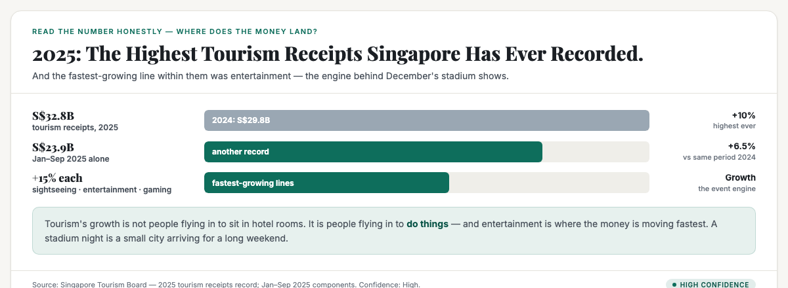
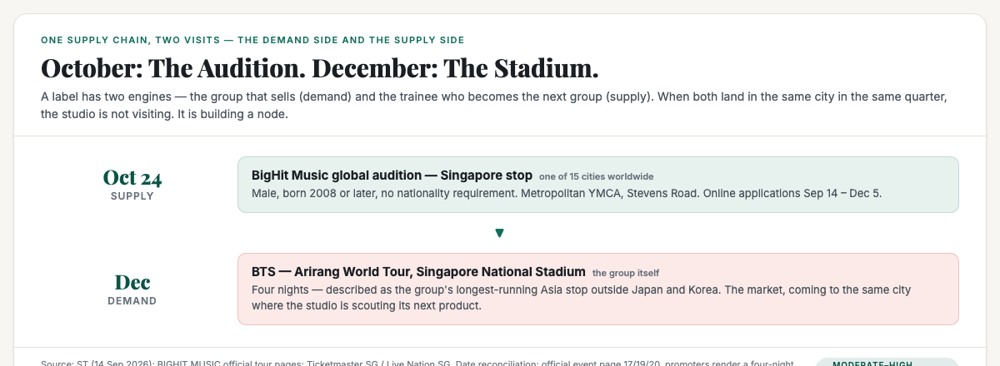
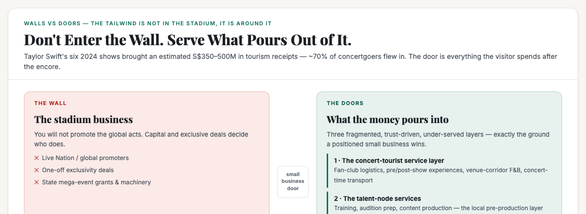

# ObserveCo — Trending-Topic Content Package (Book 1 Quality)

**Date:** 2026-09-15
**Trigger:** Trending on X — ST: "K-pop group BTS' agency BigHit Music to hold audition in Singapore on Oct 24 for male talent" (ST, 14 Sep 2026). BigHit's global audition for male trainees stops in Singapore on Oct 24 at Metropolitan YMCA; online applications Sept 14–Dec 5. Same week, BTS's Arirang World Tour is confirmed for Singapore's National Stadium in December — four nights, the group's longest Asia run outside Japan/Korea.
**Source visuals:** `fig-bts-01-money.html/.png`, `fig-bts-02-supplychain.html/.png`, `fig-bts-03-doors.html/.png`, `banner-bts.html/.png`.
**Source manuscript:** `whitepapers/book1-map-manuscript.md` — Ch 1 (reading numbers honestly), Part 2 Ch 3 (the external forces: tourism as recurring injection; "a tourist's S$200 dinner is pure new money dropped into the domestic layer"), Part 3 Ch 2 (growth / stale / decline = "the current is at your back"), Part 3 Ch 3 (the structural test, walls vs doors, the slots).
**Voice:** Sean's register — first-person, plainspoken, evidence-first, no hype. Teaches the mechanism, not the headline.
**Rule:** Draft only. Nothing posted. Sean pushes the button.

---

# THE FRESH PERSPECTIVE (the wedge)

Every hot take on this story is either a fan piece ("BTS is coming to Singapore!") or a talent piece ("Singaporean kids could become K-pop idols!"). Both read the headline at face value: one concert, one audition, two separate pieces of entertainment news. Both miss the structural signal sitting right between them.

Read the two announcements as one event and you see the real story: **the biggest entertainment supply chain in Asia is building a node in Singapore.** The audition is not charity outreach and it is not a fan event — it is a global studio choosing to source its next product from the same city where it sells its current one. HYBE is running this audition in fifteen cities worldwide. Singapore made the cut. Two months later, its flagship group plays four nights at the National Stadium. Demand and supply, arriving in the same quarter, pointed at the same little red dot.

That is a "where the money is going" signal straight out of Book 1's map. The wedge: **"BTS is coming to Singapore twice this year. October: the audition. December: the stadium. That is not a coincidence — it is a supply chain deciding where to build the factory. And it is the clearest sign yet of where the money in Singapore is going: into the event economy, twice."** A small business reads that the way it reads any number — what does it actually measure, and which side of the money can I stand on?

---

# PART ONE — THE X ARTICLE (long-form, Book 1 quality)

## Article: "BTS Is Coming to Singapore Twice. Read It as One Signal: The Money Is Building a Factory Here."

**Format:** X Article, ~2,200 words, 3 embedded visuals.

---

### The number nobody can look away from

S$32.8 **billion**. That is what tourists spent in Singapore in 2025 — the highest tourism receipts this country has ever recorded, up ten percent in a single year. Read it the way this book teaches: where does it come from? The Singapore Tourism Board, the agency that actually counts it. Is it current? Months old. What does it actually measure? The whole of visitor spending — hotels, sightseeing, retail, food, entertainment — not any single business's market. It is a map of where money lands in this country, not a cheque one business can cash.

Now strip the number down to the line that matters. In the first nine months of 2025, receipts hit S$23.9 billion, another record. And the fastest-growing lines were not the ones you expect. **Sightseeing, entertainment and gaming each grew about fifteen percent.** Tourism's growth is not coming from people flying in to sit in hotel rooms. It is coming from people flying in to *do things* — and the thing doing the heaviest lifting in entertainment has a name.

The same week the tourism board's numbers were still being digested, The Straits Times ran a story that looks like entertainment news and reads like a supply-chain decision. **BigHit Music, the agency behind BTS, is holding a global audition for male talent — and Singapore is one of fifteen cities chosen on-site.** October 24, Metropolitan YMCA in Stevens Road, any male born in 2008 or later, no nationality requirement. Online applications run from September 14 to December 5.

Now add the second announcement, because the two are one story. **BTS's Arirang World Tour plays Singapore's National Stadium in December** — four nights, the group's longest-running Asia stop outside Japan and Korea. Ticket platforms describe it as an unprecedented four-night stadium engagement.

October: the audition — the *next* group. December: the concert — *the* group. One supply chain, two visits, same city, same quarter.

### Why the audition is not a talent story

Most people will read the audition as a talent story — "your kid could be the next K-pop idol" — and that is the hot take the headline invites. It is also the wrong layer.

Think about what a global audition actually is. HYBE does not hold on-site auditions in fifteen cities out of charity, and it does not do it for publicity. It does it because the economics of K-pop production have changed: the group is built in Korea, but the market is everywhere, and the pipeline of trainees is only as good as the cities it sources from. Singapore was one of seventeen cities in the 2024 round. It is one of fifteen in 2026, in the same list as Seoul, Tokyo, Los Angeles, Sydney and Toronto. That is not a scouting trip. That is a studio treating a city as a source of supply.

Here is the mechanism, plainly. A record label's business has two engines: **demand** (the group's concerts, albums, merchandise) and **supply** (the trainees who become the next group). When a studio runs both engines in the same city in the same quarter, it is not visiting. It is deciding that the city is a node — a place where its customers live *and* where its next products come from.

Singapore has spent two decades buying the product. Now the producer is checking whether the city can make it too.

### The honest read of the concert number

Before the "so what," read the concert the way the book reads any number. What does a BTS concert actually *measure*?

Not a ticket. A visit.

A stadium show by a global act is a small foreign city arriving for a long weekend. When Taylor Swift played six shows in Singapore in 2024, economists estimated S$350 million to S$500 million in tourism receipts — on the assumption that roughly seven out of ten concertgoers flew in from overseas. Maybank's macro research put that estimate in print; The Business Times reported it. Coldplay's six shows the month before made Singapore the Asian anchor of that tour; booking platforms measured an 8.7-times surge in accommodation searches. The Monetary Authority of Singapore itself credited the two tours with a visible "surge in tourism activity" in the first quarter of 2024. This is not a vibe. The central bank said it.

And that is the honest arithmetic of what is coming in December. Four stadium nights, at the largest venue in the country, headlined by the biggest act in the category. Each concertgoer who flies in is a hotel night, meals, transport, retail, and — with the right positioning — something to do around the show. The 2025 record was built on this exact engine, and the 2026 calendar — BTS, Disney, the F1 — is the state's own pipeline pointed at keeping it there.

There is a counterargument, and it is worth facing. Tourism spending is forecast to soften in 2026 even as arrivals grow — the May 2026 warning from the trade. The mega-event pipeline does not suspend the economic cycle. But read the direction, not the quarter: the era when a Singapore business could ignore live entertainment as "not my industry" ended when the tourism board started booking stadium acts as economic policy. The current is at your back if you are serving what the event brings.

### The wall and the doors

Now the question the map forces: what can a small Singapore business actually do with this?

Start with what it cannot do. You will not promote the stadium acts. That world is a wall — Live Nation, the global promoters, the one-off dealmakers, and the state's own mega-event machinery with its grants and exclusivity agreements. A small business does not enter that wall. The discipline from the book: stop at the wall, and look for where the money pours out of it.

It pours out in three places, and each is a door a small business can walk through.

**Door one — the concert-tourist service layer.** Every stadium night is a small town arriving: tens of thousands of visitors, most of them foreign, each carrying a weekend of spending. The door is not the show. It is everything around the show — fan-club coordination and group logistics, pre- and post-concert experiences, late-night F&B on the venue corridor, transport that runs on concert time instead of office time. The receipts precedent is S$350 million to S$500 million from six shows; the businesses that captured a slice of it were not ticket sellers, they were the ones who served the visitor after the encore. In a country that buys through referral — Book 1's structure — the fan community is the referral economy distilled: a named, trusted organiser who packages the weekend.

**Door two — the talent-node services.** This is the door nobody is talking about, because it is the one the audition itself opens. When a global studio holds auditions in your city over years, it creates a permanent local market for the *pre-production* layer: vocal and dance training, audition material production, styling, content creation. The 2024 round was seventeen cities; the 2026 round is fifteen. HYBE keeps coming back, which means the pipeline is real — and every trainee pipeline needs local suppliers who teach, prepare and present the talent. (Verify before entering: what do the local academies actually charge, and does the demand recur between audition rounds? The audition is one weekend; the training business is the whole year.)

**Door three — the premium visitor.**
Remember the map's most useful phrase: a tourist's S$200 dinner is pure new money dropped into the domestic layer. The event tourist is the high-spending visitor, already flying in, already committed to spending. Door three is the curated layer for exactly that person — the trusted local who packages Singapore around the show: the pre-concert dining experience, the day-after excursion, the coordinated group offer. The state's whole mega-event strategy exists to put that person on the ground. Nobody has claimed the word "the concert tourist's local" yet.

Each of these is a slot, not a business — a place a position can live, exactly as Book 1 says: **the tailwind lands hardest in the fragmented, trust-driven, under-served corner, and that is the ground a positioned small business owns.**

### The honest closing

Let me tell you what this story is *not*.

It is not "Singapore is becoming a K-pop capital" — that is a headline, and the evidence for it is one audition and one tour. It is not "open a talent academy tomorrow" — each door above is a place to look, not a guarantee, and the book's rule applies: an open word means where to investigate, not what to build.

What it is, is a map reading. Two announcements in the same week — an audition in October and a stadium in December — are the same signal written twice: **the biggest entertainment supply chain in Asia has decided where its customers are, and where its next products will be made.** The money was already here: S$32.8 billion in receipts, entertainment growing fifteen percent, a mega-event calendar for 2026 that names the stadium acts months in advance. The map is drawn. The question it leaves a small business with is the only one that ever matters: **which side of the money are you on — the wall, or the door?**

October 24 is an audition. December is a concert. Together, they are a where-the-money-is-going sign, posted in the clearest language Singapore business owners understand: the same city is now on both sides of the world's biggest music supply chain. Where you stand on that map is a position. And positions, as the second book says, are where small businesses get chosen.

---

# PART TWO — THE X POSTS (beefed up, educational)

## Primary — the supply-chain mechanism

> BTS' agency is holding a global audition in Singapore on Oct 24 — one of only 15 cities worldwide.
>
> Two months later, BTS itself plays 4 nights at our National Stadium.
>
> That's not a coincidence. That's a supply chain deciding where to build the factory.
>
> Here's how to read it, Singapore-small-business style:
>
> The concert = demand. The audition = supply. When a studio runs BOTH in the same city in the same quarter, the city is no longer just a market. It's a node — where customers live AND where products come from.
>
> The money behind it: S$32.8B tourism receipts in 2025 — a record, up 10%. And the fastest-growing line was entertainment: +15%.
>
> Taylor Swift's 6 shows in 2024: est. S$350–500M in tourism receipts, ~70% of concertgoers flying in. MAS credited concerts with a Q1 2024 tourism "surge."
>
> What can a small business actually do?
> - Don't enter the wall (Live Nation, global promoters, state mega-event deals)
> - Serve what pours OUT of it:
>   1. The concert-tourist layer — logistics, pre/post-show experiences, venue-corridor F&B
>   2. The talent-node layer — training, audition prep, content production for the scouted talent
>   3. The premium visitor — the trusted local who packages the weekend for the S$200-dinner tourist
>
> The tailwind lands in the fragmented, under-served corner — same as always.
>
> October: the audition. December: the stadium. Read them as one signal.
>
> #Singapore #Business

## Alt — the "wall vs door" hook

> Everyone's reading the BigHit audition as a talent story. "Your kid could be a K-pop idol!"
>
> That's the headline. Here's the mechanism:
>
> HYBE is running on-site auditions in 15 cities — Seoul, Tokyo, LA, Sydney... and Singapore. Two months later, BTS plays 4 nights at the National Stadium — the group's longest Asia run outside Japan/Korea.
>
> A label has two engines: demand (concerts, albums) and supply (the next group). When both engines land in the same city in the same quarter, the studio isn't visiting. It's building a node.
>
> Singapore spent 20 years buying the product. Now the producer is checking if we can make it too.
>
> For small business, the honest read:
> - The stadium business is a wall. You don't enter it.
> - The money pours OUT of it: the visitor layer, the talent prep layer, the premium local layer.
>
> One audition + one tour = the clearest "where the money is going" sign on the island.
>
> #Singapore #Positioning

---

# PART THREE — HASHTAGS (per platform)

## X — keep it to 1–2 tags (the hook + one topic tag)
- Primary: `#Singapore` + `#Business`
- Alt: `#Singapore` + `#Positioning`

---

# STATUS

- [x] Rendered 4 visuals (fig-bts-01..03, banner-bts) — 1200×440 / 1200×480
- [x] Rendered visuals verified — dimensions exact (PNG header), non-blank, design palette present (teal-family 470–3,503 px, red-family 1,019–4,247 px per image)
- [ ] Sean reviews the X article (Part One)
- [ ] Sean reviews the X post (Part Two — pick primary or alt)
- [ ] Sean posts (I never post without approval)

---

*Draft only. Nothing posted without approval.*

---

## Research notes (for follow-up edits)

**Primary sources:**
- ST, "K-pop group BTS' agency BigHit Music to hold audition in Singapore on Oct 24 for male talent" (Ann Chen, 14 Sep 2026):
  - BigHit global audition for male talent, Sept–Dec; Singapore on-site Oct 24 at Metropolitan YMCA, Stevens Rd; on-site registration 11am.
  - Eligibility: males born 2008 or later, no nationality requirement.
  - Online audition accepts applications Sep 14–Dec 5 (HYBE Instagram: "Show us who you are in any category of your choice — even just a single photo is enough to apply!").
  - 15-city list beyond Singapore: HCMC, Hanoi, Jakarta, Bangkok, Osaka, Tokyo, Taipei, Seoul, LA, Vancouver, Toronto, Sydney, Melbourne, Auckland.
  - Precedent: 2024 round, Singapore was one of 17 on-site cities.
- CNA Lifestyle, "BTS' agency to hold auditions for new male trainees in Singapore this October" (15 Sep 2026): same facts; BTS Arirang tour Singapore leg referenced.
- BIGHIT MUSIC official: bighitsmusic.com/event/arirang-singapore — Singapore dates Dec 17/19/20; bighitsmusic.com/bts/tour lists Dec 17/22 at Singapore National Stadium.
- Ticketmaster SG (26sg_bts): "BTS WORLD TOUR 'ARIRANG' will be staged in Singapore for an unprecedented four-night stadium engagement, marking the group's longest-running Asia stop outside of Japan and Korea." Live Nation SG: 17 Dec – 22 Dec 2026.
  - Date reconciliation needed before publish: official BIGHIT event page lists 17/19/20; Ticketmaster/Live Nation describe/render a four-night engagement (17–22). Article uses "four nights" per TM/LN; research notes flag the difference.

**Concert-economy numbers (High unless noted):**
- STB: 2025 tourism receipts S$32.8B, +10% YoY from S$29.8B (2024) — highest ever (STB media centre, Feb/May 2026).
- STB: Jan–Sep 2025 receipts S$23.9B (+6.5%, record); sightseeing/entertainment/gaming each +15% (STB, Feb 2026); arrivals 16.9M (+2.3%).
- Taylor Swift Eras (Mar 2024, six shows): est. S$350–500M tourism receipts, ~70% of concertgoers assumed flying in (Erica Tay, Maybank — via ST/BT, Feb 2024). Confidence Moderate-High (economist estimate, widely reported).
- Coldplay Music of the Spheres (Jan 2024, six shows): Singapore = main Asia stop; Agoda 8.7x accommodation-search surge from MY/ID/HK/AU/PH (ST, Jun 2023).
- MAS: Q1 2024 "surge in tourism activity" credited to Coldplay + Taylor Swift (CNA, May 2024).
- 2026 outlook: mega-event pipeline (BTS, Disney, F1) forecast ~S$32.5B tourism spend (SBR, Feb 2026). Counterweight: CNBC (May 2026) — arrivals up but spending forecast to soften. Both Moderate.
- National Stadium concert capacity ~55,000 (widely reported; unverified this session — label Low/range if used).
- Swift NA tour US$2.2B gross (theindependent.sg) — not used in article.

**Book 1 manuscript anchors** (`whitepapers/book1-map-manuscript.md`):
- Ch 1: reading numbers honestly — where does the number come from / is it current / what does it measure / one number or a range. Used for the S$32.8B read-down.
- Part 2 Ch 3 (external forces): "Tourism is a recurring injection of high-spending visitors walking past your door... A tourist's S$200 dinner is pure new money dropped into the domestic layer." Tourism F&B/sightseeing/entertainment/gaming +15% (p. 393–401).
- Part 3 Ch 2: "Being in a growing industry does not guarantee you win, but it means the current is at your back. Being in a stale or declining one means the current is against you" (p. 1182).
- Part 3 Ch 3: structural test; walls vs doors; "the winning slots sit in industries the big players find too small or too messy"; tailwind lands in fragmented, under-served corner.

**Confidence labels:**
- Audition facts (dates, venue, eligibility, city count) — High (ST + CNA + official pages, days old).
- Concert dates — Moderate-High (conflict noted above; four-night framing per TM/LN).
- Receipts/tourism figures — High (STB primary).
- Swift/Coldplay impact estimates — Moderate (economist estimates).
- The three doors — Moderate (positioning leads per Book 1's "lead to verify" rule, not settled findings).

**Wedge anchor:** Book 1's map — reading a number honestly + the walls-and-doors pattern: the tailwind lands in the fragmented, under-served service layer, not the wall. Fresh twist: the audition is a supply signal, not a talent story — the studio building a node next to its market.
