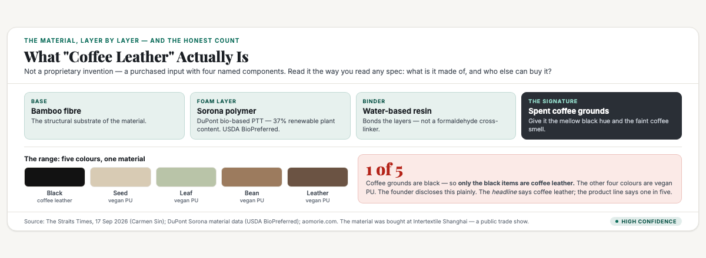
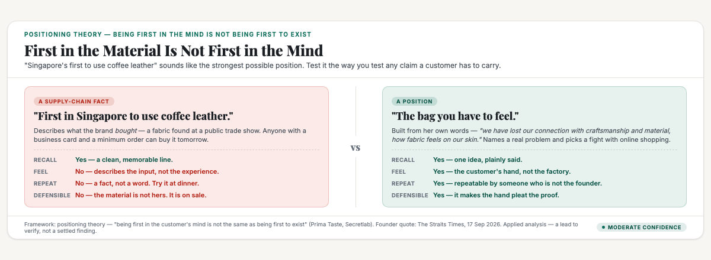
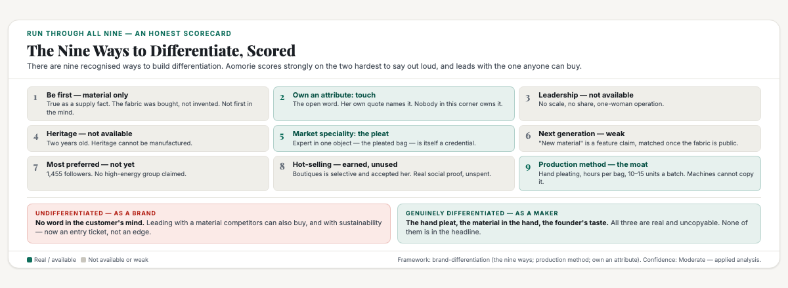

# ObserveCo — Trending-Topic Content Package (Book 1 Quality)

**Date:** 2026-09-17
**Trigger:** Trending on X — ST: "On The Radar: Aomorie is the small Singapore brand turning coffee leather into jackets and bags" (ST, 17 Sep 2026, Carmen Sin). Apple Lau, 28, incorporated Aomorie in May 2024; billed as the first brand in Singapore to use coffee leather — a vegan material discovered at Intertextile Shanghai. Signature pieces: the Coffee Leather Jacket ($300) and hand-pleated Bloom bags ($135–195). First physical stockist to be announced in October.
**Source visuals:** `fig-aom-01-material.html/.png`, `fig-aom-02-position.html/.png`, `fig-aom-03-nine.html/.png`, `banner-aomorie.html/.png`.
**Source manuscript:** `whitepapers/print/output/ebook/book2-manuscript-CURRENT.md` — Ch "The word in the mind" (the mind holds one word per brand; being first in the mind is not the same as being first to exist; the two doors — be first, or be different), Ch "Being first: the strongest position there is" (first in the mind ≠ first in time; Prima Taste / Secretlab), the five-step apparatus chapter (the four postures matrix; the one-page position; question six — the one line in under fifteen words), Ch "Positioning vs branding" (positioning first, branding second). `whitepapers/book1-map-manuscript.md` — Ch 1 (reading numbers honestly), Part 3 Ch 3 (walls vs doors; the structural test; the flank).
**Skill lens:** `positioning-strategy` (Five Laws of the Mind; the four postures; Trap #7 Category Trap) + `brand-differentiation` (the nine ways; the three kinds of credentials; potato vs rose; the five concepts that rarely make differentiation; naming principles).
**Voice:** Sean's register — first person, plainspoken, evidence-first, no hype. Teaches the mechanism, not the headline.
**Humanizer pass:** run 2026-09-17 after Sean flagged the first draft as AI slop. Measured against `SecondBrain/2_Areas/Identity/SEAN_FOO.md` as the voice sample: avg sentence 14.2 words, 19% under 6 words, bold 1.07/1k, em dash 5.14/1k, first person throughout. Repeated skeleton removed (`the number nobody can look away from` / `let me be fair` / `the honest closing`). See "Voice calibration" in the research notes.
**Rule:** Draft only. Nothing posted. Sean pushes the button.

---

# THE FRESH PERSPECTIVE (the wedge)

I read the Aomorie story twice. The second time, I stopped caring about the coffee.

The coffee is the hook every write-up has taken, and I understand why. A 28-year-old Singapore designer turns spent coffee grounds into leather jackets. That is a clean story, and it is true. It is also the least protected thing about her business, and once I noticed that, I couldn't unsee it.

Apple Lau found the fabric at Intertextile Shanghai, one of the largest textile trade fairs in the world. That is a public floor with public booths and a minimum order quantity. She didn't invent it. She didn't develop it. She liked how it felt in her hand and she bought it. Which means the material that makes her brand famous is available to anyone who reads the same article I read.

I don't think that's a weakness in her business. I think it's the most useful fact in the story, because it tells you where her real defence sits — and it isn't where the headlines are pointing.

Here's the thing I couldn't stop thinking about. There is one part of Aomorie that no one can buy, and it's the part that got one sentence in a 1,500-word profile: the pleats.

Her Bloom bags are hand-folded, pleat by pleat, on both sides, in batches of ten to fifteen. That is a production method. It's hours of someone's hands per bag, and it can't be ordered from a supplier in Shanghai. A cheaper competitor can buy her fabric tomorrow. They cannot buy her pleats.

So the brand's strongest asset is being treated as a detail, and its weakest asset is carrying the whole story. That's the wedge here, and it's the same mistake I see in almost every small brand I look at. Everyone leads with the thing they bought. Almost nobody leads with the thing they made.

---

# PART ONE — THE X ARTICLE (long-form, Book 1 quality)

## Article: "Aomorie Is Genuinely Different. That's Exactly Why It's Still Invisible."

**Format:** X Article, ~2,000 words, 3 embedded visuals.

---

### One of five

The first number that stopped me was the smallest one.

Out of five colours in the range, exactly one is made from coffee leather. The other four are vegan PU. The reason is simple: coffee grounds are black, so the black items are the coffee ones and the pastel ones aren't. It's in the Straits Times piece, stated plainly, by her.

I want to be clear that this isn't a criticism. She disclosed it, unprompted. But read the two lines side by side. The headline says coffee leather. The product range says one in five. The founder is being honest. The category label is doing the exaggerating for her.

That gap between the label and the product is where I started paying attention.

The rest of her numbers describe a business more precisely than any adjective could:

- **$300** for the Coffee Leather Jacket, her first product, which took six months of trial and error.
- **$135 to $195** for the Bloom bags. She says those bags took the brand "from three digits to five" in annual revenue. That means hundreds of dollars a month becoming tens of thousands a year. A real business, and a small one.
- **$10,000** to start, with, in her words, no backup.
- **10 to 15 units** per make and colour. That's the batch ceiling, set by hand pleating and by a fabric that costs double what ordinary vegan leather costs.
- **Not yet profitable.** She said so herself, which is worth more credit than it will get.

One woman, a dining table, a genuinely uncopyable product, made in deliberately tiny batches, at an honest price, not yet at profit.

I've seen this shape before. It's a positioning problem wearing a materials win as a disguise, and the disguise is good enough that everyone covering the story is praising the wrong half.

### She got the hard part right

Before I get to the uncomfortable part, the fair part, because the craft in this brand is real and I'm not going to pretend otherwise.

The material works in the hand. It's a bamboo fibre base with a partially plant-based foam called Sorona, a water-based resin, and the spent grounds that darken it. Sorona is DuPont's polymer with 37 per cent renewable plant content and USDA certification. The grounds are a waste stream getting a second life. None of that is nothing.

The pleat is better than that. She found it by accident, playing with the leather on her sewing machine, and discovered the fabric was thin enough to fold. You can't pleat full-grain leather that way. The Bloom bags are folded by hand, on both sides, and I keep coming back to the same point: that's labour, skill, and hours per unit. That is the kind of differentiation a cheaper competitor cannot copy without trained hands.

And she's honest about her limits. Only black is coffee leather. Mass production is unviable at these costs. She's not profitable and she has no safety net. In a category where greenwashing is the norm, a founder who volunteers her constraints is more believable than one who hides them.

The craft is real. The price is honest. This is a better-run brand than most at two years old.

Now the part that will decide whether it lasts.

### The fabric isn't the moat

Here's the sentence in the article that I think matters more than every other sentence in it. She found the fabric at a trade show.

A trade show is a shop. Coffee leather is not her technology, her patent, or her exclusive. It's an input she buys. And it isn't new to textiles either — the Taiwanese mill Singtex has been selling a coffee-ground-infused yarn called S.Café for years, at industrial scale, to brands all over the world. That product is polyester-based and behaves differently. But it tells you that "coffee in a fabric" is an established, purchasable category. Nobody in this story invented it.

So let me lay out what actually protects her, layer by layer:

| Layer | Does it protect her? | Why |
|---|---|---|
| The coffee leather fabric | No | Bought on a public trade floor. Anyone can buy it tomorrow. |
| The brand story | Not much | A good story, easily copied by the next founder with the same fabric. |
| The hand pleat | Yes | Labour, skill and hours per unit. A cheap rival can't copy it without hands. |
| Her taste | Yes | Not transferable, not purchasable, and the hardest thing to copy. |

Every headline written about Aomorie is about row one. Row one is the weakest row in the table.

She's being carried by rows three and four, and neither of those made the headline.

### Being first with the material isn't being first in anyone's mind

This is the part I find genuinely useful, because it's a mistake I see constantly and the fix is small.

"Singapore's first brand to use coffee leather" sounds like the strongest position a small brand can hold. It reads like being first, and being first is the best position there is. But it isn't that. It's a supply-chain fact dressed up as a position.

Test it the way you'd test any claim you're going to repeat to a friend. Can a customer recall it? Yes, it's a clean line. Can they feel it? No, because it describes what she bought, not what they get. Can they repeat it at dinner without sounding like a press release? Try it out loud. "She's the first in Singapore to use coffee leather." It's a fact about a fabric order.

The positioning people have a name for this and it's the most expensive mistake in the book: naming the category before the value is obvious. Coffee leather is a category label. Nobody wakes up wanting coffee leather. They want a bag they love, that feels beautiful, that nobody else is carrying, that they'll still use in three years.

The label isn't the position. The word is.

### She already said the word

Here's the line in the profile that I think she doesn't realise is her pitch:

> *"We live in a time where shopping happens through a screen, and people decide to buy things based solely on visuals on a screen. For a long time, I felt that because of this, we have lost our connection with craftsmanship and material. It's the simple things like how fabric feels on our skin."*

That isn't a nice sentiment. That's a position, fully formed, sitting there unclaimed.

Look at what it does. It names a problem anyone with a phone recognises — everything looks identical on a screen, and the thing you actually buy with is touch. It picks a fight with online shopping as a category. And it turns her material from a spec into an answer: the reason the coffee leather matters is that you have to feel it.

Her own Instagram bio already gestures at it. "Shaped by textures and material-led design." She is one step from the word. The word is touch. In customer language rather than designer language, it's the bag you have to feel.

That's the opening, and it's the one her industry structure actually supports.

### Read the structure, and the opening is there

Structure decides which game you're playing, and this is where Aomorie's situation is genuinely good.

Ask two questions about Singapore's handbag market. Do a few names own the money? In luxury, yes. But at her price point — S$100 to S$300, plant-based, independent — can an average customer name a single brand? No. There is no Singapore name the mind reaches for when someone wants a plant-based bag. That's an open position, and the move it makes available is to create the category and be first in it.

Now the part that should worry her. She isn't alone on that ground, and the others are moving. AALLSS launched a minimalist handbag line in vegan apple leather and got profiled by the same paper a month earlier. Tocco Toscano claims Singapore's first plant-based bag collection. Aijek just relaunched on a fully plant-based promise.

Everyone has a plant. Everyone has a story. In that crowd, the material stops being a differentiator and becomes a ticket to entry. Which means the brand that wins this corner won't be the one with the best fabric. It'll be the one that claims the word first.

Aomorie's material is the most unusual of the four. Her story is the most personal. And the word is still sitting on the table.

### Where she scores

There are nine recognised ways to build differentiation. Running her through all of them is more revealing than any single verdict, because her strengths cluster in the places that are hardest to say out loud.

The short version: she's differentiated as a maker and undifferentiated as a brand. Everything that's genuinely hers — the hands, the taste, the method — lives on the workshop side. Everything she's saying lives on the supply side. Nothing yet lives in the customer's head.

### Six things I'd do next

In the order I'd do them.

**1. Claim touch, not vegan.** Stop leading with the material and lead with the sensation. The claim becomes: the brand you have to feel before you buy. It's true, it's hers, and nobody in her corner owns it. Her material stops being a spec and becomes an argument.

**2. Move "sustainable" to the footnote.** It's the most crowded claim in fashion right now, and every competitor I named above is making it. Sustainability behaves the way quality does in every positioning framework: it's an entry ticket, not a reason to choose. Say it accurately once and let the touch claim carry the weight.

**3. Turn the PU disclosure into a credential.** This is the counterintuitive one. She has an asset she's treating as a liability. In a category thick with greenwash, component-level honesty is rare enough to be valuable. State it as a standard: the black is coffee leather because the grounds are black, the colours are PU because dyeing would compromise the material, and we'll tell you which is which every time. Most brands in her space would fail that test. She passes it by default, because she's already doing it.

**4. Count the pleats.** Her real moat is a method, and methods become differentiation when you name them and count them. How many pleats per bag, how many hours, by whose hand. The production-method brands didn't say "carefully made." They named the process and let the number do the arguing. A pleat count is a credential, a story, and a defence of the price, all in one figure.

**5. Get a credential that isn't a newspaper.** Right now her strongest proof point is a lifestyle profile. That's soft. The material has checkable properties — the Sorona certification, the diverted waste, the water-based resin — and those need to exist in a form a customer could repeat. Credentials only work when someone other than the founder can say them.

**6. Fix the price, and treat the stockist as the real news.** The ST piece gives two prices for the same bag: $135 in the text and $155 in a caption. Probably a caption slip, but a premium brand cannot have two prices for one product in a national paper. More importantly, the October stockist announcement matters more than any new design. Pop-ups are demonstrations. A stockist is distribution. That's the step that turns a dining-table brand into a repeatable one.

One caveat, and she already knows it: the jacket is a strange product for the tropics. She calls it a forgiving first project and she's hunting for a cooler fabric. The $300 jacket is doing its job as proof that the material can be tailored. The Bloom bag is the business. Put the money on the bag and let the jacket be the credential.

### What I actually take from this

Aomorie isn't a Singapore fashion success story yet. One profile and 1,455 Instagram followers is a start, not a position. And "coffee leather is the future of fashion" isn't true either — it's a bought material with real costs and real limits, as she'd be the first to tell you.

What it is, is a live test of the idea I use more than any other. Difference is a fact. A position is a word.

She has the hard half. A product nobody else in the country makes, a method a cheaper competitor can't copy, and taste that can't be bought. Most small businesses never get that far, and I'm not being generous when I say that.

What she hasn't done is claim the word. And the word is already written, in her own quote, about the screen and the skin.

Touch is on the table. The first brand in this corner to take it will own it. In a market where every competitor has a plant and a story, the one that gets remembered won't have the best material.

It'll have the one word.

---

# PART TWO — THE X POSTS (beefed up, educational)

## Primary — the material is the weakest layer

> A Singapore designer is making leather jackets and hand-pleated bags out of spent coffee grounds. 28 years old, started with $10,000, still not profitable.
>
> I read the profile twice. The second time I stopped caring about the coffee, and here's why:
>
> 1. She found the fabric at Intertextile Shanghai — one of the world's biggest fabric trade fairs. Public floor. Minimum order.
> It's not her material. It's a purchase. Anyone reading that article could order the same thing next week.
>
> 2. Which means the thing making her famous is the thing giving her the least protection.
> The coffee leather is row three of her defence. She's being carried by rows one and two, and neither made the headline.
>
> 3. What actually protects her: the pleats.
> Hand-folded, both sides, 10–15 units a batch, on a fabric that costs double normal vegan leather. That's a production method. A cheaper rival can buy her fabric tomorrow. They can't buy her hands.
>
> 4. Being first to use a material isn't being first in anyone's mind.
> "Singapore's first to use coffee leather" — can a customer recall it? Yes. Feel it? No. Repeat it at dinner without sounding like a press release? Try it.
> It's a supply-chain fact, not a position.
>
> 5. She already said the word and didn't claim it:
> "We have lost our connection with craftsmanship and material. How fabric feels on our skin."
>
> That's the position. The word is TOUCH. The bag you have to feel.
>
> Difference is a fact. A position is a word. She has the hard half.
>
> #Singapore #Positioning

## Alt — one of five

> One number tells you more about this brand than the headline does.
>
> Out of five colours, one is coffee leather. The black ones. The rest are vegan PU — because coffee grounds are black.
>
> She discloses that plainly. The headline is what's exaggerating: it says coffee leather, the range says one in five.
>
> Now apply the same honesty to the rest of it:
> • The fabric — bought at a public trade show. Not proprietary. Not a moat.
> • The pleats — hand-folded, 10–15 units a batch. That IS the moat.
> • "First in Singapore" — true, but it's a supply fact, not a word in a customer's head.
>
> Singapore's plant-based bag corner is filling up. AALLSS has apple leather. Tocco Toscano claims the first plant-based collection. Aijek relaunched fully plant-based.
>
> Everyone has a plant. Everyone has a story. The material stopped being a differentiator and became a ticket to entry.
>
> Nobody owns the word yet. It's touch.
>
> In a crowded category you don't win with a better material. You win by owning a word before someone else takes it.
>
> #Singapore #Business

---

# PART THREE — HASHTAGS (per platform)

## X — keep it to 1–2 tags (the hook + one topic tag)
- Primary: `#Singapore` + `#Positioning`
- Alt: `#Singapore` + `#Business`

## Research notes (for follow-up edits)

**Primary source — ST, "On The Radar: Aomorie is the small Singapore brand turning coffee leather into jackets and bags" (Carmen Sin, 17 Sep 2026, updated 4:37pm):**
- Apple Lau, 28. Aomorie incorporated May 2024 (she quit a design agency job). UEN 202417488D (AOMORIE PRIVATE LIMITED, incorporated 02 May 2024).
- Billed as "the first in Singapore to use coffee leather."
- Material: bamboo fibre base + partial plant-based polymer **Sorona** foam + **water-based resin** + **spent coffee grounds** → mellow black hue. Found at **Intertextile Shanghai**. "A hint of the coffee smell." "Soft and buttery to the touch."
- Her mission quote (the wedge anchor): *"We live in a time where shopping happens through a screen... we have lost our connection with craftsmanship and material. It's the simple things like how fabric feels on our skin."*
- Products: Coffee Leather Jacket **$300** (pilot, 6 months of trial and error — "a more forgiving" first project; "I could have made pants or a skirt, but I wanted something very classic and timeless"). Bloom pleated bags — **$135 (Bloom 25) / $195 (Bloom 38)** in body text; a photo caption reads **"Aomorie Bloom Bag 25 in Long Black ($155)"** → **PRICE CONFLICT, flag** (article is internally inconsistent; website lists Bloom 25 Long Black and Bloom 38 Coffee Leaf).
- Bloom name: after the *bloom* step of manual coffee brewing (pouring hot water onto fresh grounds to release CO2). "The folded coffee filter also recalls a pleat." — "A simple structure with a function."
- Range: scrunchies from **$25**, pouches **$45**, Coffee Seed Charm **$19**, Bloom bags 2 sizes × 5 colours.
- **Only black items are coffee leather**; other "pastoral tones" are **vegan PU leather**.
- Hand pleating + coffee leather at **double** ordinary vegan leather cost → mass production unviable; batches kept to **~10–15 units** per make and colour.
- Revenue: the bags took Aomorie "from three digits to five" in annual revenue.
- Debut: first full collection at **Boutiques (Nov 2025)** — 300+ independent brands, twice yearly at the F1 Pit Building. "Notoriously selective about vendors." Five further pop-ups since, including Boutiques' first overseas edition in **Bangkok (July 2026)**.
- Online launch **January 2025** (aomorie.com). Crafted with partners in **Chengdu** (per aomorie.com).
- **First physical stockist found — details announced October.**
- **Not yet profitable.** "Every day is very scary to me... I don't have a backup." Spent **$10,000** to start. Asked how she feels: "Anticipation."
- Next: hunting a **cooling fabric** for clothing (tropics problem — the jacket is a strange choice for Singapore, she concedes).
- NTU School of Art, Design and Media — Bachelor of Fine Arts in Design Art; learnt pleating, smocking, latex manipulation in a surface design class. Sewing partly self-taught (YouTube + a school elective).

**Material / market verification (independent):**
- **Sorona (DuPont)**: partially bio-based PTT polymer, **37% renewable plant-based content** (corn/corn starch derived Bio-PDO); **USDA BioPreferred Program certified**; DuPont joined bluesign. → Source: California Apparel News (2019), Innovation in Textiles, TEXtalks. Confidence: High. *Note: 37% plant-based means 63% petroleum-derived — "plant-based polymer" is accurate but partial.*
- **S.Café (Singtex, Taiwan)**: established industrial coffee-ground textile — coffee grounds combined onto **polyester** yarn surface for fast-drying (up to 200% faster than cotton), UV protection, odour control. 100% recycled polyester / 65-35 poly blends. → Source: Singtex product pages, MaterialDistrict. Confidence: High. *Evidence that "coffee in fabric" is a mature, purchasable category, not a novel invention.*
- **Intertextile Shanghai** is one of the world's largest fabric trade shows → the material is a publicly available input, not proprietary to Aomorie. (Directly implied by the ST article.) Confidence: High.
- **Singapore competitor set (the flank is filling):** AALLSS — minimalist, logo-less handbags in **vegan apple leather**, founder Alison Lim (ex-tech), founded 2022, ST profile 13 Aug 2026, ~3,828 IG followers. Tocco Toscano — "Singapore's first bag and accessories collection made out of a plant-based material — apple [leather]". Aijek — relaunched 2026 on 100% plant-based, biodegradable fabrics. Confidence: High.
- **Aomorie digital footprint**: Instagram @aomorie.official — **1,455 followers, 75 posts** (bio: "Designed in Singapore, shaped by textures and material-led design"); aomorie.com; CNA938 "Culture Club" interview (with Rock Daisy's Rachel Liou) on eco-conscious boutique brands. Confidence: High.
- **Vegan leather market size: estimates conflict wildly and should NOT be quoted.** Morgan Reed Insights: $32.8B (2026) → $86.66B (2035), 11.4% CAGR. NextMSC: $46.01B (2025) → $145.46B (2035), 12.2%. Global Growth Insights (plant-based vegan leather only): $5.43B (2025) → $5.83B (2026). Verified Market Research: $10.6B (2024) → $25.4B (2032), 11.5%. Research and Markets: $234.12M (2026) → $355.23M (2032). — **A 100x+ spread across vendors on the same category. Do not use any of these figures in client-facing copy; the honest statement is "vendor estimates disagree by orders of magnitude."** Confidence in the conflict itself: High.

**Positioning-theory anchors (`book2-manuscript-CURRENT.md`):**
- Being first in the mind ≠ first in time: "Prima Taste was not the first instant noodle maker... Secretlab was not the first gaming chair maker. Being first is about being first in the mind, not first in time." (Ch "Being first: the strongest position there is")
- Two doors into a full mind: "Door one, be first... Door two, be different." (Ch "The word in the mind")
- The four postures matrix: fragmented industries (tuition, home care, professional tiers) → **the flank** — "No one owns the category → Create a category; be first." The posture "is not a choice; it is a discovery."
- The one-page position, question six: "Can you say it in under fifteen words, out loud, without wincing?"
- Positioning vs branding: "Positioning is the word you own in the customer's mind. Branding is the look and feel... positioning first, branding second."
- The test: "Ask your customers what word they attach to you."

**`positioning-strategy` skill anchors:**
- Trap #7 (Category Trap): "naming the category before the value is self-evident... The question buyers ask is not 'is this a new category?' but 'what does this save me that I can measure?'" Fix: **name the pain, not the category.**
- Five Laws of the Mind: hates confusion (keep it simple), loses focus (become an expert brand).

**`brand-differentiation` skill anchors:**
- The nine ways: (1) Be First, (2) Own an Attribute, (3) Leadership, (4) Heritage, (5) Market Specialty, (6) Next Generation, (7) Most Preferred, (8) Hot-selling, (9) **Production Method** — "a unique process that leaves consumers awestruck even if they don't fully understand it" (Luhua 5S-pressed peanut oil; Royal Selangor handcrafted pewter). Aomorie's genuine score is strongest at **#9 (hand pleat)** and potential at **#2 (touch) / #5 (the pleated bag)**; **#1 is material-only and therefore not a mind position.**
- Three kinds of credentials: authoritative third party / the product itself / common-sense perception. Aomorie currently: product = strong; third party = **weak** (a lifestyle profile is soft); common sense = moderate.
- **The five concepts that rarely make differentiation:** quality orientation, customer orientation, low price, advertising creativity, full product line. → "sustainability/vegan" behaves like quality orientation: an entry ticket, not an edge.
- Potato vs rose: she sells a potato with a rose's story — but the story is currently **founder-centric** rather than customer-word-centric.

**Confidence labels:**
- ST profile facts (figures, quotes, dates, the 1-in-5 colour split, batch sizes, price points) — High (single primary source, hours old; the internal price conflict noted above).
- Material composition + Sorona 37% + S.Café polyester basis — High (supplier + trade press).
- Competitor set (AALLSS / Tocco Toscano / Aijek) — High.
- Market-size figures — **not used; vendors conflict by >100x.**
- The positioning read (material ≠ moat; touch is the open word; the flank is available) — **Moderate** — this is applied analysis via the positioning lens, i.e. a lead to verify, not a settled finding. Presented as reasoning, with its evidence shown.

**Wedge anchor:** positioning theory's central distinction — **difference is a fact, a position is a word in the customer's mind** — applied to a brand whose differentiation is real in the product and invisible in the mind. Fresh twist: the celebrated asset (coffee leather) is the weakest layer of the position, and the uncopied asset (the hand pleat + the founder's stated mission about touch) is where the word already sits.

**Voice calibration (2026-09-17 — after Sean flagged AI slop):**

Measured with a script, not by feel. Baseline = Sean's own writing (`SecondBrain/2_Areas/Identity/SEAN_FOO.md`, 10,313 chars):

| Signal | Sean (target) | Draft v1 (Aomorie / Robots) | Draft v2 |
|---|---|---|---|
| Avg sentence length | 14.2 words | 19.1 / 20.6 | 12.4 / 13.6 |
| Sentences <=6 words | 19% | 17% / 20% | 26% / 26% |
| Bold density | 1.07 /1k | 3.57 /4.43 | 0.69 /0.39 |
| First person "I" | 57 | 7 / 0 | 31 / 17 |
| Em dashes | 5.14 /1k | 3.28 /2.72 | 1.26 /1.44 |

**Counter-intuitive finding: em dashes were NOT the tell.** Sean's own writing runs 5.14/1k — higher than the stock humanizer human baseline (0.80) and higher than both drafts. Applying the stock number would have "fixed" a pattern that is his voice. The real tells were (a) sentences running ~40% longer than his, (b) bold density 3–4x his, (c) first person stripped out (7 uses, then 0), and (d) a repeated structural skeleton across both pieces.

**The repeated skeleton (the actual slop):** both v1 articles opened on a heading literally titled "The number nobody can look away from", ran an identical "give it that first / let me be fair" beat, and closed on "the honest closing". One article written twice with different nouns. All three tics are now gone from both pieces — grep them before publishing.

**Lesson:** when humanizing for a named person, calibrate against THEIR writing, not the generic baseline. The stock pattern list is a starting point; the person's own samples are the truth.
