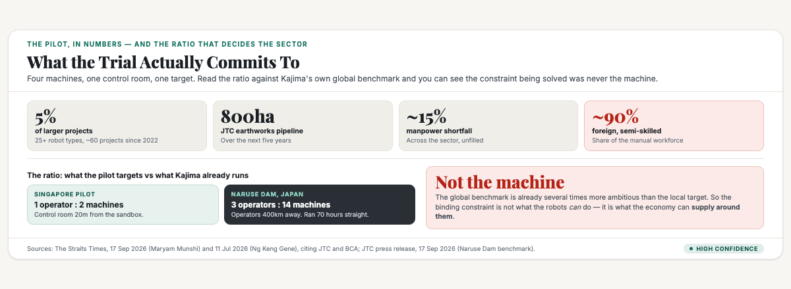
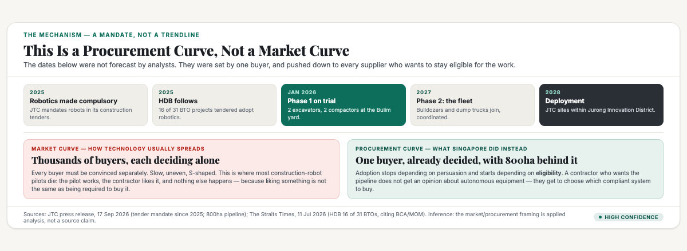
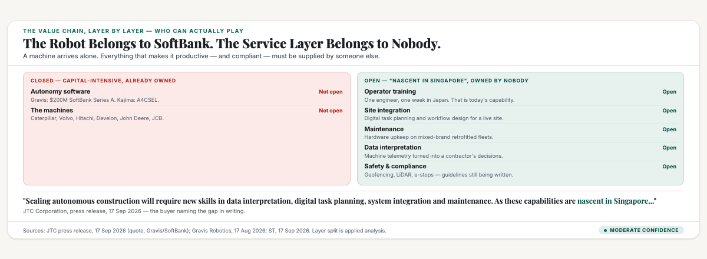

# ObserveCo — Trending-Topic Content Package (Book 1 Quality)

**Date:** 2026-09-17
**Trigger:** Trending on X — ST: "Construction robots on trial in Singapore could be deployed as early as 2028" (The Straits Times, 17 Sep 2026, Maryam Munshi; published 4:00pm, updated 5:36pm). JTC Corporation and Kajima have launched Singapore's first autonomous heavy construction equipment pilot at the Bulim Autonomous Yard (BAY) in Jurong Innovation District. Four machines — two excavators, two compactors — retrofitted with autonomy, supervised by operators from a control room 20m away. Phase 1 began January 2026 and ends early 2027; Phase 2 adds bulldozers and dump trucks; deployment across JTC sites within the Jurong Innovation District is possible from 2028. [Source: ST 17 Sep 2026 + JTC press release, 17 Sep 2026]
**Source visuals:** `fig-rob-01-arithmetic.html/.png`, `fig-rob-02-tender.html/.png`, `fig-rob-03-layers.html/.png`, `banner-construction-robots.html/.png`.
**Source manuscript:** `whitepapers/book1-map-manuscript.md` — Ch 1 "Where does the money come from?" (reading numbers honestly: where does the number come from, what does it actually measure), Ch 3 "Who holds the power, and what room do you have?" (the ten structural forces; the state as the tenth force — the direct market participant), Part Two "Stream two: the government money" (the state as buyer), the survival split (high-barrier 70%+ vs low-barrier most fail). `whitepapers/print/output/ebook/book2-manuscript-CURRENT.md` — the flank ("no one owns the category → create a category; be first"; a posture "is not a choice; it is a discovery"), "Being first: the strongest position there is" (first in the mind ≠ first in time).
**Skill lens:** `positioning-strategy` (the four postures matrix — the flank; Trap #7 the category trap) + `brand-differentiation` (the nine ways; market specialty; production method) + `technical-decision-framing` (lead with the mechanism, not the headline).
**Voice:** Sean's register — first person, plainspoken, evidence-first, no hype. Teaches the mechanism, not the headline.
**Humanizer pass:** run 2026-09-17 after Sean flagged the first draft as AI slop. Measured against `SecondBrain/2_Areas/Identity/SEAN_FOO.md` as the voice sample: avg sentence 14.2 words, 19% under 6 words, bold 1.07/1k, em dash 5.14/1k, first person throughout. Repeated skeleton removed (`the number nobody can look away from` / `let me be fair` / `the honest closing`). See "Voice calibration" in the research notes.
**Rule:** Draft only. Nothing posted. Sean pushes the button.

---

# THE FRESH PERSPECTIVE (the wedge)

I've read a lot of stories about construction robots, and most of them die the same way. A pilot works. The contractor likes it. Then nothing happens, because liking something is not the same as being required to buy it.

That's why I nearly skipped this one. Singapore put four autonomous machines on a site in Jurong, and my first reaction was that I'd read this story before, six or seven times, in six or seven countries.

Then I found the sentence that changed my mind. JTC has been mandating robotics in its construction tenders since 2025.

That's not a pilot. That's a condition of getting paid.

I want to explain why that one line makes this different from every robot pilot that quietly failed, because it took me a while to see it and it changed how I read the whole thing.

Most technology adoption runs on a market curve. Thousands of separate buyers, each deciding for themselves, each free to say no. Slow, uneven, and usually killed by one bad quarter. Construction robotics has died on that curve for a decade.

This is a different curve. One buyer, with a mandate, and a pipeline so big that contractors can't afford to be locked out of it. Adoption stops depending on persuasion and starts depending on eligibility. A contractor who wants JTC's earthworks work doesn't get an opinion about autonomous equipment. They get to choose which compliant machine to buy.

That's why I take the 2028 date seriously when I don't take most robot forecasts seriously. 2028 isn't a technology prediction. It's a procurement schedule, and procurement schedules have authors.

And here's the part that actually made me sit up. A robot arrives with nothing attached. No one trained to supervise it, no plan for fitting it into a live site, no maintenance regime, no data pipeline, no safety case. JTC says so themselves, in writing — those capabilities are "nascent in Singapore."

A government agency just named the gap. It's still empty.

---

# PART ONE — THE X ARTICLE (long-form, Book 1 quality)

## Article: "Singapore's Construction Robots Aren't Arriving Because They're Better. They're Arriving Because the Biggest Buyer Wrote Them Into the Tender."

**Format:** X Article, ~2,000 words, 3 embedded visuals.

---

### Five per cent

The number that got me was five per cent.

That's how much of Singapore's larger construction work actually has robots on site today. More than 25 machine types across roughly 60 projects, up from almost nothing in 2022, and still about five in a hundred. BCA's figures, reported in July.

I sat with that for a while, because it's doing two jobs. On the surface it says the technology has barely landed. Underneath it says something more useful: it has barely landed yet, and the thing about to change isn't the technology.

The rest of the numbers describe the change better than any headline:

- **50 per cent** — JTC's target cut in operators. One person supervising two machines, from a control room 20 metres away.
- **800 hectares** — JTC's own earthworks pipeline over the next five years. That's the demand sitting behind a four-machine trial.
- **About 15 per cent** — the sector's persistent manpower shortfall. Roughly one role in seven, unfilled.
- **Nearly 90 per cent** — the foreign share of the manual semi-skilled construction workforce.
- **14 machines, 3 operators** — Kajima's benchmark at the Naruse Dam in Akita. Those operators were 400km away, and the fleet ran up to 70 hours straight.
- **20 to 30 per cent** — JTC's target speed gain over conventional machines.

Put the fifth and sixth lines next to each other. At Naruse Dam, three people ran fourteen robots from four hundred kilometres away. In Singapore, the trial's target is two machines per operator in the next room. The global benchmark is already several times more ambitious than the local goal. Which tells me the constraint being solved here was never really about what the machines can do.

### The sentence at the bottom of the coverage

Here's the fact I found buried, and I think it's the most important fact in the story. JTC has mandated robotics in its construction tenders since 2025. HDB has put robotics into 16 of the 31 Build-To-Order projects it has tendered since 2025.

One design choice, and it changes everything downstream.

Think about how technology normally spreads. Thousands of buyers, weighing cost against benefit, each free to refuse. Adoption is slow because every single buyer has to be convinced separately. That's why construction robot pilots die: the pilot works, the contractor is impressed, and then nothing happens. Being impressed isn't being compelled.

Now change one variable. One dominant buyer with a mandate and a pipeline so large that exclusion isn't survivable. Adoption stops depending on persuasion. It depends on eligibility. A contractor who wants JTC's earthworks work doesn't get to have a view on autonomous equipment. They get to decide which compliant system to buy.

That's why 2028 deserves to be taken seriously. Not because the machines are ready, but because the demand side isn't a market. It's a procurement schedule with a single author.

And then the second-order effect, which is the part with teeth. When the tender sets the standard, the buying criteria change. Contractors stop asking "is this cheaper" and start asking "does this keep me eligible." Those are completely different questions, and they reward completely different suppliers.

### The technology is real

The fair part first, because the capability here is genuine and I'm not going to write it off as a stunt.

The retrofit is the clever decision. The excavator runs a retrofit kit from Gravis Robotics, a Zurich startup spun out of ETH Zurich. The compactor runs Kajima's A4CSEL system, in its first deployment outside Japan. Retrofitting matters because contractors upgrade machines they already own instead of replacing whole fleets. That's the difference between an adoption cost that's plausible and one that's impossible.

The safety case is measurable. Geofencing to hold the machines inside set areas, LiDAR to detect people and obstacles, emergency stops both on site and in the control room. JTC is working with the Ministry of Manpower to convert the trial into operating guidelines. And MOM and BCA have already eased workplace safety rules for smart hoists — no operator required inside, provided safeguards like door interlocks are fitted. That's regulation moving to accommodate the technology, which is a leading indicator worth watching.

The capital is serious. Gravis closed a $200 million Series A from SoftBank in August 2026, the largest Series A in construction robotics to date, and reports up to 30 per cent productivity gains over peak manual operation. Its control kit runs across Caterpillar, Case, Develon, John Deere, JCB, Hitachi, Sumitomo, Yanmar and Volvo. That is not a science project.

And one caveat worth stating plainly. "Could be deployed as early as 2028" is conditional, not committed. Phase 1's machines are still on trial. Deployment, if it happens, is scoped to JTC sites inside the Jurong Innovation District. And the autonomy belongs to Gravis and Kajima — not to a Singapore contractor, and not to Singapore. This country is the customer, not the owner of the technology.

So the capability is real, the capital is real, the safety engineering is real. Which brings me to the part that decides whether this becomes an industry.

### Who captures it

If robotics becomes a condition of getting the work, one question follows straight after: who makes the money?

Start by listing what a robot doesn't come with. A machine arrives. It does not arrive with someone trained to supervise it, a plan for integrating it into a live site, a maintenance regime, a data pipeline, or a safety case that satisfies MOM. Those aren't accessories. They're the gap between owning a compliant machine and running a productive one.

JTC says this themselves, and it's the most commercially interesting sentence in the story:

> *"Scaling autonomous construction will require new skills in data interpretation, digital task planning, system integration and maintenance. As these capabilities are nascent in Singapore..."*

Nascent in Singapore. A government agency, stating in writing that the skills layer under the technology doesn't exist locally yet. They're not describing a gap they intend to fill with a mandate. They're describing an open door.

Laid out honestly, the split is stark:

| Layer | Who wins it | Can a small business play? |
|---|---|---|
| The autonomy software | Gravis ($200M SoftBank Series A), Kajima (A4CSEL) | No — deep tech, capital-intensive, ETH Zurich spin-out |
| The machines | Caterpillar, Volvo, Hitachi, Develon and the rest | No — global equipment makers |
| The retrofit fit-out | Local contractors and equipment providers | Partly — Kok Tong Construction and Tractors Singapore are doing it now |
| Training the operators | Nobody owns it yet | Yes |
| Site integration and workflow design | Nobody owns it yet | Yes |
| Maintenance and servicing | Nobody owns it yet | Yes |
| Data interpretation and reporting | Nobody owns it yet | Yes |
| Safety and compliance advisory | Nobody owns it yet | Yes |

The top two rows are closed. The bottom five are open, and open for the exact reason JTC named.

Look at the training path as it stands today. Two operators from the local contractor Kok Tong Construction were sent to Japan for a week to train under Kajima's operators. Project engineer Tosh Chin Kah Woo learned to supervise the fleet there too. One week, one engineer, one contractor. That's the entire state of the skills layer. It cannot scale to an 800-hectare pipeline without becoming a business.

### What happens to the workers

This is where I think both camps get it wrong, and where honesty is worth more than comfort.

Singapore's construction sector employed 566,800 people as at December 2025, and close to four in five were non-residents. Migrant workers make up nearly 90 per cent of the manual semi-skilled workforce. Meanwhile MOM's construction quota allows five Work Permit holders for every local employee earning the Local Qualifying Salary.

So the "robots are taking Singaporean jobs" framing is misdirected. The labour being substituted is overwhelmingly migrant labour, and policy has been tightening that tap deliberately for years. The levy and quota system exists precisely to make hiring foreign workers more expensive and more complex than automating.

But I'm not going to let the official optimism do the work here. JTC's line is that foreign workers "may get the chance to upskill and become more productive," and that suitability "will depend on their skill level and aptitude."

Read that carefully. Aptitude is a polite word for a filter. Some of the people currently driving those machines will move into control rooms. Some won't, and no section of this story says what happens to them.

That's the gap in the coverage. The automation arithmetic is clear. The transition plan isn't. A sector that is 90 per cent migrant labour and moving to one operator per two machines isn't just buying equipment. It's running an unannounced retraining programme across the workforce with the least bargaining power in the economy, and the only public statement about it is a sentence about aptitude.

If you want the number that should worry a policymaker, it isn't the robot count. It's this: more than 25 machine types, about 60 projects, and still a 15 per cent shortfall. Technology hasn't closed the gap yet. So far it has only changed its shape.

### The part that transfers

Step back, and the whole thing resolves into one lesson I've now used in three different industries.

Almost everything a small business owner reads about technology assumes a market: customers who must be convinced, one at a time. But wherever the state is the dominant buyer — construction, infrastructure, healthcare, education, defence — adoption doesn't run on markets. It runs on tenders.

And when it runs on tenders, "is this technology good?" is the wrong question. There are three better ones:

1. Who is the buyer, and how concentrated is the demand?
2. Has the buyer already decided, and written that decision into the contract?
3. What does compliance require that nobody currently supplies?

In construction: one dominant buyer across JTC, HDB and LTA. A decision already made and mandated since 2025. And a list of compliance requirements — training, integration, maintenance, data, safety — that the buyer itself has publicly labelled nascent. Three questions, one clear answer, and you don't need a robot of your own.

This shows up everywhere once you start looking for it. The Singapore government was never only a regulator in this economy. It's the single largest buyer in it, and its procurement decisions are the closest thing this country has to an industrial policy you can read in advance. When the biggest buyer changes what it buys, it doesn't just shift its own demand. It resets the standard for every supplier who wants to sell to it.

I'd rather hold that position than "we have a robot." Anyone can buy a robot.

### What this isn't

This story is not "Singapore is building robots." It's buying them — from a Swiss startup and a Japanese contractor, on machines made by Caterpillar and Volvo. It's not "construction is automated" either. Five per cent of larger projects isn't automation, it's a beachhead. And it isn't a done deal. "As early as 2028" is conditional and scoped to one district.

What it is, is a live demonstration of a structural force most business owners never price in. In a small, concentrated economy, the largest buyer's procurement decision is a more reliable forecast than any technology trend. JTC didn't subsidise autonomous construction. It made it a condition of the pipeline, and then let an 800-hectare order book do the persuading.

The technology is arriving. Not because it won.

Because it signed the contract.

---

# PART TWO — THE X POSTS (beefed up, educational)

## Primary — the procurement curve

> Singapore just put autonomous excavators on trial in Jurong. Everyone's covering the robots. Here's the sentence I think matters more than the machines:
>
> JTC has mandated robotics in its construction tenders SINCE 2025.
> HDB put robotics into 16 of the 31 BTO projects tendered since 2025.
>
> That's not a pilot. That's a condition of getting paid. And it changes the shape of everything:
>
> • A market curve = thousands of buyers deciding separately. Slow. Uneven. Most construction robot pilots die here.
> • A procurement curve = one dominant buyer who already decided, plus a mandate that pushes it down to every supplier who wants the work.
>
> Market curves need convincing. Procurement curves have dates on them.
>
> That's why "2028" is credible when most robot forecasts aren't.
> 2028 isn't a technology forecast. It's a procurement schedule.
> Behind it: 800 hectares of earthworks over 5 years.
>
> Only ~5% of Singapore's larger construction projects have robots today. 25+ machine types. ~60 projects. Up from almost none in 2022.
>
> And here's the part with teeth. When the tender sets the standard, buying criteria change.
> Contractors stop asking "is it cheaper" and start asking "does it keep me eligible."
> Different question. Different winners.
>
> The winners aren't who you'd think. The autonomy is Gravis ($200M SoftBank Series A) and Kajima. The machines are Caterpillar and Volvo. You will not out-capitalise SoftBank.
>
> But a robot arrives with NOTHING attached.
> No trained supervisor. No site integration. No maintenance regime. No data pipeline. No safety case.
>
> JTC says it in their own press release: those capabilities are "nascent in Singapore."
>
> The government named the gap. It's still empty.
>
> The lesson transfers: when one big buyer sets the standard, don't compete with the standard. Sell to everyone who has to meet it.
>
> #Singapore #Construction

## Alt — the ratio hook

> Three operators. Fourteen robots. Four hundred kilometres away.
>
> That's not a forecast. That's Kajima's Naruse Dam project in Japan — machines running 70 hours straight, run from another prefecture.
>
> Now Singapore's target in the trial that just launched at Jurong:
> One operator. Two machines. From a control room 20 metres away.
>
> The global benchmark is already several times more ambitious than the local goal.
> Which tells you this was never really about what the machines can do.
>
> Here's what it's about:
> • 800 hectares of JTC earthworks over 5 years
> • ~15% manpower shortfall
> • ~90% of the manual semi-skilled workforce is foreign
> • MOM quota: 5 Work Permit holders per local employee
>
> You can't hire your way out of that arithmetic. JTC's own words: "Adding more manpower is not a sustainable way to meet Singapore's future construction needs."
>
> So the state did the one thing that actually changes adoption speed. It mandated robotics in its construction tenders since 2025.
>
> That's a procurement curve, not a market curve. Market curves need convincing. Procurement curves need a date.
>
> One caveat: the upskilling path for the workers being substituted depends on "aptitude." A sector 90% migrant labour moving to one operator per two machines is running an unannounced retraining programme on its least-protected workforce.
>
> And the opportunity still open: JTC says the skills to run this — data interpretation, integration, maintenance — are "nascent in Singapore."
>
> They named the gap. It's still empty.
>
> #Singapore #Business

---

# PART THREE — HASHTAGS (per platform)

## X — keep it to 1–2 tags (the hook + one topic tag)
- Primary: `#Singapore` + `#Construction`
- Alt: `#Singapore` + `#Business`

## Research notes (for follow-up edits)

**Primary source — ST, "Construction robots on trial in Jurong could be deployed as early as 2028" (Maryam Munshi, 17 Sep 2026, published 4:00pm, updated 5:36pm):**
- Pilot by JTC Corporation + Kajima at **Bulim Autonomous Yard (BAY)**, Jurong Innovation District (JID) — JTC's new **1ha sandbox**, announced by National Development Minister Chee Hong Tat at **ConTech@PDD in July 2026**. Partners: Public Sector Science & Technology Policy & Plans Office (S&TPPO) and Housing & Development Board (HDB).
- **Phase 1**: started **January 2026**, ends **early 2027**. Four machines: **2 excavators, 2 compactors**.
- **Phase 2**: autonomous **bulldozers and dump trucks** → a coordinated fleet.
- **Deployment**: possible from **2028**, scoped to JTC sites **within the Jurong Innovation District**.
- Control room **20m from the sandbox**; operators assign tasks + virtual boundaries, machines run without anyone in or near the cabin, staff monitor with line of sight and intervene.
- **JTC targets 50% reduction in operator manpower**, one operator overseeing **two machines**.
- **20–30% increase in construction speed** vs traditional machines (Cheong Jiawen, director of future of building and infrastructure, JTC).
- **JTC pipeline: at least 800ha of earthworks over the next 5 years.**
- **BCA: total construction demand projected to reach S$53 billion in 2026.**
- **Manpower shortfall of nearly 15%** across various roles (industry reports).
- **Foreign workers ≈ 90% of the manual semi-skilled construction workforce**; may upskill, suitability depends on "skill level and aptitude" (JTC).
- Training: **two operators from Kok Tong Construction (KTC)** sent to **Japan to be trained by Kajima's operators**; **project engineer Tosh Chin Kah Woo** trained **one week** in Japan.
- Retrofit: excavator = **Gravis Robotics** (Zurich) retrofit kit; compactor = **Kajima A4CSEL**, **first deployment outside Japan**. Kajima working with **KTC and Tractors Singapore**.
- Safety: **geofencing, LiDAR (people/obstacle detection), emergency-stop on site and in control room**; JTC working with **MOM** on operating guidelines.

**JTC press release (17 Sep 2026) — the authoritative version:**
- "JTC and Kajima launch Singapore's first autonomous heavy construction equipment pilot to ease manpower constraints and improve worksite safety."
- **"Since 2025, JTC has been mandating the use of robotics in construction tenders to achieve higher productivity in the sector."**
- Calvin Chung (ACE, Engineering & Operations): *"Adding more manpower is not a sustainable way to meet Singapore's future construction needs."*
- **Gravis closed its Series A in August 2026 with a $200 million investment from SoftBank — the largest Series A in construction robotics history.**
- **A4CSEL at Naruse Dam, Akita: three operators based 400km away managed 14 robots (dump trucks, bulldozers, vibratory rollers), running continuously for up to 70 hours at one point.**
- **The load-bearing quote for the wedge:** *"Scaling autonomous construction will require new skills in data interpretation, digital task planning, system integration and maintenance. As these capabilities are nascent in Singapore..."*
- Gravis closed its Series A in August 2026 with a $200 million investment from SoftBank.

**Adjacent verified sources:**
- **ST, 11 Jul 2026 ("More builders look to robots to tackle Singapore's construction labour crunch", Ng Keng Gene):** BCA figures — **more than 25 types of robots deployed across about 60 projects, up from virtually no robots in 2022**, but that is **only about 5% of larger construction projects**. **JTC has made robots compulsory in its construction tenders since late 2025**; **16 of the 31 BTO projects tendered by HDB since 2025 will adopt robotics**. As at **Dec 2025, non-residents accounted for close to four in five of the 566,800 persons working in the sector**. **Construction labourers were the top job vacancy among non-PMET roles in 2025 (MOM).** Seng Soon Huat Construction (Edmund Ng): one worker overseeing three painting robots does work previously assigned to six.
- **MOM construction sector rules:** quota = **5 Work Permit holders per local employee earning the Local Qualifying Salary**; levy applies (from 1 Jan 2024); **$900 levy** for WPs approved without required certification (Unskilled category).
- **EdgeProp Singapore, 17 Jul 2026:** BCA waives space rental at the Built Environment Innovation Hub sandboxes **for two years from July 2026**; JTC **Innovative Procurement Partnership (IPP)** — proven pilot firms can be considered for future JTC projects **without fresh tenders** (framework introduced **Feb 2025**); after the first two IPP tenders, **~20 submissions, 3 startups awarded**; **MOM and BCA eased WSH requirements for smart hoists** — no in-cab operator required given door interlocks etc.
- **Gravis Robotics, 17 Aug 2026:** $200M Series A from SoftBank; **up to 30% boost in jobsite productivity** vs peak manual operation; **Gravis Rack** installed across Caterpillar, Case, Develon, John Deere, JCB, Hitachi, Sumitomo, Yanmar, Volvo; founded 2022, spun out of ETH Zurich.

**Book 1 anchors (verified against `book1-map-manuscript.md`):**
- Ch 1, "Reading numbers honestly, the skill this whole book is built on" — four questions: where does the number come from / is it current / **what does it actually measure** / is it one number or a range. (The 5% and the 90% and the 15% each measure different things.)
- Ch 3, "The ten structural forces the numbers don't show" — force 9 is **artificial intelligence**, with the **48-point SME adoption gap** (14.5% of SMEs adopted AI in 2024, tripled from 4.2%; large businesses 62.5%).
- Ch 3, the state as the tenth force — **"the direct market participant through its linked companies"**; the state is the largest buyer, not only a regulator.
- Part Two, "Stream two: the government money" — the state as a stream a small business actually sells into.
- Survival split: **high-barrier sectors (more capital, B2B buyers) 70%+ survival; low-barrier consumer trades, most entrants fail**; whole-economy ~49% six-year survival (2020 cohort).
- Whole-economy: **77,579 new companies registered in 2025 (+8.5%, 213/day)**; 6,000–7,500 open vs 4,000–9,000 close monthly.

**Book 2 anchors (verified against `book2-manuscript-CURRENT.md`):**
- "The flank" — fragmented industry where no one owns the category → create a category; **"a posture is not a choice; it is a discovery."**
- "Being first: the strongest position there is" — **first in the mind ≠ first in time** (Prima Taste, Secretlab).
- The one-page position, question six: say it in under fifteen words, out loud, without wincing.

**Confidence labels:**
- ST 17 Sep 2026 facts (pilot scope, phases, 50% operator target, 1:2 ratio, 800ha, 20–30% speed, 20m control room, Japan training, geofencing/LiDAR/e-stop) — **High** (primary source, same-day).
- JTC press release facts (2025 tender mandate, Gravis $200M SoftBank Series A, Naruse Dam 3 operators/14 robots/400km/70 hours, "nascent in Singapore" quote) — **High** (issuer's own release).
- 5% adoption, 25+ robot types, ~60 projects, JTC mandate "since late 2025", HDB 16 of 31 BTOs, 566,800 sector headcount, four-in-five non-resident, ~90% foreign manual semi-skilled — **High** (BCA/MOM figures via ST, 11 Jul 2026).
- MOM quota 5 WP per local employee (LQS) — **High** (MOM's own sector rules page).
- **CONFLICT — construction demand 2026:** ST (17 Sep 2026) reports BCA's total construction demand **projected at S$53 billion in 2026**. A recruitment-firm summary (Corestaff, 2026) reports BCA projecting **S$32–38 billion**. These are **not reconciled** — the Corestaff figure appears to be an older or differently-scoped projection. **The article attributes the S$53 billion figure to BCA via ST and does not present it as independently verified.** Moderate confidence on the number; High confidence that the sources conflict. Do not average them.
- "2028 is a procurement schedule, not a technology forecast" — **Moderate** — applied analysis (the mandate facts are High; the causal inference is mine, presented as reasoning with its evidence shown).
- "The service layer is open / value migration to training, integration, maintenance, data, safety" — **Moderate** — reasoning from JTC's own "nascent in Singapore" statement plus the confirmed absence of an owner. A lead to verify, not a settled finding.
- "The transition plan for displaced migrant workers does not exist" — **Moderate-to-High** on the evidence (no transition programme is described in any source reviewed); the characterisation of *aptitude* as a filter is my read, flagged as such in the article.

**Wedge anchor:** the market-curve vs procurement-curve distinction, applied to a government-mandated technology adoption. Fresh twist: the celebrated asset (the robot) is the layer where no small business can compete, and the government's own press release names the unowned service layer beneath it as *nascent*. The portable lesson: when one big buyer sets the standard, sell to everyone who has to meet it.

**Voice calibration (2026-09-17 — after Sean flagged AI slop):**

Measured with a script, not by feel. Baseline = Sean's own writing (`SecondBrain/2_Areas/Identity/SEAN_FOO.md`, 10,313 chars):

| Signal | Sean (target) | Draft v1 (Aomorie / Robots) | Draft v2 |
|---|---|---|---|
| Avg sentence length | 14.2 words | 19.1 / 20.6 | 12.4 / 13.6 |
| Sentences <=6 words | 19% | 17% / 20% | 26% / 26% |
| Bold density | 1.07 /1k | 3.57 /4.43 | 0.69 /0.39 |
| First person "I" | 57 | 7 / 0 | 31 / 17 |
| Em dashes | 5.14 /1k | 3.28 /2.72 | 1.26 /1.44 |

**Counter-intuitive finding: em dashes were NOT the tell.** Sean's own writing runs 5.14/1k — higher than the stock humanizer human baseline (0.80) and higher than both drafts. Applying the stock number would have "fixed" a pattern that is his voice. The real tells were (a) sentences running ~40% longer than his, (b) bold density 3–4x his, (c) first person stripped out (7 uses, then 0), and (d) a repeated structural skeleton across both pieces.

**The repeated skeleton (the actual slop):** both v1 articles opened on a heading literally titled "The number nobody can look away from", ran an identical "give it that first / let me be fair" beat, and closed on "the honest closing". One article written twice with different nouns. All three tics are now gone from both pieces — grep them before publishing.

**Lesson:** when humanizing for a named person, calibrate against THEIR writing, not the generic baseline. The stock pattern list is a starting point; the person's own samples are the truth.
