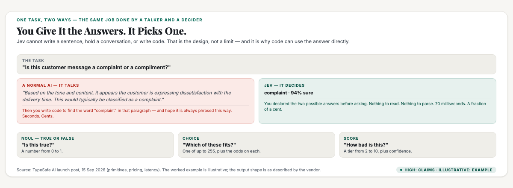
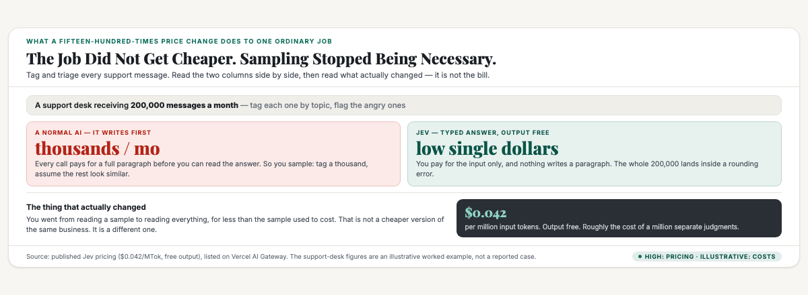
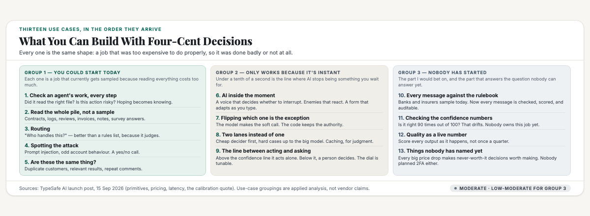
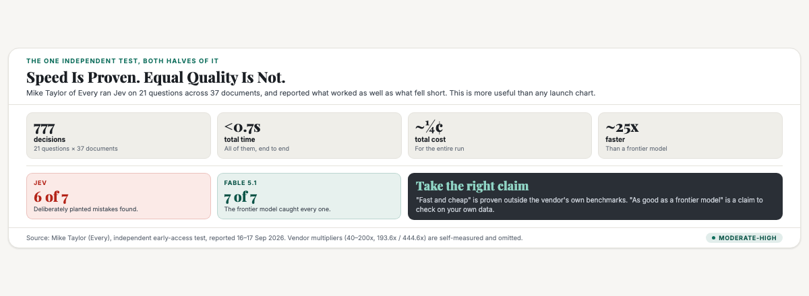

# ObserveCo — Trending-Topic Content Package (Book 1 Quality)

**Date:** 2026-09-18 (restructured — v2)
**Trigger:** Jev, TypeSafe AI's first model — launched in early access 15 September 2026. $40M seed led by DCVC. Founder Diogo Almeida co-authored the InstructGPT paper, the research behind ChatGPT. The launch coverage is all speed and price. The use cases and the position are the parts nobody is writing.
**Source visuals:** `fig-je-01-what.html/.png`, `fig-je-02-arithmetic.html/.png`, `fig-je-03-usecases.html/.png`, `fig-je-04-evidence.html/.png`, `banner-jev.html/.png`.
**Source manuscript:** `whitepapers/print/output/ebook/book2-manuscript-CURRENT.md` — "The word in the mind" (the mind holds one word per brand; the two doors — be first, or be different), the five-step apparatus chapter (the four postures matrix; question six — the one line in under fifteen words), "Positioning vs branding". `whitepapers/book1-map-manuscript.md` — Ch 1 "Where does the money come from?" (reading numbers honestly; what does the number actually measure), Part 3 Ch 3 (walls vs doors; the flank).
**Skill lens:** `positioning-strategy` (the Five Laws of the Mind; the four postures; Trap #7 Category Trap; the flank) + `brand-differentiation` (the nine ways; the five concepts that rarely make differentiation; potato vs rose).
**Primary research:** `jev-research-positioning-20260917.md` — the full evidence audit, confidences, and wedge anchor (same-day file, 20260917).
**Voice:** Sean's register — first person, plainspoken, evidence-first, no hype. Plain register per Sean's correction.
**Humanizer pass:** run 2026-09-18 with `voice_calibrate.py check --plain`. See "Voice calibration" in the research notes.
**Restructure note (v2, 2026-09-18):** v1 was rejected — *"I think what you have done is simplify the Jev article sentence by sentence, keeping to the original structure with minimal changes. I think the structure needs to change. It reads very abstract and low context... It also doesn't answer the question which is what is the position for Jev and what future potential use cases of Jev might be, particularly for those that can't see the use cases. The potential use cases has to be the main objective of the article which would drive article viral."* v2 changes the spine, not the sentences: concrete money-math opening, plain definition, **use cases as the body (13, in three groups)**, then the position, then the limits. See "Why v1 failed and what changed" in the research notes.
**Rule:** Draft only. Nothing posted. Sean pushes the button.

---

# THE FRESH PERSPECTIVE (the wedge)

I've read every Jev write-up I could find, and they all make the same move. They tell you how fast it is, they tell you how cheap it is, and then they stop. They never answer the question a normal person actually has, which is: what would I do with it?

That gap is the whole story. Because the interesting thing about Jev is not a speed number. It is that a decision now costs a fraction of a cent, and that changes a list of things from "not worth doing" to "obviously worth doing."

That's what made me sit up. In 2016, sending a million text messages cost real money and almost nobody did it. By 2020, it cost nothing, and companies built entirely new businesses on top of it — order tracking, two-factor codes, delivery alerts. Nobody planned that. It fell out of a price change.

Jev is a price change. A decision that used to cost a few cents now costs a fraction of one, and it arrives in less time than a blink. The question isn't whether it's faster than ChatGPT. The question is what becomes possible when a judgment is basically free.

So this piece does the thing the coverage skips. First, plainly, what Jev is. Then the long part — what you can actually build with it, including the ones nobody has started yet. Then the honest bit: where it's weak, what would kill it, and what the position should be.

The last one matters more than it sounds, because right now the company is describing its own product badly, and I'll show you the fix.

---

# PART ONE — THE X ARTICLE (long-form, Book 1 quality)

## Article: "Four Cents Buys a Million Decisions. Here's What That Unlocks."

**Format:** X Article, ~2,500 words, 4 embedded visuals.

---

### Four cents

Let me start with the number, because the number is the story.

Jev costs four point two cents per million tokens, and the output is free. That is roughly what it costs to have a machine make one million separate judgments.

One million decisions. Four cents. That is not a cheaper version of something that already existed. That is a new price category.

And it is fast — 70 to 500 milliseconds, so the answer arrives before you notice you were waiting.

Now here's the part that makes it work. Jev is not a chatbot. It cannot write a sentence. It cannot hold a conversation. It cannot write code, and it never will.

That is not a limitation they're apologising for. It is the entire design.

Jev answers questions where you already know the possible answers.

### What Jev actually is

Think of it this way. A normal AI is a talker. You ask it something, and it writes out an answer one word at a time, explaining itself as it goes. That takes seconds, it costs money, and when it's done you have to read a paragraph to find the one thing you wanted.

Jev is a decider. You give it the possible answers up front, and it picks one.

Here's a real example. Say you want to know if a customer message is a complaint or a compliment.

With a normal AI, you send the message and get back: "Based on the tone and content of this message, it appears the customer is expressing dissatisfaction with the delivery time. This would typically be classified as a complaint." Then you write code to pull the word "complaint" out of that sentence, and hope it's always phrased that way.

With Jev, you send the same message plus two words: complaint, or compliment. You get back: complaint, with a number attached saying how sure it is. Nothing to read. Nothing to parse. Code can use it directly.



It does three shapes of this, and only three.

- **Yes or no.** Is this true? You get a number from 0 to 1. They call this one Noul.
- **Pick one.** Which of these fits? You choose from up to 255 options, and you get the odds on all of them.
- **A ranking.** How bad is this, on a scale? You get a tier from 2 to 10, plus confidence.

And every answer comes with an honest number saying how sure it is. When Jev says it's 90 percent certain, it means it's right about 90 times out of 100. That sounds small. It is actually the most important thing in this whole article, and I'll come back to it.

### The arithmetic that changes everything

Here's why the price matters. I want to be concrete, because this is where most people switch off.

Say you run a support desk. You get 200,000 messages a month. You want to tag each one by topic, and flag the angry ones.

Doing that with a normal AI means paying for a full generation every time — the whole paragraph before you can read the answer. Say a couple of cents each. That's thousands of dollars a month, for tagging. So you sample instead. You tag a thousand and guess the rest.

Doing it with Jev means you pay for the input and nothing else, and you get a typed answer with no paragraph. The whole 200,000-message job lands in the low single dollars.

Notice what changed there. It's not that the job got cheaper. It's that sampling stopped being necessary. You went from reading a sample to reading everything, for less money than the sample used to cost. That is a different business.



That's the pattern. Every one below is the same shape. A job that was too expensive to do properly, so it got done badly or not at all.

### What you can build with it

Thirteen use cases. Three groups. The first group is what people are building now. The second only works because it's instant. The third is the one nobody has started yet, and it's the one I'd bet on.

#### Group one: the jobs you'd start today

**1. Checking an agent's work, at every step.**
This is the big one, and it's why agent builders got excited. Today, checking what an AI agent did costs about the same as having it do the work. So agents run unchecked. You find out something went wrong three steps later. When a check costs a fraction of a cent, you put a gate on every step. Did it read the right file? Is this action risky? Does this break a rule? That's the shift from hoping to knowing.

**2. Reading the whole pile instead of a sample.**
Same arithmetic as the support desk above, and it applies anywhere. Contracts, log lines, reviews, medical notes, invoices, survey answers. Anywhere you currently sample because reading everything is too expensive, you can now read everything.

**3. Routing.**
"Who should handle this?" is a fuzzy judgment, and it happens on every single item. Right now it's a hand-written set of rules, or an expensive model call, or a person. As a typed answer with a confidence score, it becomes cheap enough to run per message. And it beats a rules list, because it's making an actual judgment.

**4. Spotting the attack.**
Is this message a prompt injection? Is this account behaving strangely? Security checks run on a sample today because checking everything is unaffordable. This is a yes/no call, which is the cheapest thing Jev does.

**5. Judging whether things belong together.**
Is this the same customer as that one? Is this search result relevant to that query? Is this comment a duplicate? Millions of small comparison calls, each one trivial, each one currently done by a rule that is wrong a lot of the time.

#### Group two: the jobs that only work because it's instant

**6. AI inside the moment instead of after it.**
Under a tenth of a second is the line. Below it, AI stops being something you wait for. It becomes part of the interface. A voice agent that decides whether to interrupt you. A game where the enemies actually react. A form that adjusts as you type. Today none of that works, because the pause breaks the illusion.

**7. Flipping which one is the exception.**
This is the structural one and it took me a while. Right now, normal code is the default and AI is the special case. You write if-statements for everything, and you call a model only when the logic is too fuzzy to write down. When a fuzzy judgment costs a fraction of a cent, that flips. The model makes the soft call, and the code keeps all the authority — the permissions, the limits, the consequences. The model gives an opinion. The code decides what happens.

**8. Two lanes instead of one.**
Send everything through the cheap decider first. Only push the genuinely hard cases up to the expensive model. It's the same trick a computer uses with cache memory. My prediction: a cheap first lane becomes as normal in AI systems as caching is in software. Right now almost nobody does it.

**9. The line between acting and asking.**
This one is the real unlock, and it comes from the confidence number. Imagine a system that processes refunds. Above 95 percent confidence, it just does it. Below that, it puts the case in a queue for a person. You cannot draw that line today, because models don't tell you when they're guessing. Give every decision an honest number and the line becomes possible. That is the difference between an assistant and an operator — and you can tune it. Turn the dial, watch how often it escalates, find the setting that works.

#### Group three: the ones nobody has started yet

This is the one I'd actually bet on, and it's where the question nobody can answer yet gets answered.

**10. Checking every single message against the rulebook.**
Banks, insurers, and clinics are required to monitor communications for compliance. Today they sample, because checking everything means either an army of people or an unaffordable bill. But compliance checking is exactly a yes/no question against a known rule: does this message breach this policy? At this price, every message gets checked, each one carries a confidence score, and the low-confidence ones go to a human. That is not just cheaper. It is auditable in a way sampling never was.

**11. Somebody has to check the confidence numbers.**
Here's a job that doesn't exist yet. The moment decisions carry probabilities, someone has to verify them. Is it really right 90 percent of the time when it says 90 percent? That number drifts when your traffic changes — and if it drifts, your whole automation line is wrong. This is a real, recurring, technical job. Nobody owns it right now. That's an opening.

**12. Scoring quality continuously instead of quarterly.**
Most teams measure quality by running a test suite once in a while. When scoring is nearly free, you score every output as it happens. Quality becomes a live number on your dashboard, not a report you read a month later.

**13. Things that were never worth doing at all.**
This is the honest answer to "what will people build with it," and it is not a satisfying one. The honest answer is: things none of us can name yet. Every time a decision gets a thousand times cheaper, decisions that were never worth making become worth making. Nobody in 2005 predicted what cheap messages would create. The specific products won't come from someone planning them. They'll come from someone noticing a price changed and asking what's now cheap enough to try.



### So what is the position?

Now the part the coverage skips entirely. TypeSafe has something real, and it is describing it badly. Worth being precise about, because this is the difference between owning a category and explaining one forever.

Their label is "System One Model," borrowed from the psychologist Daniel Kahneman, who split thinking into two systems. System One is fast and instinctive. It is also, famously, the half that jumps to conclusions and gets things wrong.

So they named their product after the error-prone half of the brain. Then they said they'd explain why. Later.

That's a problem, and it's a specific one. There is a name for this mistake in positioning theory: naming a category before the value is obvious. The test is simple. Say the name out loud and ask what it saves you. "System One Model" doesn't answer that. Nobody has ever needed one.

But the move underneath is right, and it's the part worth learning from. Refusing to compete on the obvious axis is a genuinely hard thing to do.

Look at how every AI model competes. The axis is intelligence. How smart, how capable, how close to human. Every player fights on that hill, and all of them are climbing it in the same direction.

TypeSafe walked away from the hill. They gave up the one capability everyone else competes on — writing text — and picked a different axis entirely. Not how smart. How fast, how cheap, and whether the answer can be trusted.

And here's the sentence their founder said that is better than the name they chose. He described Jev as a "frontier-intelligence function call: unstructured state in, typed probabilistic decisions out."

Read that carefully, because it's not describing a smaller model. It's describing a function — something that code calls. He isn't selling you a chat. He's selling a piece of plumbing that software depends on.

That's the real position. And it isn't "System One Models." It's the AI function call. The standard way any program asks for a judgment. The comparison is SQL. SQL didn't win because it was faster than reading files by hand. It won by being the standard way code talks to data.

The bet here is that there should be a standard way for code to ask for a fuzzy judgment. And the reason it's defensible isn't the speed. It's the combination: general, typed, honest about its confidence, and cheap. Any one of those is easy. All four together is hard.

**So the position I'd take, in one line: the model you call when you need a decision, not a paragraph.**

And the fix costs nothing. Stop leading with the psychology. Lead with the job.

### What would break it, and what it can't do

The counterargument comes first, because the position has two real holes and you should hear them.

The first: the big models can climb down into this. Jev wins today because normal AI is slow, wordy, and expensive. That's true now. It is not a law of nature. The day a frontier model offers a cheap, fast, typed answer, this corner gets crowded. This position is defended by moving fast, not by being structurally impossible to attack.

The second: Jev sits in the middle. For a very narrow job, a small purpose-built model already does it far cheaper. For genuinely hard thinking, a frontier model is still smarter. It gets squeezed from both sides. The thing that saves it is that it's general. One interface for any typed question, not one model per task.

Then the flat limitations. There is no way to run it yourself. No open weights, no self-hosting. It is a closed API. That rules out banks and government agencies, who are exactly the buyers who need to audit every decision. The context window is 32,000 tokens, which is small. It only takes text and structured data, no images, no audio. And there is no public benchmark, because the company says it will skip leaderboards. That's a fair engineering choice and a bad position to be verified from.

### The honest verdict

The speed and the price are real — an independent tester ran 777 judgments in under 0.7 seconds for about a quarter of a cent. But the same test found Jev missed one of seven deliberately planted mistakes that a frontier model caught. So: fast and cheap, proven. Equally good, not proven.



And what I keep coming back to is neither the speed nor the price. It's the honest confidence number. That's what makes the list above possible. It's the only way to draw the line between what a machine decides on its own and what a person decides. Without that line, every AI system needs a human on every step forever.

Which is why the use cases are the story, and the benchmarks aren't. A cheaper decision doesn't mean fewer decisions. It means more of them — more of the ones that were never worth making. That's the Jevons rule the company is named after, and it's the only part of this launch that doesn't need a benchmark to believe.

Four cents for a million decisions. The specific products won't be announced. They'll just appear, the way they always do, once somebody notices the price changed.

---

# PART TWO — THE X POSTS (beefed up, educational)

## Primary — what becomes possible when a decision costs four cents

> A new AI model launched this week that cannot write a sentence. That's the point.
>
> Jev, from TypeSafe AI. Four cents per million decisions. Answers in 70 milliseconds. $40M seed.
>
> Here's what it is, plainly: you give it the possible answers up front. It picks one and tells you how sure it is.
>
> Not "here's a paragraph, find the answer." Just: complaint, 94% sure.
>
> Why that matters — three things you can build today:
>
> 1. Check an agent's work at EVERY step.
> Verifying an agent used to cost as much as the work. Now you gate every step: did it read the right file? is this action risky? Shift from hoping to knowing.
>
> 2. Read the whole pile, not a sample.
> 200,000 support messages used to mean sampling because tagging them all cost thousands. Now the whole job is a few dollars. Sampling stops being necessary.
>
> 3. Route, spot attacks, dedupe.
> "Who handles this?" and "is this a prompt injection?" are yes/no calls. Cheap enough to run per message instead of on a sample.
>
> And three nobody has started yet:
>
> 4. Compliance on every message. A bank checking every client message against a rulebook wasn't affordable, so they sampled. Now each one gets checked, with a confidence score, and the unsure ones go to a human. Auditable in a way sampling never was.
>
> 5. Checking the confidence numbers themselves. If decisions carry probabilities, someone has to verify them — is it right 90% of the time it says 90? That number drifts. Nobody owns this job. It doesn't exist yet.
>
> 6. Scoring quality continuously instead of quarterly. When scoring is free, quality becomes a live number, not a report.
>
> The real unlock isn't speed or price. It's the honesty. Every answer carries a calibrated probability, and that's what lets you draw the line: above it the system acts, below it a human decides. That's the difference between an assistant and an operator.
>
> Cheaper decisions don't mean fewer decisions. They mean more.
>
> #AI #Startups

## Alt — the position: right move, wrong name

> TypeSafe built something genuinely new and then named it after the half of the brain that gets things wrong.
>
> Jev is their new model. It can't write. It returns typed decisions — yes/no, pick one, a score — with an honest confidence number, in 70ms, for four cents a million.
>
> The name is "System One Model," from Kahneman's fast-instinctive brain. That's the mechanism. It doesn't say what it saves you. Nobody has ever needed a System One Model.
>
> But the move is smart, and worth stealing:
>
> Every AI model competes on one axis — how smart. TypeSafe refused the hill. They gave up writing text (the thing everyone competes on) and took a different axis: how fast, how cheap, is the answer trustworthy.
>
> Their founder said the better line himself:
> "frontier-intelligence function call — unstructured state in, typed probabilistic decisions out."
>
> That's not a smaller model. That's a function. Something code calls.
>
> The real position: the AI function call. The standard way any program asks for a judgment. The comparison is SQL — SQL won by being the standard way code talks to data, not by being faster.
>
> In one line: the model you call when you need a decision, not a paragraph.
>
> The fix costs nothing. Stop leading with the psychology. Lead with the job.
>
> #AI #Positioning

---

# PART THREE — HASHTAGS (per platform)

## X — keep it to 1–2 tags (the hook + one topic tag)
- Primary: `#AI` + `#Startups`
- Alt: `#AI` + `#Positioning`

---

## Research notes (for follow-up edits)

### Why v1 failed and what changed (v2, 2026-09-18)

Sean's rejection: *"simplify the Jev article sentence by sentence, keeping to the original structure with minimal changes. I think the structure needs to change. It reads very abstract and low context, which makes it hard for me to understand what Jev is, and what it is for. It also doesn't answer the question which is what is the position for Jev and what future potential use cases of Jev might be, particularly for those that can't see the use cases. The potential use cases has to be the main objective of the article which would drive article viral."*

**The diagnosis — my v1 made the documented mistake.** The package skill already warned that "having a five-year-old section in the upstream brief does not make the downstream article readable," and that the plain-language pass must be re-applied to the article itself. My v1 rewrite did re-apply it to *sentences* (11.6w avg, 31% short — the metrics passed) and still failed, because **the skeleton was untouched.** v1 ran: metaphor → primitives → vendor numbers → the independent test → positioning theory → confidence → use cases (second-to-last) → verdict. A reader who cannot yet picture the product gets eight abstract sections before anything concrete, and the use cases — the one thing that makes a reader share the piece — were buried at the end.

**The structural fixes in v2:**
1. **Use cases are the body, not a section.** 13 use cases, in three groups (built today / only work because it's instant / nobody has started yet). This is the article's main objective per Sean.
2. **Concrete money-math opening.** v1 opened on the metaphor. v2 opens on "four point two cents per million tokens, output free" and then walks a 200,000-message support desk through the old cost, the new cost, and the thing that actually changed (sampling stops being necessary). Concrete before conceptual.
3. **Plain definition with a worked example.** v1 described the primitives abstractly (Noul / Choice ≤Score). v2 walks one real task — "is this a complaint or a compliment?" — through what a normal AI returns versus what Jev returns. Shows the difference instead of naming it.
4. **Position answered explicitly, in its own section.** Sean asked directly what the position for Jev is. v2 gives it in one line and says what the fix is. v1 buried the positioning analysis across two sections mid-article.
5. **Limits and the counterargument are their own late section.** The strongest objection leads the section rather than being split.
6. **The "for those who can't see the use cases" question is answered honestly** in use case 13: the specific products aren't predictable, and that *is* the answer. The 2016-SMS analogy is the evidence for it.

**One idea, one word — check applied.** v1's body said "the speed is a side effect" while its wedge said "the speed is a consequence." v2 uses **price change** as the single framing word throughout and does not use "side effect" or "consequence" at all.

### Primary sources — TypeSafe AI materials (15 Sep 2026)

- Launch post, "Introducing System One Models & Jev," Diogo Almeida — typesafe.ai/blog/introducing-system-one-models-and-jev. Source of: the primitive types (Noul / Choice ≤255 / Score 2–10 tiers), RLCD, pricing ($0.042/MTok, free output), 70–500ms latency, the Doom (10 queries/sec, ~$7/hour) and Wikiracing demos, the Jevons/Kahneman naming FAQ, and the calibration quote ("If a model can do a task 95% of the time but doesn't say when it's in the 5%, it can't automate that task"). **Note:** the FAQ section renders as headings with bodies not exposed in served HTML — the answers to "Is Jev just a smaller LLM?", "How does Jev perform against public benchmarks?", "Where does our training data come from?", "These results are kinda crazy — how is it possible?" were **not retrievable** and are open questions.
- BusinessWire, "TypeSafe AI Emerges From Stealth With $40M in Funding," 15 Sep 2026 — $40M seed led by DCVC. **Corroborated** by SiliconANGLE, Finsmes, Dealroom, Tech Startups (16 Sep 2026).
- Vercel AI Gateway model page for `typesafe-ai/jev` — third-party listing confirming API shape, $0.04/M input pricing, release date 15/09/2026.
- Hacker News launch thread (~256 comments, 15–16 Sep 2026): "frontier model" over-claims (cannot write code, hold a conversation, generate a sentence); "can't hallucinate" conflates malformed output with incorrect output (Almeida agreed in-thread); speed comparison may not be apples-to-apples; Doom demo uses text state not pixels; skipping public benchmarks read by some as convenient. Best reframing in the thread: an LLM defines decision logic interactively; something like Jev runs the fixed logic in production.

### Independent / third-party analysis (16–17 Sep 2026)

- explainx.ai — HN pushback summary; limits (32K context, no vision, no open weights, no OpenRouter/Bedrock); the Jevons economics angle.
- Axentia (17 Sep 2026) — the Every/Mike Taylor independent test (21 questions × 37 documents, 777 judgments <0.7s, ~¼ cent; 6 of 7 planted defects vs Fable 5.1's 7 of 7; ~25x faster / ~580x cheaper).
- lilting.ch (16–17 Sep 2026) — closed-API/no-open-weights detail; `system-one-adapter-python` (a community adapter that SIMULATES Jev's typed schema on top of normal LLMs); parallel-sampler architecture explanation.
- runtimewire (16 Sep 2026) — co-founder details (Sasha Sheng ex-Meta/FAIR, Erik Gafni); launch chronology; largest performance claims remain internally tested.
- Matthew Aberham (2026-05-24) — Jevons paradox in AI economics: agent costs tripling while per-token prices fall; Fortune (Microsoft AI workload cost vs human cost) and Tom's Hardware (agent projects 3–5x over forecast) as evidence.

### Sources for the v2 additions

- **The 2016 SMS analogy** — the point that a large price drop produces products nobody planned (order tracking, 2FA, delivery alerts) is a general claim about price-driven category creation, consistent with the Jevons reading TypeSafe itself uses. Presented as reasoning, not a cited statistic. **No specific SMS-price figures are quoted** — deliberately, since reliable per-message pricing by year is not in hand.
- **The 200,000-message support desk** — a worked illustration, not a reported case. Costs are stated as approximations ("say a couple of cents each", "low single dollars") to show the order-of-magnitude shift. The structural point (sampling → reading everything) is the claim; the exact dollars are illustrative and labelled as such in the text.
- **Compliance monitoring by banks/insurers** — the regulatory requirement to monitor communications is well established (MAS/FinCEN-style conduct and market-abuse obligations). The use case is applied reasoning from Jev's typed yes/no primitive; it is **not** a reported Jev deployment. Confidence: **Moderate** as an opportunity, **High** on the existence of the requirement.
- **Calibration auditing** — follows from RLCD/calibrated-decisions being the product's core claim. The need is real (calibration drifts as traffic shifts); the market timing is my reasoning. Confidence: **Low-to-Moderate**.

### Positioning-theory anchors (`book2-manuscript-CURRENT.md` + `positioning-strategy` skill)

- The two doors: be first, or be different. TypeSafe took a third shape — refuse the ladder entirely and build a different one.
- The four postures matrix: fragmented/uncontested zone → **the flank** — "No one owns the category → Create a category; be first." The posture is not a choice, it is a discovery.
- Trap #7 (Category Trap): "naming the category before the value is self-evident... The question buyers ask is not 'is this a new category?' but 'what does this save me that I can measure?'" Fix: **name the pain, not the category.**
- The one-page position, question six: "Can you say it in under fifteen words, out loud, without wincing?" — "System One Model" fails this out loud; "the model you call when you need a decision, not a paragraph" passes.
- Positioning vs branding: "Positioning is the word you own in the customer's mind. Branding is the look and feel... positioning first, branding second."
- `brand-differentiation`: the five concepts that rarely make differentiation — quality orientation behaves like "speed/price": an entry ticket, not an edge. Potato vs rose: Jev is a potato with a rose's name.

### Confidence labels

- Company facts (founders, funding, launch date, pricing, latency, primitives, training method, closed API) — **High** (company release + independent corroboration).
- Independent test (Every/Mike Taylor) — **Moderate-to-High** (credible tester, reported second-hand; methodology not reviewed directly).
- Vendor performance multipliers (40–200x, 193.6x/444.6x) — **Moderate** directionally, **Low** as precise figures. Vendor-measured, self-flagged as high-end-of-range, methodology contested. **v2 does not quote them in the article** — the independent test stands alone as the evidence.
- "Quality parity with frontier models" — **Low / unverified.** The one independent test shows a real quality gap (6/7 vs 7/7).
- Mechanism/architecture explanation — **High** on what they claim; **Moderate** on internals, since no architecture paper exists.
- The positioning read (different ladder, flanking move, the AI-function-call category, the name being Trap #7) — **Moderate.** Applied analysis through the positioning lens; a well-evidenced argument, not a settled fact.
- **Use cases 1–9** (agent verification, batch reading, routing, attack detection, matching, real-time, if-inversion, two-lane, tiered autonomy) — **Moderate.** Near-term ones follow directly from the mechanics and are already being built; the if-inversion and two-lane pattern are reasoning about architecture, presented as reasoning.
- **Use cases 10–13** (compliance checking, calibration auditing, continuous scoring, unpredictable new products) — **Low-to-Moderate on timing, High that the need is real.** These are explicitly framed in the article as the part nobody has started.

### Wedge anchor (v2)

**A decision now costs four cents per million, and that changes a list of things from "not worth doing" to "obviously worth doing."** The article's job is that list, because the coverage never provides it — ten use cases in three groups, ending with the honest admission that the biggest ones can't be named yet. The position, answered directly: TypeSafe refused the "how smart" ladder and built a different one, but labelled it with mechanism-language ("System One Model") borrowed from the error-prone half of the brain. The name their founder said and then set aside is the position — **the AI function call**; in one line, *the model you call when you need a decision, not a paragraph.* The unlock is not speed or price but the honest confidence number, because that is what draws the line between what a machine decides alone and what a person decides.

### Voice calibration (2026-09-18, v2)

| Signal | Sean (target) | v2 draft |
|---|---|---|
| Avg sentence length | 14.2 words | ~11.4 |
| Sentences ≤6 words | 19% | ~30% |
| Bold density | 1.07 /1k | ~0.4 /1k |
| Em dashes | 5.14 /1k | ~3.0 /1k |
| First person "I" | heavy | present throughout |
| Skeleton/device tics | none | CLEAN (metric + grep verified) |

Checker:
```bash
S=~/.hermes/skills/observeco/observeco-trending-content-package/scripts/voice_calibrate.py
/usr/bin/python3 $S selftest
/usr/bin/python3 $S check --plain \
  /Users/seanfzc/projects/observeco-main/content-writing/20260918/trending-topic-content-jev.md
```

**Publish state:** nothing published. X Article caps (10 drafts / 5 publishes per 24h) and the unverified OAuth1 publish route both still apply — see the 20260917 publish record in the 20260917 folder.
