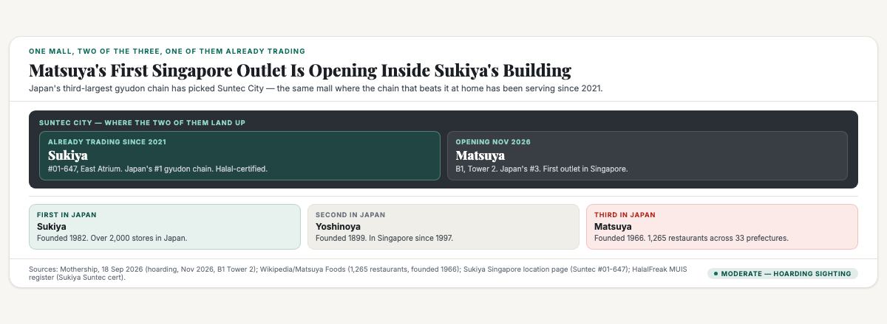
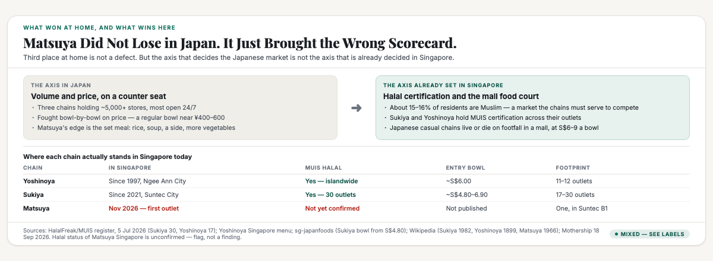
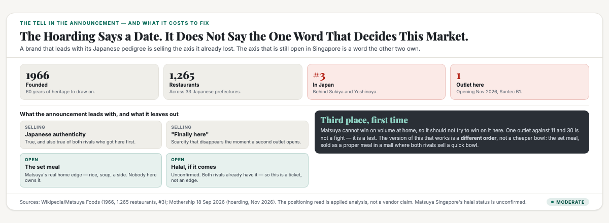

# ObserveCo — Trending-Topic Content Package (Book 1 Quality)

**Date:** 2026-09-18
**Trigger:** Trending on X / news — Mothership: "Hoarding for Japanese gyudon chain Matsuya seen at Suntec City, states opening in Nov. 2026" (Mothership, 18 Sep 2026, 12:01pm; resolved from bit.ly/3V3lEIS). Public sighting on X by @valterria (17 Sep 2026): Matsuya branding on hoarding at Suntec City, B1 of Tower 2, opening November 2026. It would be Matsuya's first Singapore outlet. Currently operates in Japan, mainland China, Hong Kong, Taiwan, Vietnam. **Note: a hoarding is a sighting, not an official announcement** — no Matsuya or mall press release had been issued at time of writing.
**Source visuals:** `fig-mat-01-building.html/.png`, `fig-mat-02-axis.html/.png`, `fig-mat-03-tell.html/.png`, `banner-matsuya.html/.png`.
**Source manuscript:** `whitepapers/print/output/ebook/book2-manuscript-CURRENT.md` — "The brands that created a category" (the flank: create a new category and be first in it; TWG, Prima Taste, Mr Coconut), "The truth about being first" (first in the mind ≠ first in time), "Door one, be first. Door two, be different.", the five-step apparatus (evaluate every way to stand out; find the open slot and the traps). `whitepapers/book1-map-manuscript.md` — Ch 1 "Where does the money come from?" (reading numbers honestly — what does the number actually measure), Ch 2 "What's it like to compete there?" (the cost structure; why the price war is a trap), Ch 3 (the structural forces).
**Skill lens:** `positioning-strategy` (the Five Laws of the Mind; the four postures; the flank; Trap #7 the category trap) + `brand-differentiation` (the nine ways; the five concepts that rarely make differentiation; market specialty) + `technical-decision-framing`.
**Voice:** Sean's register — first person, plainspoken, evidence-first, no hype. **Normal register** (business/positioning subject, not a technical mechanism), per the register table in the skill.
**Humanizer pass:** run 2026-09-18 with `voice_calibrate.py check` against SEAN_FOO.md targets. See "Voice calibration" in the research notes.
**Rule:** Draft only. Nothing posted. Sean pushes the button.

---

# THE FRESH PERSPECTIVE (the wedge)

Everyone will read the Matsuya hoarding the same way: another Japanese chain finally arrives in Singapore. Nice news for people who like beef bowls. That reading misses the only thing that makes the story worth writing.

Matsuya is not arriving into an empty market. It is arriving into Suntec City — the exact mall where Sukiya, the chain that beats it in Japan, has already been trading since 2021. Japan's number three is opening inside number one's building.

That's not a coincidence worth shrugging at. It's the clearest example I've seen in a while of a brand walking into a market with the wrong scorecard.

Here is the distinction I keep coming back to. Winning third place in Japan is not a defect — the three-way gyudon rivalry is one of the fiercest in Japanese food, and third place among those three is a real business. But the axis that decides Japan is volume and price, fought bowl by bowl on a counter. The axis that is already decided in Singapore is different. It's halal certification, mall footfall, and a bowl that lands between S$5 and S$9.

Both of the rivals who got here first already hold halal certification. Matsuya's is unconfirmed. That is a ticket to entry, not an edge, and it's currently unverified.

So the interesting question isn't whether Matsuya can make a good bowl. It's whether a brand that lost at home on one scorecard can win here on a different one — and whether it knows the scorecard changed.

That's what this piece is about, and it ends somewhere more useful than a verdict on beef.

---

# PART ONE — THE X ARTICLE (long-form, Book 1 quality)

## Article: "Japan's No. 3 Gyudon Chain Is Opening Inside No. 1's Building"

**Format:** X Article, ~2,300 words, 3 embedded visuals.

---

### The building

I want to start with the detail that everybody will scroll past.

Matsuya's hoarding went up at Suntec City. B1 of Tower 2, opening November 2026, first outlet in Singapore. That's the news. Fine.

Now the detail that changes the reading. Sukiya is already in Suntec City. Not nearby, not in a competing mall down the road. The same building, at #01-647, trading since 2021.

Sukiya is Japan's largest gyudon chain. Over 2,000 stores in Japan. Matsuya is third, behind Sukiya and Yoshinoya. So the chain that beats Matsuya at home, and beats it by a distance, has been serving bowls in that mall for five years.



I don't think that's bad luck. I think it's the whole story, and it's a much more useful thing to look at than the food.

Because when a brand enters a new market, it has exactly one decision that matters, and it makes it before it opens the doors: which version of itself does it bring?

### The three of them

You can't read this properly without knowing who the three are, so here it is quickly.

Yoshinoya is the oldest. Founded 1899 at the Nihonbashi fish market in Tokyo, and it is the second-largest gyudon chain in the world. It got to Singapore in 1997, through a franchise deal, opening first at Ngee Ann City. It's been here almost thirty years. There are roughly eleven or twelve outlets today.

Sukiya came second in Japan by size but first in this story's timing. Founded 1982 in Yokohama. The largest gyudon chain in Japan, over 2,000 stores, owned by Zensho Holdings. It opened in Singapore in 2021 — at Suntec City, which is where we came in.

Matsuya is the youngest of the three. Founded 1966 by Toshio Kawarabuki. As of 2025 it runs 1,265 restaurants across 33 Japanese prefectures. It's the third-largest, and Singapore would be its first outlet here. The other overseas markets are mainland China, Hong Kong, Taiwan and Vietnam.

Read those three histories next to each other and something obvious falls out. Yoshinoya has been building a Singapore habit for nearly three decades. Sukiya has had five years. Matsuya has zero, and it's opening in the same building as the category leader.

That isn't a fight. With one outlet against eleven and thirty, it's a test.

### What won at home

Before I get to the part that could go wrong, the fair part, because Matsuya is a genuinely good business and I'm not going to write it off. Sixty years of trading earns that much.

Third place in Japan is not a failure. The gyudon market there is one of the most brutal in food. The three chains together run more than 5,000 stores. Most urban locations are open 24 hours. They have fought a public price war for years — a regular bowl lands somewhere around ¥400 to ¥600, which is about the cheapest hot sit-down meal in the country.

You don't survive in that fight by being bad. And Matsuya's particular angle is real. In Japan it's the one that leans hardest on the set meal — teishoku — where you get rice, soup, a side, and vegetables, not just a bowl of beef. It also does curry properly, and its menu is wider than a pure beef-bowl shop.

So the brand has 60 years of history, a real menu advantage, and a chain of over a thousand restaurants. There is nothing wrong with this company.

Here's the problem. That description is a description of how it competes in Japan, and Japan is where it came third.

### What actually decides it here

Now the axis that is already set in Singapore, because this is where the story turns.

Singapore is roughly 15 to 16 percent Muslim by resident population. That is not a niche. It is a market share large enough that the fast casual Japanese chains here treat halal certification as a condition of competing, not a bonus.

And they have. Sukiya holds MUIS halal certification at 30 outlets in Singapore. Yoshinoya holds it at 17. Both of them. The certification is issued per premises, so every branch carries its own certificate number — the two leaders went to the trouble of certifying branch by branch.

Matsuya's halal status in Singapore is not confirmed. There is no Singapore outlet open yet and no announcement on it. So the honest position is: unknown.

That matters more than it sounds. If Matsuya arrives without certification, it opens with a smaller addressable market than either rival, on day one, in a mall where one of them is literally upstairs. If it arrives with certification, that's not an advantage — it's the entry ticket both rivals already paid for years ago.



Then there's the price. Sukiya's bowls start around S$4.80 to S$6.90 depending on size. Yoshinoya's regular gyudon is about S$6.00. That range is where the category's Singapore customers have already been trained, and it's low.

Which brings the whole thing into focus. Matsuya's Japanese advantage — the bigger, more complete set meal — is a higher-ticket product. Its rivals' Singapore advantage is cheap, fast, halal-certified volume. Those two things pull in opposite directions.

### The trap in the price war

I want to be careful here, because the obvious advice is wrong.

The obvious advice is: come in cheaper. Underprice Sukiya, win the value customer, build volume.

That's the price war, and the book I keep coming back to has a specific warning about it. When your whole offer is a lower price, you have to keep being the cheapest, forever, and the day someone cuts below you, your position is gone. Price is not a position you own. It's a position you rent, and the rent goes up.

It's also the fight Matsuya already lost. Competing on cheap volume against the biggest volume player in your category, in a market where that player has 30 stores to your one, is not a strategy. It's a surrender with extra steps.

So what does it actually have?

### The thing nobody here is selling

Here's where I'd look if I were them, and I think it's the most interesting fact in the whole story.

In Japan, Matsuya is the set-meal chain. Not the beef bowl chain that also does set meals — the one that leads with them. Rice, soup, a side, vegetables, a proper tray. Sixty years of building a menu around a complete meal rather than a single bowl.

Now look at what Singapore has. Sukiya sells bowls and curry. Yoshinoya sells bowls and combos. Both are good at what they do. Neither is the place you go for a proper set meal in a mall at lunchtime.

That is an open slot, and it's the one Matsuya already owns at home.

The move is not "better beef bowl." It's a different order. Not the cheapest bowl in the mall, but the only complete Japanese tray in the mall — sold at a fair price, aimed at the office lunch and the family dinner, in exactly the kind of building Suntec City is. It sits above Sukiya's price instead of under it, which means it isn't in the price war at all. It's in a different conversation.

That's what the flank looks like in practice: when you can't be first in the category, you create the version of it where you are first. Every Singapore brand that did this — TWG with luxury tea, Prima Taste with the world's best instant noodle, Mr Coconut with the coconut drink — stopped arguing about being better and started owning a slot nobody else had claimed.

And here's the point that makes it more than a marketing manoeuvre. A set meal is a higher-margin product than a S$5 bowl, and it's harder for a volume operator to copy, because copying it means changing their operations. Sukiya can undercut a cheaper bowl trivially. It can't undercut a product it doesn't want to serve.



### What I actually watch, and one thing worth knowing now

Three things, in the order they'd tell you the answer.

**First, the halal question.** If Matsuya announces MUIS certification early, it's playing to compete properly. If it opens un-certified and stays that way, it has quietly accepted a smaller market, and that tells you it's testing rather than entering.

**Second, the menu, and specifically whether the set meal leads.** If the Singapore outlet puts teishoku at the front — photographed, priced, advertised — it's bringing its actual advantage. If the marketing is all beef bowls versus beef bowls, it has walked into the price war and it will lose it, slowly.

**Third, whether the second outlet gets announced quickly.** One outlet is a test; a second is a decision. Watch for the next location, and watch whether it's another mall with a Sukiya already in it.

There's also a small thing worth knowing, because it will confuse people for the next few months. If you search for Matsuya in Singapore today, you won't find the beef bowl chain. You'll find Matsuya Dining, a small omakase restaurant at Beach Road, run by a homegrown chef, seating about 48 people. It's a completely separate business with no connection to the Japanese company. That name collision is already sitting there, and until the Suntec outlet opens, it's the only Matsuya most Singaporeans can find. For a brand whose entire proposition is a sixty-year-old name, arriving into a market where somebody else is already using it is an annoyance worth noting early.

### What I take from this

I don't know how this ends. The hoarding is a sighting by a passerby, not an official announcement, and the outlet could still change or slip. The halal question is genuinely open. One outlet against thirty is a test, not a verdict.

But the shape of the thing is clear enough to be worth writing down, because it's not really about beef bowls.

Yoshinoya came here in 1997 and spent thirty years becoming familiar. Sukiya came in 2021 and spent five years becoming certified and convenient. Both of them built a position in Singapore first and got to their menu second.

Matsuya is doing it the other way round. It's bringing a sixty-year-old Japanese scorecard — where it came third — into a market that has already decided on a different one.

I've watched this mistake enough times to have a name for it in my head. A brand arrives with the thing it's proud of, rather than the thing the market is missing. It works until a bigger player shows up, and then the pride stops being an asset.

The chain that beats you at home is already in the building. That is a reason to stop selling the bowl, not a reason to compete harder.

---

# PART TWO — THE X POSTS (beefed up, educational)

## Primary — number three is opening inside number one's building

> Japanese gyudon chain Matsuya is opening its first Singapore outlet. Suntec City, B1 Tower 2, November 2026.
>
> Here's the detail everyone will skip: Sukiya is already in that mall. Has been since 2021. Same building.
>
> Sukiya is Japan's largest gyudon chain — 2,000+ stores. Matsuya is third, at 1,265. So number three is opening inside number one's building.
>
> Three things worth knowing:
>
> 1. It's not a fight, it's a test.
> Yoshinoya has been in Singapore since 1997 (11–12 outlets). Sukiya since 2021 (17–30 outlets). Matsuya: one.
>
> 2. The axis that decides this market is already set.
> ~15–16% of Singapore residents are Muslim.
> Sukiya: MUIS halal at 30 outlets. Yoshinoya: 17. Both paid that entry ticket years ago.
> Matsuya's halal status here: unconfirmed.
>
> 3. The obvious advice is a trap.
> "Come in cheaper" means fighting the biggest volume player in the category, on volume, with one store. That's the price war. Price is a position you rent, not one you own.
>
> What Matsuya actually has is the thing nobody here sells: the set meal.
> In Japan it's the teishoku chain — rice, soup, a side, a proper tray. Sukiya and Yoshinoya sell bowls and combos. Nobody in a Singapore mall owns "the complete Japanese lunch".
>
> So the move isn't a better beef bowl. It's a different order. Above Sukiya's price, not under it — which means it isn't in the price war at all.
>
> When you can't be first in a category, you create the version of it where you are first. TWG did it with luxury tea. Mr Coconut did it with the coconut drink.
>
> The chain that beats you at home is already in the building. That's not a reason to compete harder — it's a reason to stop selling the bowl.
>
> #Singapore #Positioning

## Alt — the scorecard changed

> A Japanese chain with 1,265 restaurants is opening in Singapore. It came third at home, and it's about to find out the scorecard changed.
>
> Matsuya — hoarding up at Suntec City, opening Nov 2026. First outlet here.
>
> In Japan, the gyudon fight is volume and price. Three chains, 5,000+ stores, most open 24/7, a regular bowl near ¥400–600. Matsuya is the one that leans on the set meal.
>
> In Singapore, the fight was decided before it arrived:
> • ~15–16% of residents are Muslim
> • Sukiya holds MUIS halal at 30 outlets, Yoshinoya at 17
> • Bowls landed at S$4.80–6.90
>
> Both rivals paid the halal entry ticket years ago. Matsuya's status here: unconfirmed.
>
> Here's the interesting part. Its Japanese advantage — the bigger, complete set meal — is a higher-ticket product. Its rivals' Singapore advantage is cheap certified volume. Those pull opposite ways.
>
> So don't come in cheaper. That's the fight it already lost, against the biggest volume player in the category, with one store against thirty.
>
> Sell the set meal. Nobody in a Singapore mall owns "the complete Japanese tray". That slot is open, and it's the one Matsuya won on at home.
>
> A brand arrives with the thing it's proud of, instead of the thing the market is missing. It works — until a bigger player shows up, and then the pride stops being an asset.
>
> #Singapore #Business

---

# PART THREE — HASHTAGS (per platform)

## X — keep it to 1–2 tags (the hook + one topic tag)
- Primary: `#Singapore` + `#Positioning`
- Alt: `#Singapore` + `#Business`

---

## Research notes (for follow-up edits)

**Primary sources — the trigger (17–18 Sep 2026):**
- **Mothership, 18 Sep 2026, 12:01pm** (Nicolas Wong) — "Hoarding for Japanese gyudon chain Matsuya seen at Suntec City, states opening in Nov. 2026." Source of: the hoarding sighting, the November 2026 date, location **B1 of the mall's Tower 2**, "first Matsuya outlet in Singapore", the overseas market list (Japan, mainland China, Hong Kong, Taiwan, Vietnam), the trinity framing (Matsuya, Sukiya, Yoshinoya), Matsuya founded 1966, **third-largest gyudon chain in Japan with Sukiya first**, and the entrant history — **Yoshinoya first entered 1997 at Ngee Ann City; Sukiya, also in Suntec City, in 2021**. Resolved from bit.ly/3V3lEIS.
- **The original sighting: @valterria on X, 17 Sep 2026** — photo of the storefront, caption "Its not a drill! There's Matsuya opening in Singapore!" This is the first public evidence; the Mothership piece is reporting it.
- ⚠️ **A hoarding is a sighting, not an announcement.** No Matsuya Foods or Suntec City press release was found. Treat the November 2026 date and the store location as reported-but-unconfirmed. The article says this explicitly.

**Chain facts (independent verification):**
- **Matsuya Foods** — Wikipedia: established in Japan **1966**, founded by **Toshio Kawarabuki**; **1,265 restaurants across 33 Japanese prefectures** as of 2025; overseas stores in mainland China, Hong Kong, Taiwan and Vietnam; sells gyūdon, Japanese curry and **teishoku**. Also sponsors the Yakuza video-game franchise. Confidence: **High** (Wikipedia, sourced to the company).
- **Sukiya** — Wikipedia: **largest gyūdon chain in Japan**, **over 2,000 stores** in Japan; founded **1982 in Yokohama** by Kentarō Ogawa, who originally worked at Yoshinoya and also founded Zensho Holdings (TSE-listed, ¥511bn sales in 2016). Slogan "Save Time and Money". Note: in 2025 Sukiya closed its ~2,000 Japanese stores for a week after pest-contamination incidents (rat in a miso soup in Tottori; cockroach in Tokyo). Confidence: **High**.
- **Yoshinoya** — Wikipedia: founded **1899** at the Nihonbashi fish market, Tokyo; the **second-largest** gyūdon chain; motto "Tasty, low-priced, and quick". **Entered Singapore in 1997** via a franchise agreement with Wing Tai Investment & Development, opening first at **Ngee Ann City in September 1997** and a second at Scott's Picnic; Wing Tai sold the Singapore franchise shares in 2016 to Asia Yoshinoya International. **11 stores in Singapore as of 2023.** Confidence: **High**.
- **The three together** — roughly **5,000+ stores** nationwide, most urban locations open 24/7, regular bowls around **¥400–600** (yenfinder.com, 19 May 2026; Japan Experience; kanko-map.com chain comparison, 30 Jul 2026). Confidence: **Moderate** (aggregator/travel sources; treat as approximate).

**The Singapore market facts (the load-bearing ones):**
- **~15–16% of Singapore residents are Muslim** — 2020 Census of Population: **15.6%** of the resident population declared themselves Muslim (Religion in Singapore, Wikipedia, citing the census). Confidence: **High**.
- **Sukiya holds MUIS halal certification at 30 outlets** as of 5 July 2026 — HalalFreak, an independent directory rebuilt from the official MUIS register, listing certificate numbers per premises. **The Suntec City outlet is explicitly listed**: "Sukiya Gyudon • Curry, 3 Temasek Boulevard #01-647 Suntec City Mall · 038983, Cert EERT20240000362". Confidence: **High** (this is the piece's key co-location fact, and it is verified from the halal register, not assumed).
- **Yoshinoya holds MUIS halal certification at 17 outlets** — HalalFreak, same register, same date. Confidence: **High**.
- **Sukiya Singapore pricing** — bowls from about **S$4.80** (sg-japanfoods/Umami Compass: "Beef bowls from S$4.80 with premium Koshihikari rice"; gyudon medium S$6.90, large S$8.90); menuzsg.com (5 Jul 2026) quotes small gyudon from **S$4.20**. Confidence: **Moderate** — the aggregators disagree on the entry price (S$4.20 vs S$4.80 vs S$6.50), so the article gives a **range** rather than a single figure. **Do not quote a single "Sukiya price" — the sources conflict.**
- **Yoshinoya Singapore pricing** — gyudon (beef) Jr **S$6.00**, R S$6.50, L S$8.00 (yoshinoya.com.sg menu). Confidence: **High** (own site).
- **Sukiya Singapore outlet count — CONFLICT, handled by giving a range.** Sources disagree: the MUIS halal register lists **30**; sg-japanfoods says **17 outlets**; bestreviews.sg says **7** and attributes the brand to Creative Eateries Group (as of Jan 2026). The article therefore says "17 to 30" and does not pick one. **Flag this rather than resolving it** — the halal-premises count (30) is the most authoritative single number, but the "17" appears repeatedly and may reflect a different counting date or a live-outlet subset.
- **Yoshinoya Singapore outlet count** — **11** (Wikipedia, as of 2023) vs **12** (allsgpromo). Article says "eleven or twelve". Confidence: **Moderate**.

**⚠️ THE NAMING COLLISION — do not confuse the two.**
There is an unrelated restaurant called **"Matsuya Dining"** at **15 Beach Road, Beach Centre #01-01**, a small (~48-seater) **premium Japanese / omakase** restaurant helmed by a homegrown chef called Benson. It has **no connection** to Matsuya Foods Co. of Japan — different owner, different cuisine, different price tier (it appears in GrabPay DealBook's Gourmet Tribe Edition). If anyone searches "Matsuya Singapore" today, this is what they will find first, and it will keep confusing coverage until the Suntec outlet opens. Worth a follow-up post on its own.

**Positioning-theory anchors (`book2-manuscript-CURRENT.md` + `positioning-strategy` skill):**
- The flank: **"if you cannot be first in an existing category, create a new one and be first in it."** TWG created "luxury tea", Prima Taste "the world's best instant noodle", Mr Coconut "the coconut drink". None attacked the leader head-on.
- **"The truth about being first"** — first in the mind ≠ first in time. Prima Taste and Secretlab were neither first to exist. Applied here: Sukiya was first into *Suntec*, which is not the same as owning the mall's lunch.
- The two doors: "Door one, be first. Door two, be different."
- The five concepts that rarely make differentiation — **low price is one of them.** "Sustainability/vegan"-style claims and price cuts behave like *quality orientation*: an entry ticket, not an edge. This is the anchor for the "don't fight the price war" section.
- Book 1 Ch 2 "the cost structure, why the price war is a trap" — the structural anchor for the same argument.
- Trap #7 (Category Trap): naming a category before the value is self-evident. Related but not the main lens here.

**Confidence labels:**
- The hoarding, the November 2026 date, B1 Tower 2, first Singapore outlet — **Moderate.** Single sighting (a passerby's photo) reported by one outlet; no official confirmation. **The article states this caveat explicitly.**
- Chain histories and scales (Yoshinoya 1899, Sukiya 1982/2,000+, Matsuya 1966/1,265/33 prefectures) — **High.**
- The entrant chronology (Yoshinoya 1997 Ngee Ann City; Sukiya 2021 Suntec City) — **High** (Wikipedia + Mothership agree).
- **Sukiya already trading in Suntec City (#01-647)** — **High**, verified from the MUIS halal register entry, not inferred.
- Halal certification of Sukiya (30 outlets) and Yoshinoya (17) — **High** (register-derived directory; per-premises certificate numbers listed).
- **Matsuya's Singapore halal status — UNKNOWN.** No outlet open, no announcement. The article says "unconfirmed" and does not speculate either way. **This is a flag, not a finding.**
- Prices — **Moderate**, and deliberately given as ranges because the aggregator sources conflict. Yoshinoya's own site is High.
- Outlet counts — **Moderate**, given as ranges for the same reason.
- The positioning read (wrong scorecard, the set meal as the open slot, the price war as the trap) — **Moderate.** Applied analysis through the positioning lens: a well-evidenced argument, not a settled fact. The set-meal gap is inferred from both rivals' public menus, not from a survey.
- **No market-size figures are quoted.** Consistent with the Aomorie and Waymo precedents.

**Wedge anchor:** Japan's number three is opening inside number one's building — Sukiya has been trading in Suntec City since 2021, five years before Matsuya gets there. **Third place at home is not a defect; bringing the scorecard that lost is.** The axis that decides Japan (volume and price, fought bowl by bowl) is not the axis already set in Singapore (halal certification, mall footfall, a S$5–9 bowl) — and both rivals paid the halal entry ticket years ago while Matsuya's status is unconfirmed. The obvious move, undercutting on price, is the fight Matsuya already lost against the category's biggest volume player with one store against thirty. The open slot is the one it owns at home and nobody here sells: **the complete set meal** — a different order, priced above Sukiya rather than under it, which takes it out of the price war entirely.

**Voice calibration (2026-09-18):**
Normal register (business/positioning subject). Targets from Sean's own writing (SEAN_FOO.md + CORE_INTENT.md):

| Signal | Sean (target) | This draft |
|---|---|---|
| Avg sentence length | 14.2 words | see checker |
| Sentences ≤6 words | 19% | see checker |
| Bold density | 1.07 /1k | see checker |
| Em dashes | 5.14 /1k | see checker |
| First person "I" | heavy | present throughout |
| Skeleton/device tics | none | checked |

Checker (normal register — **no `--plain` flag**; this is not a technical piece):
```bash
S=~/.hermes/skills/observeco/observeco-trending-content-package/scripts/voice_calibrate.py
/usr/bin/python3 $S selftest
/usr/bin/python3 $S check \
  /Users/seanfzc/projects/observeco-main/content-writing/20260918/trending-topic-content-matsuya.md
```

**Publish state:** nothing published. X Article caps (10 drafts / 5 publishes per 24h) and the unverified OAuth1 publish route both still apply — see the 20260917 publish record. Retweeting the source post is a separate, unblocked step.
