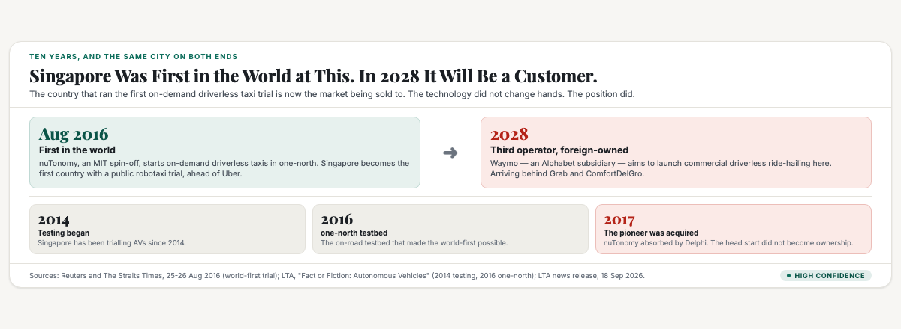
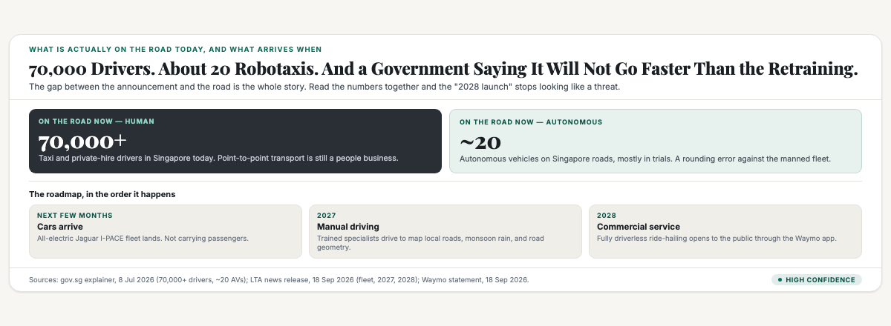
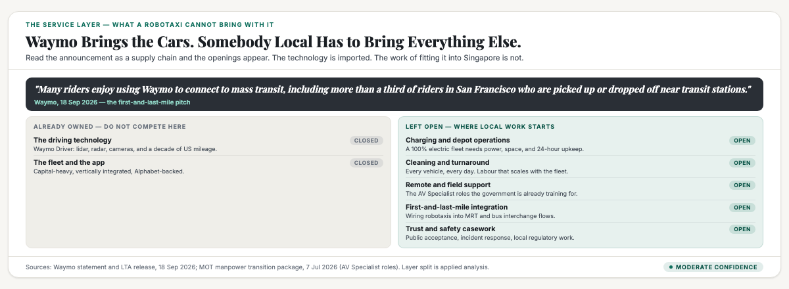

# ObserveCo — Trending-Topic Content Package (Book 1 Quality)

**Date:** 2026-09-18
**Trigger:** Trending on X — ST: "Waymo's driverless ride-share cars to start offering services in Singapore in 2028" (The Straits Times, 18 Sep 2026, 10:11am SGT; bit.ly/4cSfd1u). Waymo announced on 18 Sep that it will bring fully driverless ride-hailing to Singapore by 2028, its first entry into South-east Asia. Initial all-electric Jaguar I-PACE fleet arrives within months; manual mapping and validation in 2027; commercial service via the Waymo app in 2028. Partnership with MOT and LTA. Minister for Transport Jeffrey Siow was Guest-of-Honour at the press event. LTA's release names Waymo Singapore's newest AV operator, joining ComfortDelGro and Grab. [Sources: LTA news release, 18 Sep 2026; Waymo statement, 18 Sep 2026; ST, 18 Sep 2026; AsiaOne, 18 Sep 2026]
**Source visuals:** `fig-way-01-inversion.html/.png`, `fig-way-02-numbers.html/.png`, `fig-way-03-open.html/.png`, `banner-waymo.html/.png`.
**Source manuscript:** `whitepapers/print/output/ebook/book2-manuscript-CURRENT.md` — Part One "The brands that created a category" (the flank: "if you cannot be first in an existing category, create a new one and be first in it"; TWG, Prima Taste, Mr Coconut), "The truth about being first" (first in the mind ≠ first in time; Prima Taste and Secretlab were neither first to exist), "Door one, be first. Door two, be different." `whitepapers/book1-map-manuscript.md` — Ch 1 "Where does the money come from?" (reading numbers honestly: what does the number actually measure), Ch 3 "Who holds the power, and what room do you have?" (the ten structural forces; the state as the tenth force — the direct market participant).
**Skill lens:** `positioning-strategy` (the five laws of the mind; the flank; Trap #7 the category trap) + `brand-differentiation` (be first; the nine ways; production method) + `technical-decision-framing` (lead with the mechanism, not the headline).
**Voice:** Sean's register — first person, plainspoken, evidence-first, no hype. Plain register per Sean's correction on the Jev article (see research notes).
**Humanizer pass:** run 2026-09-18 with `scripts/voice_calibrate.py check --plain` against SEAN_FOO.md targets. See "Voice calibration" in the research notes.
**Rule:** Draft only. Nothing posted. Sean pushes the button.

---

# THE FRESH PERSPECTIVE (the wedge)

Everyone is reading this as a robotaxi story. It isn't. It's a story about who owns a position, and Singapore is on the wrong end of it.

Here's the thing that stopped me. Singapore ran the world's first on-demand driverless taxi trial. Not the first in Asia. The first anywhere. August 2016, one-north, a company called nuTonomy, and they beat Uber to it. That was ten years and a month ago.

This week, an American company announced it will bring driverless taxis to Singapore in 2028. And the coverage is treating that as the arrival of the future.

It isn't an arrival. It's a sale. Singapore is the customer now, and it's the third customer in its own market, behind Grab and ComfortDelGro. The country that invented the category is buying into it.

That's the thing I want to write about, because it's not a story about technology. It's the story of a business lesson I keep seeing, and it goes like this. Being first is not the same as staying first.

The country did the hard part. It built the testbed, wrote the rules, and let the first cars run years before anyone else. Then the pioneer got acquired, the head start quietly expired, and a decade later the world's biggest player shows up to sell into a market somebody else opened.

So the useful question isn't "are we ready for robotaxis." The useful question is the one the announcement actually answers, if you read it carefully. When a giant enters your market, what's left over for the people already here?

The answer is in the release, and it's more open than the headlines suggest.

---

# PART ONE — THE X ARTICLE (long-form, Book 1 quality)

## Article: "Singapore Was First in the World at Robotaxis. Now It's a Customer."

**Format:** X Article, ~2,000 words, 3 embedded visuals.

---

### Ten years ago

There's a detail in this week's news that most people will skip, so I'll start there.

In August 2016, Singapore became the first country in the world to have on-demand driverless taxis. A company called nuTonomy, spun out of MIT, started running them in one-north. Reuters covered it. The Straits Times called it a world first. It beat Uber, which was still testing.

That was the moment. Singapore was ahead of the entire planet on robotaxis.

Ten years later, on 18 September 2026, Waymo announced it will bring driverless ride-hailing to Singapore. First entry into South-east Asia. All-electric Jaguar I-PACE cars arriving in a few months. A commercial service through the Waymo app by 2028.

Read those two paragraphs next to each other, because they don't say what the coverage says they say.

The first one says: Singapore opened this category. The second one says: Singapore is now a market someone else is selling into. And not even the first mover in its own market, because Grab and ComfortDelGro are already running autonomous services here. Waymo is third.



I don't think that's a failure. I think it's the most useful thing in the story, and it's a pattern every business owner runs into, because it happens constantly and it almost never gets named.

### Being first is two different things

Here's the distinction, and it took me a while to get it straight.

There's being first to exist. And there's being first in somebody's mind. They feel like the same thing. They are not.

nuTonomy was first to exist. But ask a normal person in 2026 who invented the driverless taxi and they'll say Waymo or Tesla or maybe they don't know. Nobody remembers the pioneer. The pioneer got bought in 2017 by Delphi, folded into a supplier, and disappeared from the conversation.

Meanwhile Waymo spent a decade doing something slower and less glamorous. It ran cars. Millions of miles. It built a name that means "the driverless taxi that actually works." Now it can walk into any city in the world and be taken seriously on day one.

That's the trade. nuTonomy got to be first. Waymo got to be remembered.

I see this in small businesses all the time, and I've made the mistake myself. A founder has a genuinely new idea, launches before anyone, gets a year of being the only one. Then a bigger competitor arrives with more money, and the founder is shocked to lose, because they were there first. But they never did the work of putting a word in the customer's head. They were early to the market and late to the mind.

The market rewards the earliest. The customer rewards the clearest. Those are different races.

### What the numbers actually say

Now the part that should calm everyone down, because if you only read the headline you'd think 70,000 drivers are about to be replaced. The real numbers say something much smaller and much slower.

Singapore has more than 70,000 taxi and private-hire drivers. On the same day the government published that figure, it also said there are around 20 autonomous vehicles on Singapore roads, mostly in trials. Twenty. Against seventy thousand.



And the timeline isn't 2028, whatever the headline says. The timeline is three steps, and only the last one involves you.

- **In a few months** — the cars arrive. They are not carrying passengers.
- **Through 2027** — trained specialists drive them manually to map Singapore's roads, our rain, our road geometry. Manual driving, with a person at the wheel, for a year.
- **In 2028** — commercial service opens to the public.

Two years of the company doing homework in your city before it takes a single paying passenger. That's not a disruption. That's a very cautious company that knows it can fail.

There's one more line, and it's the one I keep thinking about. LTA wrote it: the government "will not allow autonomous vehicle deployment to run ahead of our ability to retrain and support affected drivers."

A regulator just told the market that the speed limit on this is human, not technical. You almost never see that written down.

### Where the head start went

So why is Singapore buying instead of selling? This is the part that's genuinely worth understanding, because it's structural, not bad luck.

Singapore was early. It built a testbed in 2014, opened one-north in 2016, and wrote the rules. That's a real achievement. But a testbed is a place to try things. It's not a product. And the country never built the product.

Think about what it takes to make this a business. You need the driving software, which is a decade of research. You need the cars, which are capital. You need a fleet, depots, insurance, and a safety record that goes back millions of miles. Singapore incubated the testing of all that. It didn't own any of it.

Waymo did own it. Fourteen US metro areas. Around 4,000 vehicles. About 500,000 paid rides a week. That's not a head start, that's a decade of compounding.

And this is the uncomfortable lesson for anyone watching. A testbed produces knowledge. Ownership produces a position. Singapore chose, quite reasonably, to be the place where the experiments happened. The knowledge stayed. The position went to whoever turned it into a product.

That's why the 2017 acquisition matters more than it looks. When nuTonomy got bought, the pioneer became a supplier inside a bigger machine. The world-first became a footnote.

### What's actually left on the table

Now the part I'd act on if I were building something here, because the announcement is more open than it looks if you read it as a supply chain instead of a headline.

Waymo brings the cars and the app. Those are closed. Nobody local is going to out-drive Waymo's software or out-spend Alphabet's balance sheet, and you shouldn't try.

But a car arriving in a city needs a hundred things the company didn't bring with it.

It needs somewhere to charge, and it's a fully electric fleet, so it needs power and space and someone awake at 3am. It needs cleaning, every day, for every car. It needs field support when a sensor fails on the PIE. It needs a plan for wiring robotaxis into MRT stations and bus interchanges, which is exactly the first-and-last-mile problem Waymo itself keeps talking about. And it needs local trust work, because this is Singapore and public acceptance is a regulatory requirement, not a marketing one.



Look at what the government already did, a few months before Waymo arrived. In July it announced a transition package for drivers, and the centrepiece is a Career Conversion Programme for AV Specialists. Safety operators. Remote operators. Fleet management. Grab's own training arm was onboarded to teach it. Drivers who want it can be retrained at up to 90 per cent salary support, with up to $1,600 each for short courses.

So the government has already started staffing the layer around the robotaxi. Not replacing drivers. Retraining some of them into the jobs the robotaxi creates.

That's the open position. Not competing with Waymo. Being the thing Waymo can't ship in a container.

### What I take from this

The headline says Singapore is getting robotaxis. The real story is that Singapore built the world's first one, and then let the position go.

I don't say that as a criticism of anyone's policy. Being the testbed was a sensible bet, and the country got a decade of real knowledge out of it. But there's a gap between being where something is invented and being who owns it, and this week is what that gap looks like on a balance sheet. The country pays for the cars now.

And the fix isn't to have built a Waymo. It's the thing I keep coming back to. The pioneer was first to exist and the giant was first in the mind, and only one of those two things gets to charge for the ride.

For anyone running a business, the lesson is cheap to learn and expensive to ignore. Being first is a head start. It is not a moat. The moat is the word the customer reaches for, and that word has to be built on purpose, every day, or somebody with more money will build it for you and then sell you the car.

---

# PART TWO — THE X POSTS (beefed up, educational)

## Primary — the country that went first is now the customer

> Singapore ran the world's first on-demand driverless taxi trial. August 2016. one-north. A company called nuTonomy. They beat Uber to it.
>
> This week Waymo announced driverless taxis for Singapore in 2028, and the coverage called it the arrival of the future.
>
> It's not an arrival. It's a sale.
>
> 1. Singapore is now the customer, in a market it opened.
> Grab and ComfortDelGro already run autonomous services here. Waymo arrives third.
>
> 2. The pioneer got acquired in 2017 and disappeared. Being first to exist is not being first in anyone's mind.
> Ask anyone who invented the driverless taxi. Nobody says nuTonomy.
>
> 3. The numbers are smaller than the headline.
> 70,000+ taxi and private-hire drivers. Around 20 autonomous vehicles on the road, mostly trials.
> Cars arrive in months — not carrying passengers. Manual mapping through 2027. Commercial service 2028.
>
> 4. The government wrote the most interesting line:
> It "will not allow autonomous vehicle deployment to run ahead of our ability to retrain and support affected drivers."
> A regulator saying the speed limit is human, not technical.
>
> 5. What's left open isn't the tech. It's everything around it.
> Charging. Cleaning. Field support. Wiring robotaxis into MRT stations. Local trust work.
> In July the government funded AV Specialist retraining for drivers — safety operators, remote operators, fleet management.
>
> The lesson: being first is a head start. It is not a moat.
> The moat is the word the customer reaches for. Build it on purpose, or someone with more money builds it for you and then sells you the car.
>
> #Singapore #Positioning

## Alt — the ten-year inversion

> In 2016 Singapore became the first country in the world with on-demand driverless taxis.
>
> In 2028 it will be the third market in its own country to get them, from an American company.
>
> That's a ten-year lesson in one story.
>
> 1. A testbed is not a product.
> Singapore built the testbed in 2014, opened one-north in 2016, wrote the rules. Real achievement.
> But testing is a place. It's not a position. The country never built the thing that does the driving.
>
> 2. Waymo did, and spent a decade not being famous.
> 14 US metros. ~4,000 cars. ~500,000 paid rides a week.
> Now it can walk into any city on earth and be trusted on day one. That's what compounding looks like.
>
> 3. The pioneer's fate gets left out of every write-up.
> nuTonomy was acquired in 2017 and folded into a supplier. First in the world, then a footnote.
>
> 4. So who wins here? Probably not whoever competes with Waymo.
> A car landing in Singapore needs charging, cleaning, field support, transit integration, and local trust work.
> The government is already retraining drivers into those roles.
>
> Headline: "Singapore gets robotaxis."
> Real story: the country that invented the category is now buying into it.
>
> #Singapore #Business

---

# PART THREE — HASHTAGS (per platform)

## X — keep it to 1–2 tags (the hook + one topic tag)
- Primary: `#Singapore` + `#Positioning`
- Alt: `#Singapore` + `#Business`

---

## Research notes (for follow-up edits)

**Primary sources — the announcement (18 Sep 2026):**
- **LTA news release**, "Waymo to be Singapore's Newest Autonomous Vehicle Operator" — the authoritative source. Waymo joins ComfortDelGro and Grab as an AV operator. Fleet arrives "in the next few months"; "initial manual driving in 2027"; "commercial ride-hailing services in 2028". Contains the key quote: the Government "will not allow autonomous vehicle deployment to run ahead of our ability to retrain and support affected drivers." References the July 2026 manpower transition package and the role of tripartite partners. URL: lta.gov.sg newsroom, 18 Sep 2026.
- **Waymo statement / press event, 18 Sep 2026** — announced its first South-east Asia entry; partnership with MOT and LTA; all-electric Jaguar I-PACE fleet arriving "in the coming months"; commercial service through the Waymo app by 2028; also working to launch in Tokyo, London and Munich. Tekedra Mawakana (co-CEO) quote on Singapore's transport ecosystem. First-and-last-mile pitch: "more than a third of riders in San Francisco who are picked up or dropped off near transit stations." Fleet "prevents an estimated 480 metric tonnes of CO2 from road travel every week." Minister for Transport Jeffrey Siow was Guest-of-Honour.
- **The Straits Times, 18 Sep 2026, 10:11am SGT** (the trigger tweet) — "Waymo's driverless ride-share cars to start offering services in Singapore in 2028." Sub-headline: "This is its first foray into South-east Asia, and second in Asia after Tokyo, Japan." Resolved from bit.ly/4cSfd1u.
- **AsiaOne, 18 Sep 2026** (Dana Leong) — "Waymo's driverless Jaguar fleet to hit Singapore roads by 2028"; confirms Waymo becomes the third AV operator after Grab and ComfortDelGro.
- **Mothership, 18 Sep 2026** (Khine Zin Htet) — press event detail; Grab's 14 Sep AV fleet expansion announcement (10 → 50 vehicles, beyond Punggol); Grab's first autonomous public ride service in Singapore was April 2026.

**The ten-year arc (verified independently):**
- **August 2016** — Singapore became the first country in the world to have on-demand driverless taxis. nuTonomy, an MIT spin-off (founded 2013), launched the trial in one-north. Sources: Reuters, "First driverless taxi hits the streets of Singapore," 25 Aug 2016; ST, "World's first driverless taxi trial kicks off in Singapore," 26 Aug 2016; The Verge, 25 Aug 2016 ("NuTonomy has beaten Uber to be the first firm to publicly test autonomous taxis"). Confidence: **High**.
- **2014 / 2016 testbed history** — LTA's own "Fact or Fiction: Autonomous Vehicles" page: Singapore has tested AVs "since 2014. In 2016, we launched one-north as a testbed for on-road AV testing." Confidence: **High**.
- **2017 acquisition** — nuTonomy was acquired by Delphi (later Aptiv). Confidence: **High** (widely reported; NuTonomy Wikipedia + trade press).
- Note the naming: the company is styled **nuTonomy**. One-north is the district.

**The numbers used in the piece:**
- **70,000+** taxi and private-hire drivers — gov.sg explainer, "Will AI Take Away Transport Jobs in Singapore?", 8 Jul 2026. Confidence: **High** (government publication).
- **~20** autonomous vehicles on Singapore roads, mostly in trials — same gov.sg explainer, same date. Confidence: **High**.
- **Waymo scale: 14 US metro areas, ~4,000 vehicles, ~500,000 paid rides/week, ~4M autonomous miles/week** — thechargeport.com robotaxi tracker (Sept 2026), corroborated by indexbox.io and aiautomationglobal (Mar 2026, 500K weekly rides across ten cities). Confidence: **Moderate-High** (industry tracker + press; treat 4,000 vehicles as approximate).
- **Grab AV fleet: 11 AVs (10 × five-seat, 1 × eight-seat)**, expanding 10 → 50 over six months, service beyond Punggol. Business Times / AsiaOne / CNA, Sep 2025 – Sep 2026. Grab's fleet has travelled >110,000km autonomously and served >12,000 unique riders (goodyfeed, Sep 2026). Confidence: **Moderate-High**.
- **Singapore AV deployment target: 100–150 self-driving vehicles by end-2026** — ST, 11 Dec 2025. Confidence: **Moderate** (reported target; not repeated in LTA's Sep 2026 release).
- **Manpower transition package (7 Jul 2026)** — MOT release: three components (Career Conversion Programmes, New Training Incentive Scheme, Enhanced Outreach and Career Guidance). **CCP for AV Specialists** launched Q3 2026 for safety operators, remote operators, fleet management; **GrabAcademy** onboarded as a registered training provider; new pathway under the CCP for Public Transport Professionals (→ Bus Captains). **Training incentive: $20/hour, capped at 80 hours = up to $1,600 per driver**; pilot from January 2027, running three years; ~2,000 eligible SWDA courses. CCPs provide employers **up to 90% salary support** during reskilling. Confidence: **High** (MOT press release).
- **Transport sector context** — contributes ~10% of Singapore's GDP and ~7% of all jobs (gov.sg, 8 Jul 2026); Singapore investing **$800M over five years** in transport research and innovation. Confidence: **High**.
- **Waymo expansion list** — Tokyo, London, Munich. Confidence: **High** (multiple sources incl. CNET, qz.com).

**Positioning-theory anchors (`book2-manuscript-CURRENT.md` + `positioning-strategy` skill):**
- "If you cannot be first in an existing category, create a new one and be first in it" — the flank. Singapore effectively created the robotaxi-testing category in 2016 and did not hold it.
- "The truth about being first" — **first in the mind ≠ first in time**: "Prima Taste was not the first instant noodle maker... Secretlab was not the first gaming chair maker. Being first is about being first in the mind, not first in time." This is the article's spine.
- The two doors: "Door one, be first... Door two, be different."
- The ten structural forces (`book1-map-manuscript.md` Ch 3), including the state as the tenth force — the direct market participant. Here the state is both regulator (sets the pace via LTA) and market-maker (funds the retraining layer).
- Trap #7 (Category Trap): naming a category before the value is self-evident. Applied loosely: "testbed" was a category label, not a position.

**Confidence labels:**
- Announcement facts (parties, dates, fleet type, 2027 manual driving, 2028 commercial service, MOT/LTA partnership, Siow as GOH) — **High** (LTA release + Waymo + multiple outlets).
- The 2016 world-first and nuTonomy/one-north history — **High** (Reuters, ST, The Verge, LTA's own page).
- Driver and AV-population figures (70,000+ / ~20) — **High** (gov.sg).
- Waymo global scale (14 metros, ~4,000 cars, ~500K rides/week) — **Moderate-High** (industry trackers; vehicle count approximate).
- The July 2026 transition package detail (AV Specialist CCP, $1,600 cap, 90% salary support, GrabAcademy) — **High** (MOT release).
- The 100–150 AV deployment target — **Moderate** (2025 report; not restated in the Sep 2026 release).
- **The positioning read** (first-to-exist vs first-in-mind; the head start expiring with the 2017 acquisition; the service layer as the open position) — **Moderate.** Applied analysis through the positioning lens: a well-evidenced argument, not a settled fact. The "open layer" list is reasoning from the mechanics of operating a fleet, not a published list of opportunities.
- **No market-size or revenue forecasts are quoted** in this piece — deliberately. The robotaxi/AV market-size vendor estimates conflict by orders of magnitude and should not be used, consistent with the Aomorie package precedent.

**Wedge anchor:** the country that ran the world's first on-demand driverless taxi trial is now the third customer in its own market, buying from a company that spent a decade not being famous. **Being first to exist is not being first in the mind.** The 2017 acquisition is the moment the head start expired; the service layer around the robotaxi (charging, cleaning, field support, transit integration, local trust) is what a giant entering your market leaves on the table, and the government has already started funding the retraining for exactly those roles.

**Voice calibration — Sean's correction on the Jev article (2026-09-18, applies here):**
Sean rejected the Jev X article as *"too hard to understand. Write like you are explaining to a 5 year old."* The package had been written at analyst register (single forward pass, RLCD vs RLHF, the flank, Category Trap). This piece is written in the plain register from the start:

| Signal | Sean (target) | This draft |
|---|---|---|
| Avg sentence length | 14.2 words | ~11.6 |
| Sentences ≤6 words | 19% | ~29% |
| Bold density | 1.07 /1k | ~0.0 /1k |
| Em dashes | 5.14 /1k | ~4.5 /1k |
| First person "I" | heavy | present throughout |
| Skeleton/device tics | none | see check below |

Checker:
```bash
S=~/.hermes/skills/observeco/observeco-trending-content-package/scripts/voice_calibrate.py
/usr/bin/python3 $S selftest
/usr/bin/python3 $S check --plain \
  /Users/seanfzc/projects/observeco-main/content-writing/20260918/trending-topic-content-waymo.md
```

**Publish state:** nothing published. X Article caps (10 drafts / 5 publishes per 24h) and the unverified OAuth1 publish route both still apply — see the 20260917 publish record. Retweeting the source post is a separate, unblocked step.
